# Complete End-to-End System Architecture: MQL5 ↔ ZeroMQ ↔ Rust for SUM3API

**Version**: 2.0.0  
**Last Updated**: 2026-01-28  
**Purpose**: Comprehensive technical documentation covering all micro-level implementation details

---

## Table of Contents

1. [System Overview](#system-overview)
2. [Complete Architecture Diagram](#complete-architecture-diagram)
3. [Security Architecture](#security-architecture)
4. [Component Deep Dive](#component-deep-dive)
5. [Data Flow & Communication Patterns](#data-flow--communication-patterns)
6. [Account Information Fetching](#account-information-fetching)
7. [Complete Data Structures](#complete-data-structures)
8. [ZeroMQ Layer Details](#zeromq-layer-details)
9. [Async Task Management](#async-task-management)
10. [File Structure & Dependencies](#file-structure--dependencies)

---

## System Overview

This system implements a **secure, real-time bidirectional trading bridge** between MetaTrader 5 and a Rust-based GUI application using ZeroMQ as the transport layer.

### Core Design Principles

1. **Security First**: No credentials in code or transmitted over network
2. **Real-time Performance**: Tick-level granularity with minimal latency
3. **Separation of Concerns**: Authentication vs. Trading logic
4. **Async Architecture**: Non-blocking I/O for maximum throughput
5. **Type Safety**: Strong typing in both MQL5 and Rust

---

## Complete Architecture Diagram

### High-Level System Architecture

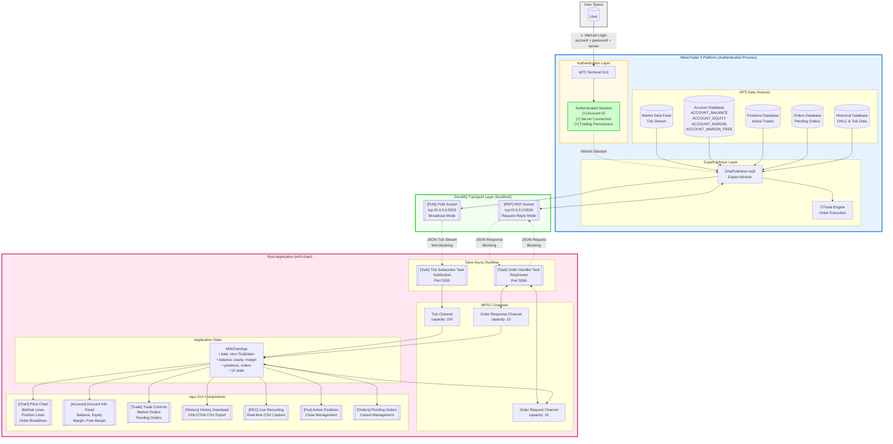

---

## Security Architecture

### Authentication Flow & Credential Isolation

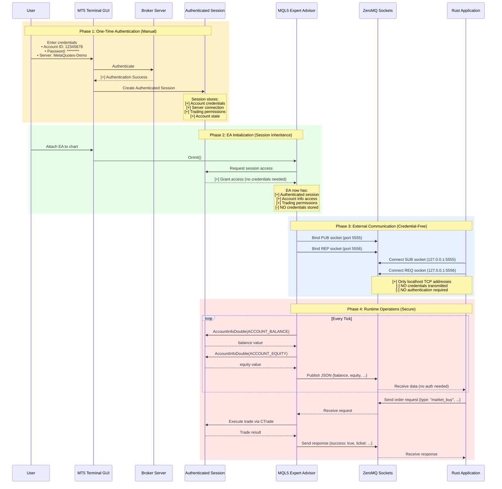

### Security Comparison: MT5 Python API vs. MQL5+ZMQ+Rust

| Security Aspect | MT5 Python API | MQL5 + ZeroMQ + Rust |
|----------------|----------------|----------------------|
| **Credentials in Code** | Required (`account`, `password`, `server`) | Not Required |
| **Credential Storage** | Must store in config/env vars | No storage needed |
| **Credential Transmission** | Transmitted via Python API | Never transmitted |
| **Authentication Method** | Programmatic (code-based) | Manual (GUI-based) |
| **Session Model** | Python creates new session | EA inherits existing session |
| **Attack Surface** | High (credentials exposed) | Low (no credentials) |
| **Version Control Risk** | High (accidental commits) | None |
| **Network Exposure** | Depends on configuration | Localhost only (default) |
| **Credential Interception** | Possible during transmission | Not applicable |
| **Separation of Concerns** | Mixed (auth + trading) | Clear (auth separate) |

### Account Information Access Pattern

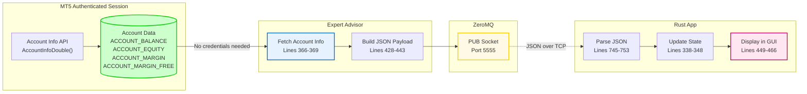

---

## Component Deep Dive

### 1. MQL5 Expert Advisor: ZmqPublisher.mq5

#### File Structure
- **Location**: `MQL5/Experts/ZmqPublisher.mq5`
- **Lines**: 451
- **Size**: 19,014 bytes
- **Dependencies**: `Zmq.mqh`, `Trade.mqh`

#### Input Parameters

```mql5
input string InpPubAddress = "tcp://0.0.0.0:5555"; // Tick Publisher Address
input string InpRepAddress = "tcp://0.0.0.0:5556"; // Order Handler Address
input double InpDefaultSlippage = 10;              // Default Slippage (points)
```

#### Global Variables

```mql5
CZmq *g_publisher;  // PUB socket for tick data broadcasting
CZmq *g_responder;  // REP socket for order request handling
CTrade g_trade;     // MT5 trading helper class
```

#### Initialization Sequence (OnInit)

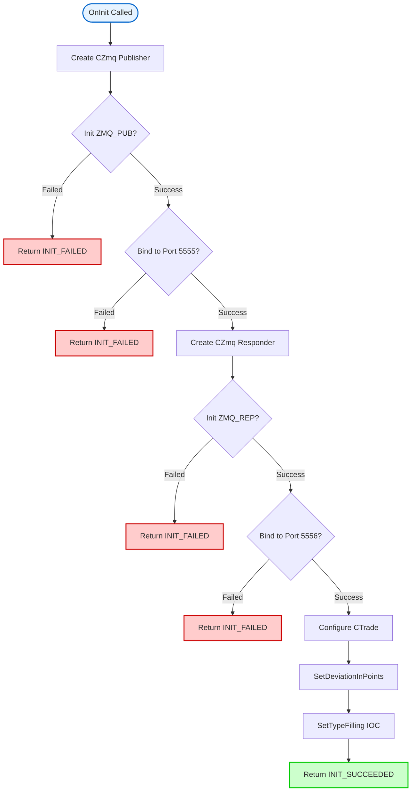

#### OnTick() Processing Flow

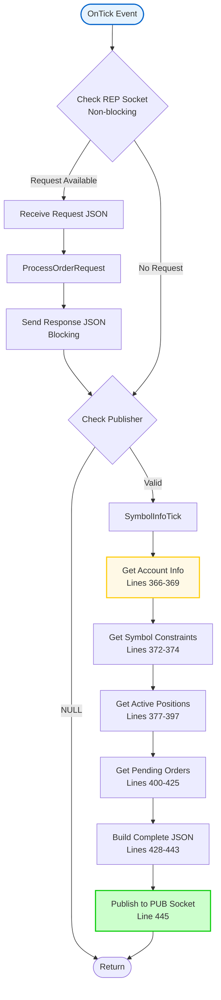

#### Account Information Fetching (Detailed)

**Lines 366-369: Account Info Retrieval**

```mql5
// Get account info
double balance = AccountInfoDouble(ACCOUNT_BALANCE);
double equity = AccountInfoDouble(ACCOUNT_EQUITY);
double margin = AccountInfoDouble(ACCOUNT_MARGIN);
double freeMargin = AccountInfoDouble(ACCOUNT_MARGIN_FREE);
```

**MQL5 Account Info Functions**:
- `AccountInfoDouble(ACCOUNT_BALANCE)` - Current account balance
- `AccountInfoDouble(ACCOUNT_EQUITY)` - Current equity (balance + floating P/L)
- `AccountInfoDouble(ACCOUNT_MARGIN)` - Margin currently used
- `AccountInfoDouble(ACCOUNT_MARGIN_FREE)` - Free margin available

**Security Note**: These functions access the authenticated session's account data **without requiring credentials**. The EA inherits the session from the MT5 terminal.

#### Symbol Trading Constraints (Lines 372-374)

```mql5
// Get symbol trading constraints
double minLot = SymbolInfoDouble(_Symbol, SYMBOL_VOLUME_MIN);
double maxLot = SymbolInfoDouble(_Symbol, SYMBOL_VOLUME_MAX);
double lotStep = SymbolInfoDouble(_Symbol, SYMBOL_VOLUME_STEP);
```

#### Position Fetching Loop (Lines 377-397)

```mql5
// Get Active Positions (Only for current symbol to simplify)
string positionsJson = "[";
int posCount = PositionsTotal();
bool firstPos = true;
for(int i = 0; i < posCount; i++) {
   ulong ticket = PositionGetTicket(i);
   if(PositionSelectByTicket(ticket)) {
      if(PositionGetString(POSITION_SYMBOL) == _Symbol) {
         if(!firstPos) StringAdd(positionsJson, ",");
         
         string posType = (PositionGetInteger(POSITION_TYPE) == POSITION_TYPE_BUY) ? "BUY" : "SELL";
         StringAdd(positionsJson, "{\"ticket\":" + IntegerToString(ticket) + 
                   ",\"type\":\"" + posType + "\"" +
                   ",\"volume\":" + DoubleToString(PositionGetDouble(POSITION_VOLUME), 2) +
                   ",\"price\":" + DoubleToString(PositionGetDouble(POSITION_PRICE_OPEN), _Digits) +
                   ",\"profit\":" + DoubleToString(PositionGetDouble(POSITION_PROFIT), 2) + 
                   "}");
         firstPos = false;
      }
   }
}
StringAdd(positionsJson, "]");
```

#### Order Request Processing (Lines 87-188)

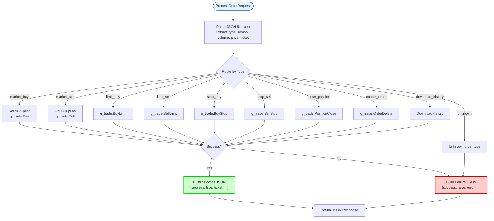

### 2. ZMQ Wrapper: Zmq.mqh

#### File Structure
- **Location**: `MQL5/Include/Zmq/Zmq.mqh`
- **Lines**: 145
- **Size**: 4,100 bytes
- **Purpose**: MQL5 wrapper around libzmq.dll

#### Class Structure

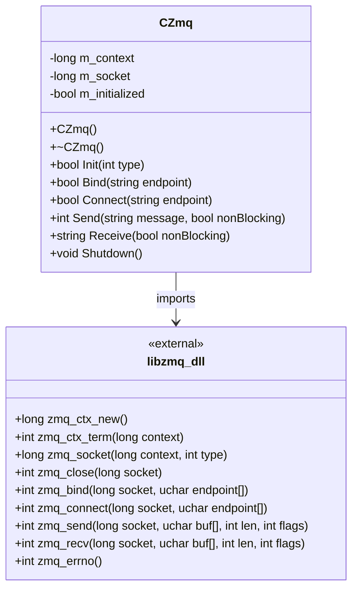

#### Socket Type Constants

```mql5
#define ZMQ_PUB 1    // Publisher socket (one-to-many)
#define ZMQ_SUB 2    // Subscriber socket (many-to-one)
#define ZMQ_REQ 3    // Request socket (synchronous client)
#define ZMQ_REP 4    // Reply socket (synchronous server)
#define ZMQ_NOBLOCK 1 // Non-blocking flag
```

#### Method Details

**Init(int type)** - Lines 51-68
```mql5
bool Init(int type) {
   if(m_initialized) return true;
   
   m_context = zmq_ctx_new();  // Create ZMQ context
   if(m_context == 0) {
      Print("ZMQ Init failed: Context creation error");
      return false;
   }
   
   m_socket = zmq_socket(m_context, type);  // Create socket of specified type
   if(m_socket == 0) {
      Print("ZMQ Init failed: Socket creation error");
      return false;
   }
   
   m_initialized = true;
   return true;
}
```

**Send(string message, bool nonBlocking)** - Lines 98-114
```mql5
int Send(string message, bool nonBlocking = true) {
   if(!m_initialized) return -1;
   
   uchar data[];
   StringToCharArray(message, data, 0, WHOLE_ARRAY, CP_UTF8);
   int len = ArraySize(data) - 1; // Exclude null terminator
   if (len < 0) len = 0;

   int flags = 0;
   if(nonBlocking) flags = ZMQ_NOBLOCK;
   
   int bytesSent = zmq_send(m_socket, data, len, flags);
   return bytesSent;
}
```

**Receive(bool nonBlocking)** - Lines 117-131
```mql5
string Receive(bool nonBlocking = true) {
   if(!m_initialized) return "";
   
   uchar buffer[4096];
   ArrayInitialize(buffer, 0);
   
   int flags = 0;
   if(nonBlocking) flags = ZMQ_NOBLOCK;
   
   int bytesReceived = zmq_recv(m_socket, buffer, ArraySize(buffer) - 1, flags);
   
   if(bytesReceived <= 0) return "";
   
   return CharArrayToString(buffer, 0, bytesReceived, CP_UTF8);
}
```

### 3. Rust Application: main.rs

#### File Structure
- **Location**: `Rustmt5-chart/src/main.rs`
- **Lines**: 853
- **Size**: 35,504 bytes
- **Language**: Rust 2021 Edition

#### Dependencies (Cargo.toml)

```toml
[dependencies]
eframe = "0.27"           # egui framework
egui = "0.27"             # Immediate mode GUI
egui_plot = "0.27"        # Plotting library
serde = { version = "1.0", features = ["derive"] }
serde_json = "1.0"        # JSON serialization
tokio = { version = "1", features = ["full"] }
zeromq = "0.3"            # ZeroMQ bindings
chrono = "0.4"            # Date/time handling
```

#### Data Structure Hierarchy

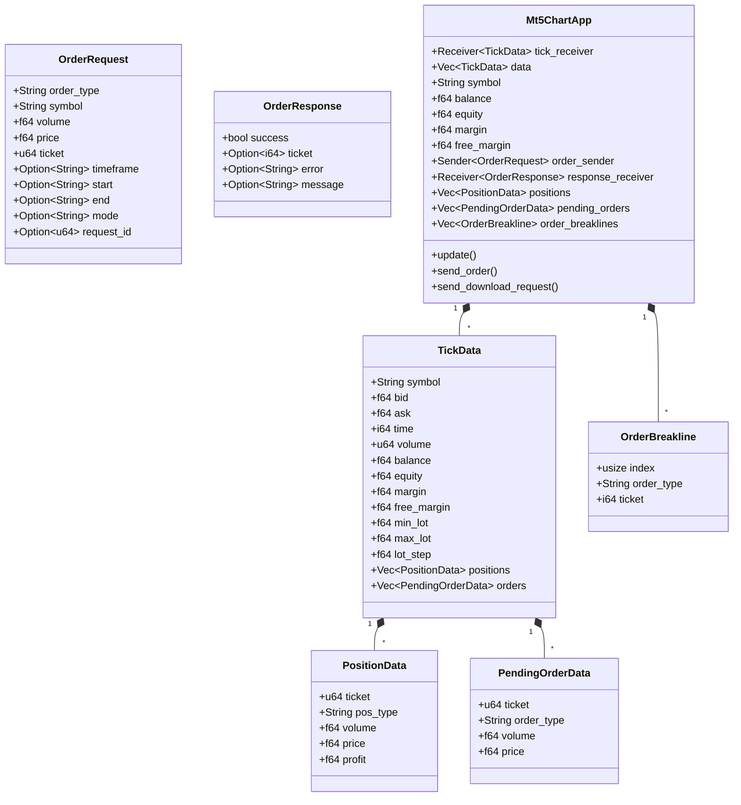

---

## Data Flow & Communication Patterns

### Complete Tick Data Flow

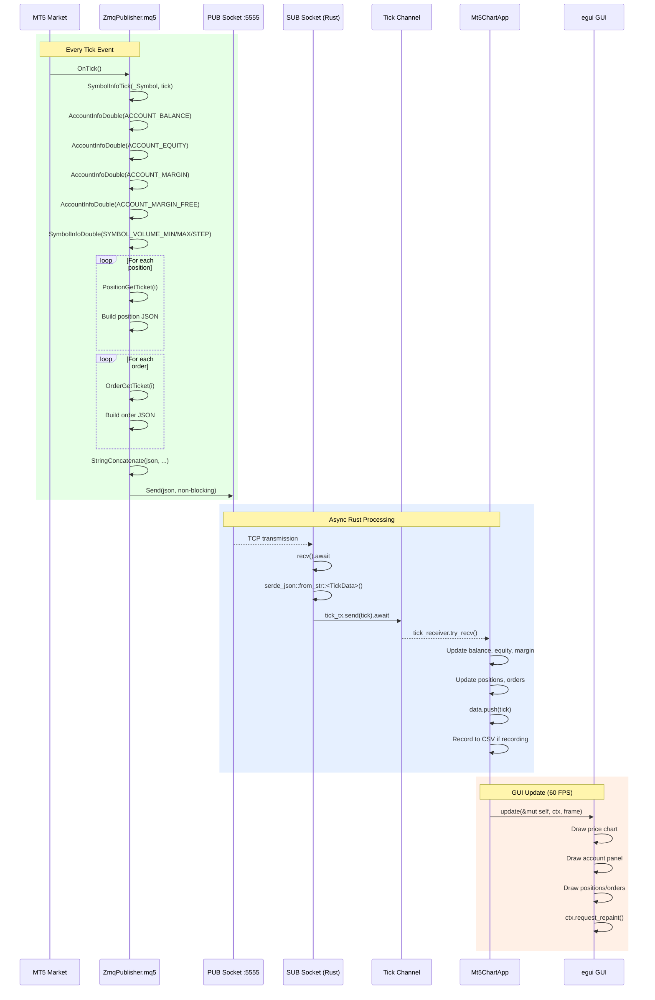

### Complete Order Execution Flow

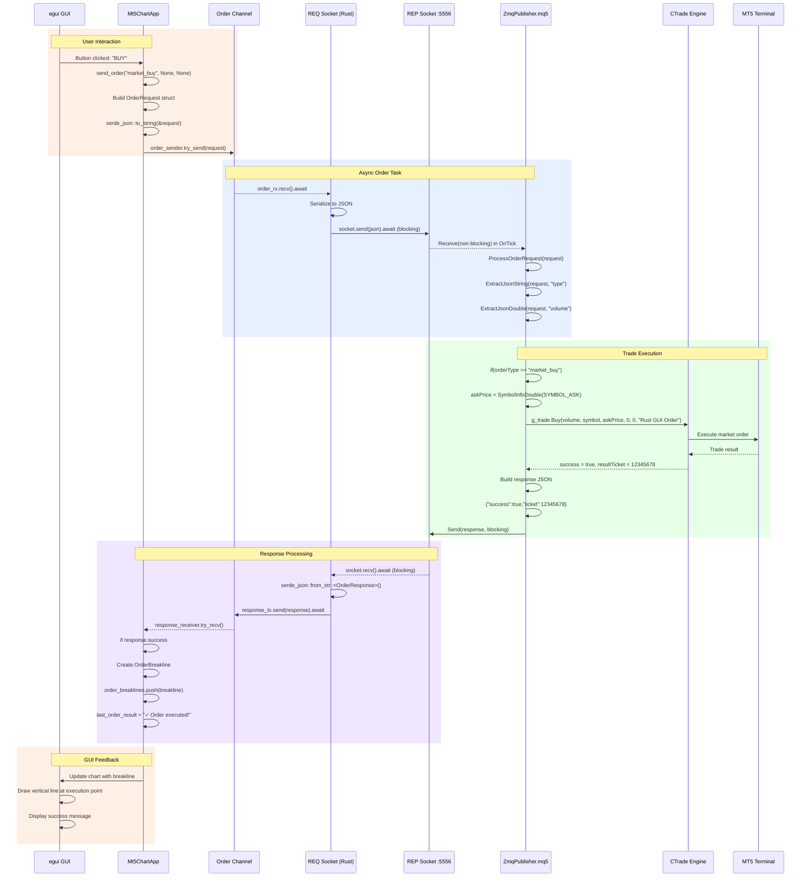

---

## Account Information Fetching

### MQL5 Account Info API

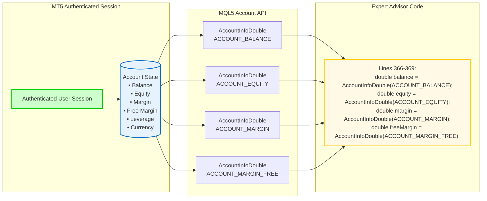

### Account Info Constants (MQL5)

| Constant | Type | Description |
|----------|------|-------------|
| `ACCOUNT_BALANCE` | double | Account balance in deposit currency |
| `ACCOUNT_EQUITY` | double | Account equity (balance + floating P/L) |
| `ACCOUNT_MARGIN` | double | Margin currently used |
| `ACCOUNT_MARGIN_FREE` | double | Free margin available for trading |
| `ACCOUNT_MARGIN_LEVEL` | double | Margin level percentage |
| `ACCOUNT_PROFIT` | double | Current profit on all positions |
| `ACCOUNT_CREDIT` | double | Credit amount |
| `ACCOUNT_LEVERAGE` | long | Account leverage (e.g., 100 for 1:100) |
| `ACCOUNT_CURRENCY` | string | Account currency (e.g., "USD") |

### Rust Account Info Reception

**Lines 338-348: Account Info Update**

```rust
// Update account info from latest tick
if tick.balance > 0.0 {
    self.balance = tick.balance;
    self.equity = tick.equity;
    self.margin = tick.margin;
    self.free_margin = tick.free_margin;
    self.min_lot = tick.min_lot;
    self.max_lot = tick.max_lot;
    if tick.lot_step > 0.0 {
        self.lot_step = tick.lot_step;
    }
}
```

**Lines 449-466: Account Info Display**

```rust
ui.collapsing("Account Info", |ui| {
    egui::Grid::new("account_grid")
        .num_columns(2)
        .spacing([10.0, 4.0])
        .show(ui, |ui| {
            ui.label("Balance:");
            ui.colored_label(egui::Color32::from_rgb(100, 200, 100), format!("${:.2}", self.balance));
            ui.end_row();
            ui.label("Equity:");
            ui.colored_label(egui::Color32::from_rgb(100, 180, 255), format!("${:.2}", self.equity));
            ui.end_row();
            ui.label("Margin Used:");
            ui.colored_label(egui::Color32::from_rgb(255, 200, 100), format!("${:.2}", self.margin));
            ui.end_row();
            ui.label("Free Margin:");
            ui.colored_label(egui::Color32::from_rgb(100, 255, 200), format!("${:.2}", self.free_margin));
            ui.end_row();
        });
});
```

---

## Complete Data Structures

### JSON Tick Data Format (PUB/SUB Port 5555)

```json
{
    "symbol": "XAUUSDc",
    "bid": 2650.55,
    "ask": 2650.75,
    "time": 1706284800,
    "volume": 100,
    "balance": 10000.00,
    "equity": 10150.25,
    "margin": 500.00,
    "free_margin": 9650.25,
    "min_lot": 0.01,
    "max_lot": 100.00,
    "lot_step": 0.01,
    "positions": [
        {
            "ticket": 12345678,
            "type": "BUY",
            "volume": 0.10,
            "price": 2645.50,
            "profit": 50.50
        },
        {
            "ticket": 12345679,
            "type": "SELL",
            "volume": 0.05,
            "price": 2655.00,
            "profit": -25.00
        }
    ],
    "orders": [
        {
            "ticket": 87654321,
            "type": "BUY LIMIT",
            "volume": 0.05,
            "price": 2600.00
        },
        {
            "ticket": 87654322,
            "type": "SELL STOP",
            "volume": 0.10,
            "price": 2700.00
        }
    ]
}
```

### JSON Order Request Format (REQ/REP Port 5556)

**Market Order Request**:
```json
{
    "type": "market_buy",
    "symbol": "XAUUSDc",
    "volume": 0.01,
    "price": 0.0,
    "ticket": 0
}
```

**Pending Order Request**:
```json
{
    "type": "limit_buy",
    "symbol": "XAUUSDc",
    "volume": 0.05,
    "price": 2600.00,
    "ticket": 0
}
```

**Close Position Request**:
```json
{
    "type": "close_position",
    "symbol": "XAUUSDc",
    "volume": 0.0,
    "price": 0.0,
    "ticket": 12345678
}
```

**History Download Request**:
```json
{
    "type": "download_history",
    "symbol": "XAUUSDc",
    "volume": 0.0,
    "price": 0.0,
    "ticket": 0,
    "timeframe": "M1",
    "start": "2024.01.01",
    "end": "2024.01.31",
    "mode": "OHLC",
    "request_id": 1
}
```

### JSON Order Response Format

**Success Response**:
```json
{
    "success": true,
    "ticket": 12345678
}
```

**Failure Response**:
```json
{
    "success": false,
    "error": "Error 10019: Not enough money"
}
```

**History Download Success Response**:
```json
{
    "success": true,
    "message": "1000 records||CSV_DATA||Time,Open,High,Low,Close,TickVol,Spread|NL|2024.01.01 00:00,2650.50,2651.00,2650.00,2650.75,100,3|NL|..."
}
```

---

## ZeroMQ Layer Details

### Socket Patterns

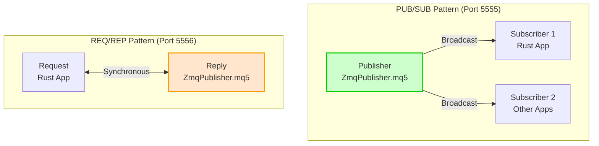

### Socket Configuration

**PUB Socket (EA Side)**:
```mql5
g_publisher = new CZmq();
g_publisher.Init(ZMQ_PUB);
g_publisher.Bind("tcp://0.0.0.0:5555");  // Bind to all interfaces
g_publisher.Send(json, true);            // Non-blocking send
```

**SUB Socket (Rust Side)**:
```rust
let mut socket = zeromq::SubSocket::new();
socket.connect("tcp://127.0.0.1:5555").await;  // Connect to localhost
socket.subscribe("").await;                     // Subscribe to all messages
let msg = socket.recv().await;                  // Blocking receive
```

**REP Socket (EA Side)**:
```mql5
g_responder = new CZmq();
g_responder.Init(ZMQ_REP);
g_responder.Bind("tcp://0.0.0.0:5556");     // Bind to all interfaces
string request = g_responder.Receive(true);  // Non-blocking receive
g_responder.Send(response, false);           // Blocking send (REP pattern)
```

**REQ Socket (Rust Side)**:
```rust
let mut socket = zeromq::ReqSocket::new();
socket.connect("tcp://127.0.0.1:5556").await;  // Connect to localhost
socket.send(json_request.into()).await;        // Blocking send
let msg = socket.recv().await;                  // Blocking receive
```

---

## Async Task Management

### Tokio Runtime Architecture

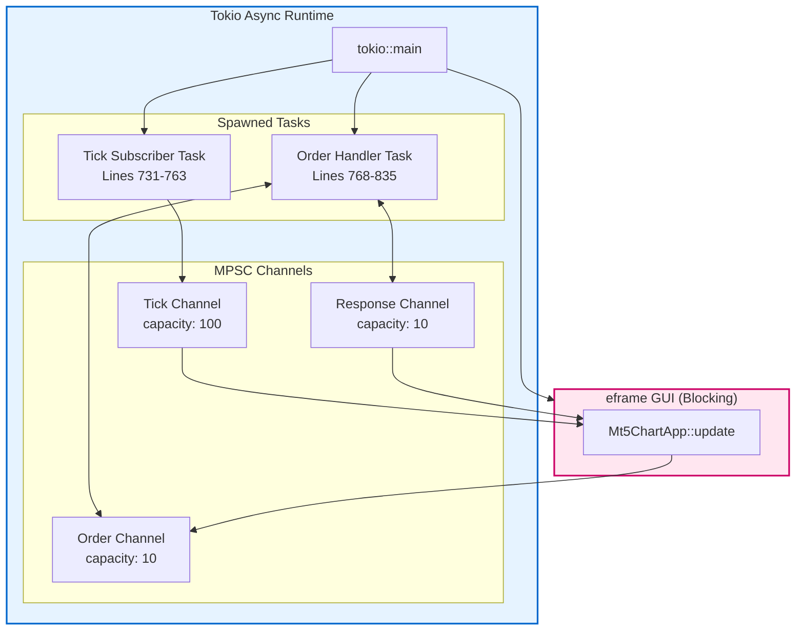

### Tick Subscriber Task (Lines 731-763)

```rust
tokio::spawn(async move {
    let mut socket = zeromq::SubSocket::new();
    match socket.connect("tcp://127.0.0.1:5555").await {
        Ok(_) => println!("Connected to ZMQ Tick Publisher on port 5555"),
        Err(e) => eprintln!("Failed to connect to ZMQ tick publisher: {}", e),
    }
    
    let _ = socket.subscribe("").await;

    loop {
        match socket.recv().await {
            Ok(msg) => {
                if let Some(payload_bytes) = msg.get(0) {
                    if let Ok(json_str) = std::str::from_utf8(payload_bytes) {
                        match serde_json::from_str::<TickData>(json_str) {
                            Ok(tick) => {
                                if let Err(e) = tick_tx.send(tick).await {
                                    eprintln!("Tick channel error: {}", e);
                                    break;
                                }
                            }
                            Err(e) => eprintln!("JSON Parse Error: {}. Msg: {}", e, json_str),
                        }
                    }
                }
            }
            Err(e) => {
                eprintln!("ZMQ Tick Recv Error: {}", e);
                tokio::time::sleep(tokio::time::Duration::from_millis(1000)).await;
            }
        }
    }
});
```

### Order Handler Task (Lines 768-835)

```rust
tokio::spawn(async move {
    let mut socket = zeromq::ReqSocket::new();
    match socket.connect("tcp://127.0.0.1:5556").await {
        Ok(_) => println!("Connected to ZMQ Order Handler on port 5556"),
        Err(e) => {
            eprintln!("Failed to connect to ZMQ order handler: {}", e);
            return;
        }
    }

    while let Some(order_request) = order_rx.recv().await {
        // Serialize order request to JSON
        let json_request = match serde_json::to_string(&order_request) {
            Ok(json) => json,
            Err(e) => {
                eprintln!("Failed to serialize order request: {}", e);
                continue;
            }
        };
        
        println!("Sending request: {}", json_request);
        
        // Send request (blocking in REQ/REP pattern)
        if let Err(e) = socket.send(json_request.into()).await {
            eprintln!("Failed to send: {}", e);
            let _ = response_tx.send(OrderResponse {
                success: false,
                ticket: None,
                error: Some(format!("Send failed: {}", e)),
                message: None,
            }).await;
            continue;
        }
        
        // Wait for response (blocking in REQ/REP pattern)
        match socket.recv().await {
            Ok(msg) => {
                if let Some(payload_bytes) = msg.get(0) {
                    if let Ok(json_str) = std::str::from_utf8(payload_bytes) {
                        println!("Received response: {}", json_str);
                        match serde_json::from_str::<OrderResponse>(json_str) {
                            Ok(response) => {
                                let _ = response_tx.send(response).await;
                            }
                            Err(e) => {
                                let _ = response_tx.send(OrderResponse {
                                    success: false,
                                    ticket: None,
                                    error: Some(format!("Parse error: {}", e)),
                                    message: None,
                                }).await;
                            }
                        }
                    }
                }
            }
            Err(e) => {
                eprintln!("Response recv error: {}", e);
                let _ = response_tx.send(OrderResponse {
                    success: false,
                    ticket: None,
                    error: Some(format!("Recv failed: {}", e)),
                    message: None,
                }).await;
            }
        }
    }
});
```

---

## File Structure & Dependencies

### Complete Directory Structure

```
SUM3API/
├── MQL5/
│   ├── Experts/
│   │   └── ZmqPublisher.mq5           # Main EA (451 lines, 19 KB)
│   ├── Include/
│   │   └── Zmq/
│   │       └── Zmq.mqh                # ZMQ wrapper (145 lines, 4 KB)
│   └── Libraries/
│       ├── libzmq.dll                 # ZeroMQ native library
│       └── libsodium.dll              # Crypto library (ZMQ dependency)
│
└── Rustmt5-chart/
    ├── Cargo.toml                     # Rust dependencies
    ├── Cargo.lock                     # Dependency lock file (117 KB)
    ├── src/
    │   └── main.rs                    # Main application (853 lines, 35 KB)
    ├── output/                        # CSV output directory
    │   ├── History_*.csv              # Downloaded historical data
    │   └── Live_*.csv                 # Live recorded tick data
    └── target/                        # Build artifacts
        ├── debug/                     # Debug build
        └── release/                   # Release build

```

### Dependency Graph

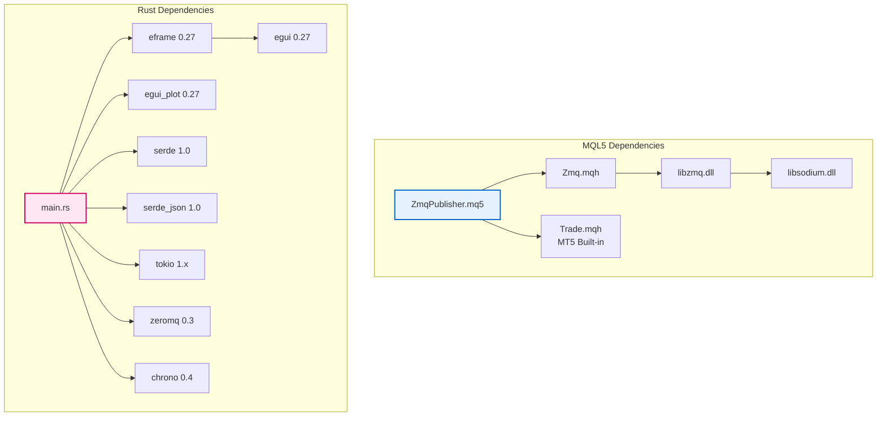

---

## Summary

This document provides a complete end-to-end technical specification of the MQL5 ↔ ZeroMQ ↔ Rust trading system, including:

**Security Architecture**: Credential-free design with session inheritance  
**Account Information Flow**: From MT5 API to Rust GUI  
**Complete Data Structures**: JSON formats and Rust/MQL5 types  
**Communication Patterns**: PUB/SUB and REQ/REP with sequence diagrams  
**Async Task Management**: Tokio runtime and channel architecture  
**Micro-level Implementation**: Line-by-line code references  
**File Structure**: Complete dependency graph  

**Key Security Advantage**: Unlike MT5's Python API which requires explicit credentials in code, this system leverages MT5's authenticated session, eliminating credential exposure entirely.

---

