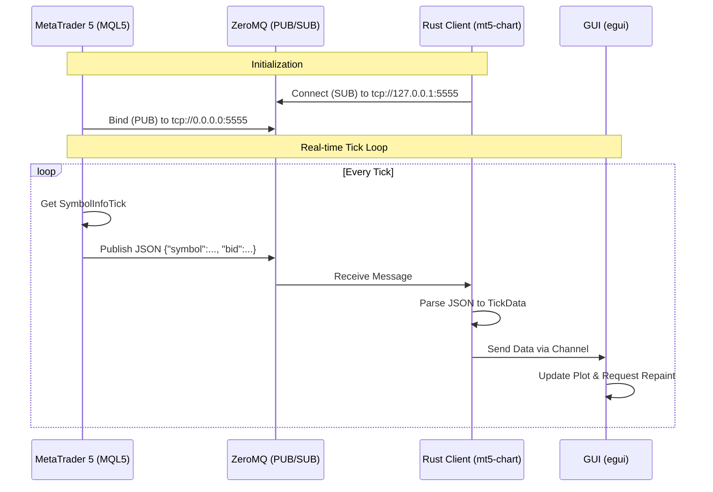

## Rust + ZMQ + MT5's MQL5: Exploiting Micro-Second BID/ASK Live Trading Data

The system operates on a publisher-subscriber model using ZeroMQ (ZMQ) to bridge MetaTrader 5 (via MQL5) and the external Rust application. To exploit micro-second BID/ASK live trading data to create a simple orderflow charting tool.


## 🌐 Software Demonstration

https://github.com/user-attachments/assets/71c51bb2-324b-4c97-ab0d-807a2c0d0d7c

### Mechanics
1.  **Publisher (MQL5)**:
    -   The `ZmqPublisher.mq5` Expert Advisor initializes a ZMQ **PUB** socket and binds it to `tcp://*:5555`.
    -   On every market tick (`OnTick()`), it retrieves the current Bid/Ask prices.
    -   It constructs a JSON object (e.g., `{"symbol": "XAUUSD", "bid": 2025.50, ...}`) and publishes it as a message.

2.  **Subscriber (Rust)**:
    -   The `mt5-chart` application initializes a ZMQ **SUB** socket and connects to `tcp://127.0.0.1:5555`.
    -   It runs an asynchronous Tokio task that listens for incoming ZMQ messages.
    -   Upon receiving a message, it deserializes the JSON data into a Rust struct (`TickData`).
    -   The data is sent via an internal channel (`mpsc`) to the GUI thread.
    -   The `eframe`/`egui` interface updates the chart and labels in real-time.

### Workflow Algorithm




---

## 🏆 Trivia

[](https://x.com/qsrsunstoic/status/2014165161381363739)
> **The very First**: Exploiting micro-second BID/ASK live trading data from **MetaTrader 5 (MT5)** using the specific combination of **Rust + ZeroMQ (ZMQ) + MetaQuotes Language (MQL5)**..

I was trying to make a trading orderflows platform, and I came up with an idea: why not use MT5 as datafeed for it? Unfortunately, there are no existing ideal projects I could use as a benchmark, hence I created my own. <br><br>
I've  worked on and made ~100+ Python trading projects, and I always use MT5 as datafeed, but I want faster; that is why I came up with using Rust as a solution, and ZMQ binding for MT5 is a common practice. In worse case sscenario, there are no _Rust + ZMQ + MT5_ combination projects existed in the world, which is pretty nuts. I didn't know it only existed in my head, Lmao. So I created it with the help of Google Antigravity.

This simple orderflow tool will serve as a benchmark for future projects.

## 🏆 A survey for AI leading platforms

Extensive research across GitHub, Hugging Face, and consultation with 9 leading AI models confirmed that no prior public projects utilizing this exact high-performance stack existed before this implementation.

**AI Survey Results**
> "no public projects combination of Rust, ZeroMQ (ZMQ), and MetaTrader 5 (MT5)."

**Proof**


<table align="center">
  <tr>
    <td align="center">
      <video 
        src="https://github.com/user-attachments/assets/18f9865c-39b8-40cd-a969-733c435621db" 
        controls 
        muted
        loop
      ></video>
    </td>
    <td align="center">
      <video 
        src="https://github.com/user-attachments/assets/ccff1713-6c14-46cc-94b0-a1831f4a8b0d" 
        controls 
        muted
        loop
      ></video>
    </td>
  </tr>
  <tr>
    <td align="center">
      <video 
        src="https://github.com/user-attachments/assets/e9631b52-e548-4224-8684-72aa282c70f0" 
        controls 
        muted
        loop
      ></video>
    </td>
    <td align="center">
      <video 
        src="https://github.com/user-attachments/assets/fe251361-1103-4c6b-b198-88134820a074" 
        controls 
        muted
        loop
      ></video>
    </td>
  </tr>
</table>


**Additional Validation**:
<table cellspacing="0" cellpadding="0">
  <tr>
    <td></td>
    <td></td>
    <td></td>
  </tr>
  <tr>
    <td></td>
    <td></td>
    <td></td>
  </tr>
  <tr>
    <td></td>
    <td></td>
    <td></td>
  </tr>
</table>


I used leading AI platforms (Grok, Gemini, Claude, ChatGPT, MSCopilot, Perplexity, Baidu (Ernie Bot), DeepSeek, Qwen) to validate my claim for _"**The very First**: Exploiting micro-second BID/ASK live trading data from **MetaTrader 5 (MT5)** using the specific combination of **Rust + ZeroMQ (ZMQ) + MetaQuotes Language (MQL5).**"_  

In addition, I ran nine different search combinations on each of four scholarly platforms: Arxiv, Google Scholar, SSRN, and Baidu Scholar. The detailed results are documented in [*scholar.md*](search/scholar.md).

*Visit my previous app to explore 284 AI platforms in one place, [AiQG](https://aiqg.vercel.app/)*  
<br>

During this process, some AI models produced hallucinated results. They suggested projects that only used partial pairs, such as Python with ZMQ or C++ with ZMQ, but never the full combination of all three components that I specified, namely Rust + ZMQ + MT5.

To correct this, I provided an explicit follow-up instruction stating ***"strictly those 3 combination"***. I then repeated the same query: ***"Show me GitHub or Hugging projects or any link that has 'Rust + ZMQ + MT5 combination' (strictly those 3), never miss a single link"***.

MetaTrader 5 uses MQL5 as its native language, which is built on C++. My objective was to extract live trading data from MT5 via ZMQ and process and visualize it in Rust to enable fast development of a high performance charting tool. After this clarification and repeated querying, all platforms returned the same conclusion.


> "no public projects combination of Rust, ZeroMQ (ZMQ), and MetaTrader 5 (MT5)."

Since no one did that combination, at least at the time of developing/writing *(Jan 20-21, 2026)*, I've decided to create one.

---

## 📂 Project Structure
These are the only necessary files that you need to have.

```graphql
Rust-ZMQ-MT5
├── MQL5                        # Relocate this (individual files) into MT5's literal path directory, located outside this repository
│   ├── Experts
│   │   └── ZmqPublisher.mq5    # The "Server": Publishes Tick Data via TCP
│   ├── Include
│   │   └── Zmq
│   │       └── Zmq.mqh         # ZMQ Wrapper Library for MQL5 (64-bit compatible)
│   └── Libraries
│       ├── libzmq.dll          # 64-bit ZeroMQ DLL (Required)
│       └── libsodium.dll       # Dependency for libzmq (Required)
├── mt5-chart                   # The "Client": Rust Desktop App
│   ├── src
│   │   └── main.rs             # Main Application Logic (Subscribes & Plots)
│   └── Cargo.toml              # Project Dependencies
└── README.md                   

```

---

## 🚀 Functionality

The system consists of two main components acting in a Publisher-Subscriber model data flow:

### 1. The Publisher (MetaTrader 5 / MQL5)
*   **Role**: The Data Source.
*   **Implementation**: An Expert Advisor (`ZmqPublisher.mq5`) utilizing a custom ZMQ wrapper (`Zmq.mqh`).
*   **Protocol**: Binds to a TCP HOST on port `5555`.
*   **Operation**: On every incoming tick (`OnTick` data event), it:
    *   Extracts Symbol, Bid price, Ask price, and Server Time.
    *   Serializes this data into a JSON string.
    *   Publishes it instantly to the ZMQ socket.

### 2. The Subscriber (Rust)
*   **Role**: The Data Consumer & Visualization.
*   **Implementation**: A high-performance GUI application built with `eframe` (egui).
*   **Protocol**: Connects to the TCP socket on `localhost:5555`.
*   **Operation**:
    *   **Asynchronous Data Ingestion**: A background `tokio` task listens for incoming ZMQ messages.
    *   **Deserialization**: Parses the raw JSON bytes into Rust `TickData` structs.
    *   **Real-time Plotting**: Updates an `egui_plot` chart at 60fps (or higher) to visualize the Bid/Ask spread in real-time.

---

## 🔧 Installation & Usage

### Prerequisites
*   **MetaTrader 5** Client [*link*](https://www.metatrader5.com/) and it must already be connected to a Broker (use whatever broker you like)
*   **Rust** (via `rustup`) [*link*](https://rust-lang.org/tools/install/) and configure its file path [*Link*](https://www.youtube.com/watch?v=2PmPWWTmfiU) on your computer.
*   **Visual Studio Build Tools (C++)** (Required for Rust Linker) [*link*](https://visualstudio.microsoft.com/visual-cpp-build-tools/) select the C++ Build tools (in my case I've downloaded 6gb)

### Step 1: MT5 Setup
1.  Copy `MQL5/Experts/ZmqPublisher.mq5` to your MT5 Data Folder's `MQL5/Experts/`. *(relocate outside this repository, into your MT5 literal path directory)*<br>
2.  Copy `MQL5/Include/Zmq/Zmq.mqh` to `MQL5/Include/Zmq/`. *(do the same for this)*<br>
3.  **Crucial**: Download `libzmq.dll` and `libsodium.dll` (64-bit versions) and place them in `MQL5/Libraries`.<br>
4.  Open the MT5 platform, look at the top of the screen. Go to **Tools -> Options -> Expert Advisors** and check **"Allow DLL imports"**.<br>
5.  Open the MetaEditor5. Go to **Navigator (Ctrl+d) -> Experts -> and find ZmqPublisher.mq5**.  Select and compile 'ZmqPublisher.mq5' once.<br>
6.  Go back to the MT5 platform. Drag and drop `ZmqPublisher` onto any chart.<br>
7.  Check. Go to **Toolbox (ctrl+t) -> Journal** section, check if it says *Success Message*: `ZmqPublisher bound to tcp://0.0.0.0:5555`

### Step 2: Rust Client Setup
1.  Open a terminal (for instance: Windows PowerShell, not a code editor like VS Code) in the `mt5-chart` folder. Or simply copy the file path
    ```bash
    cd mt5-chart

    # In my case, I will bash
    cd C:\Users\User\Desktop\VSCode\Rust-ZMQ-MT5\mt5-chart
    ```
3.  Then run the application using another bash:
    ```bash
    cargo run --release
    ```

---

## ⚠️ Common Errors & Troubleshooting

This project combines three distinct technologies (Rust, MQL5, ZeroMQ) across two different runtime environments (MetaTrader 5 and Windows Desktop). This complexity can lead to specific errors. Below is a comprehensive guide to resolving every known issue.

### 1. Critical: Antivirus & Terminal Permissions
**Symptom**: `Access Denied`, `Terminated`, or the Rust window appears and immediately closes.
*   **Cause**: Many Antivirus software (including Windows Defender) and built-in IDE terminals (like VS Code's integrated terminal) restrict programs from opening high-speed network sockets or interacting with other processes.
*   **Fix**:
    1.  **Do NOT use VS Code's Intergrated Terminal**. It often lacks the necessary permissions.
    2.  Open a **standalone** Windows PowerShell instance as Administrator.
    3.  Navigate to your project directory manually (`cd C:\Users\...\mt5-chart`).
    4.  Run `cargo run --release` from there.

### 2. MQL5: "Access Violation" / Crash on Load
**Symptom**: MetaTrader 5 crashes instantly when you drag the EA onto a chart, or the EA simply disappears from the chart "smiling face" icon.
*   **Cause**: **64-bit Pointer Truncation**. The original MQL5 language was often used on 32-bit systems where an `int` (4 bytes) was the same size as a pointer. On modern 64-bit MT5, pointers are 8 bytes (`long`). If you cast a pointer to an `int`, you lose half the memory address, causing an immediate crash when the program tries to access that invalid location.
*   **Fix**:
    *   Never use `int` for handles. Use `long` or `intptr_t`.
    *   Our provided `Zmq.mqh` has been patched to use `long` for all socket context and socket handles. Ensure you are completely replacing your old `Zmq.mqh` with the one from this repository.

### 3. MQL5: "Error 126" (Cannot Load Library)
**Symptom**: The Expert Advisor log shows `Cannot load 'libzmq.dll' [126]`.
*   **Cause**: This error means "Module Not Found". It happens for one of three reasons:
    1.  **Missing DLL**: You didn't put `libzmq.dll` in the `MQL5/Libraries` folder.
    2.  **Missing Dependency**: `libzmq.dll` itself depends on `libsodium.dll` and the **Visual C++ Redistributable**. If *those* are missing, `libzmq.dll` will fail to load, triggering the same header error.
    3.  **Architecture Mismatch**: You downloaded a 32-bit DLL for a 64-bit MT5 terminal (or vice versa).
*   **Fix**:
    *   Ensure both `libzmq.dll` AND `libsodium.dll` are in `MQL5/Libraries`.
    *   Ensure you downloaded the **x64 (64-bit)** versions of these DLLs.
    *   Install the latest **Microsoft Visual C++ Redistributable** (x64).

### 4. MQL5: "Error 22" (Invalid Argument) during Bind
**Symptom**: The EA loads, but the Journal says `ZmqPublisher: Bind failed with error 22`.
*   **Cause 1**: **Binding to Wildcard**. Defaulting to `tcp://*:5555` works on Linux but can fail on specific Windows network configurations or Firewall setups.
    *   **Fix**: Change the bind address in your code (or input settings) to `tcp://0.0.0.0:5555` to explicitly bind to all interfaces, or `tcp://127.0.0.1:5555` for local-only.
*   **Cause 2**: **String Encoding**. MQL5 uses `wchar_t` (Unicode) for strings internally. ZeroMQ demands C-style standard ASCII/UTF-8 strings. Passing a raw MQL string to the DLL sends garbage bytes.
    *   **Fix**: The `Zmq.mqh` wrapper must use `StringToCharArray` to convert the string to a byte array before passing it to `zmq_bind`.

### 5. MQL5: "DLL Imports Not Allowed"
**Symptom**: `Expert 'ZmqPublisher' cannot be loaded because DLL imports are not allowed`.
*   **Cause**: Security setting in MT5.
*   **Fix**: Go to **Tools -> Options -> Expert Advisors** and check the box **"Allow DLL imports"**. This is mandatory.

### 6. Rust: "Linker 'link.exe' not found"
**Symptom**: `cargo run` fails with a massive wall of red text mentioning `link.exe` or `msvc`.
*   **Cause**: Rust on Windows (MSVC version) relies on the Microsoft C++ Linker, which is not installed by default with Windows.
*   **Fix**:
    1.  Download the **Visual Studio Build Tools**.
    2.  In the installer, select **"Desktop development with C++"**.
    3.  Ensure the "MSVC ... -C++ x64/x86 build tools" component is checked on the right side.
    4.  Install (approx. 5-6GB).

### 7. Rust: "OS Error 32" (File used by another process)
**Symptom**: `error: linking with link.exe failed` or `Access is denied` when trying to run/build.
*   **Cause**: The compiled executable (`mt5-chart.exe`) is currently running, or is locked by:
    *   A previous instance that didn't close properly.
    *   The VS Code underlying process.
    *   Your Antivirus scanning the new `.exe`.
*   **Fix**:
    1.  **Close the GUI window** fully.
    2.  If it persists, open Task Manager and kill `mt5-chart.exe`.
    3.  Run `cargo clean` to wipe the locked artifact, then `cargo run --release` again.

### 8. Generic: ZeroMQ Message Format Mismatches
**Symptom**: Rust client connects but panics with `Error parsing JSON` or prints weird symbols.
*   **Cause**: The MQL5 Publisher and Rust Subscriber must agree *exactly* on the data format. If MQL5 sends `{"bid": ...}` but Rust expects `{"Bid": ...}` (case sensitivity) or if MQL5 sends a trailing null byte `\0` that JSON parsers hate.
*   **Fix**:
    *   Ensure the JSON structure key names match exactly.
    *   In Rust, strip the trailing null character if necessary: `msg.trim_matches(char::from(0))`.

### 9. Generic: "Address in Use" (EADDRINUSE)
**Symptom**: You restart the EA and it says `Bind failed`.
*   **Cause**: You cannot bind to port 5555 if something is already bound to it. Often, when you remove an EA, MT5 might not release the DLL handle instantly, keeping the socket open.
*   **Fix**: Restart the MetaTrader 5 terminal completely to force-close all DLL handles.

---

## 📜 Citation

If you use this project in your research or application, please cite it as follows:

```bibtex
@software{RustZmqMt5,
  author = {Albeos, Rembrant},
  title = {Rust + ZMQ + MT5's MQL5: Exploiting Micro-Second BID/ASK Live Trading Data},
  year = {2026},
  url = {https://github.com/algorembrant/Rust-ZMQ-MT5},
  note = {First known implementation for exploiting micro-second live BID/ASK trading data using Rust + ZMQ + MT5's MQL5}
}
```
