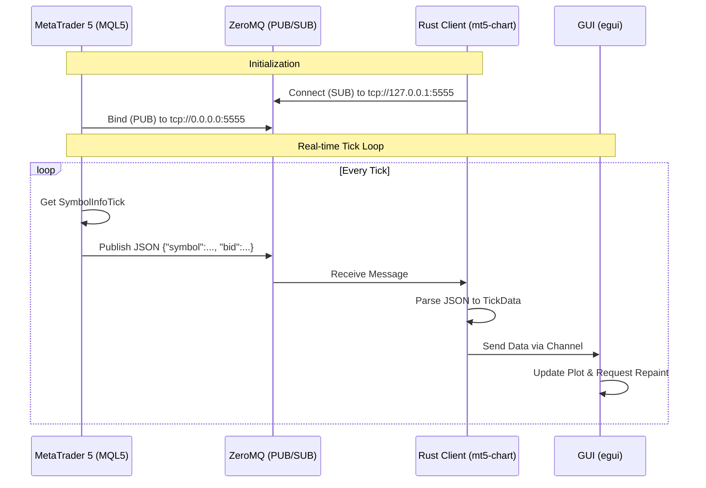

# Project Summary

## Techstack
- **Rust**: The core language for the client application (`mt5-chart`).
- **MQL5 (MetaQuotes Language 5)**: Used for the Expert Advisor on the MetaTrader 5 platform.
- **ZeroMQ (ZMQ)**: High-performance asynchronous messaging library used for communication between MT5 and Rust.
- **Bat/Shell**: Used for running build commands via PowerShell.

## Dependencies

### Rust (Client)
Defined in `mt5-chart/Cargo.toml`:
- **eframe** (0.27.1): Framework for writing GUI apps using `egui`.
- **egui** (0.27.1): Immediate mode GUI library.
- **egui_plot** (0.27.1): Plotting library for `egui`.
- **zeromq** (0.5.0-pre): Rust bindings for ZeroMQ.
- **serde** (1.0.197): Serialization/deserialization framework.
- **serde_json** (1.0.114): JSON support for Serde.
- **tokio** (1.36.0): Asynchronous runtime for Rust.
- **futures** (0.3.30): Utilities for asynchronous programming.

### MQL5 (Server)
- **Zmq.mqh**: Custom ZeroMQ wrapper library for MQL5.
- **libzmq.dll**: 64-bit ZeroMQ dynamic link library.
- **libsodium.dll**: Cryptography library required by `libzmq`.

## Applications
- **Visual Studio Code**: Code editor used for Rust development.
- **MetaTrader 5 (MT5)**: Trading platform running the MQL5 Expert Advisor.
- **MetaEditor 5**: IDE for compiling MQL5 scripts.
- **Visual Studio C++ Build Tools**: Required for compiling Rust on Windows (Linker).
- **Windows PowerShell**: Used for executing Cargo commands.
- **Google Gemini**: AI assistant used for project development aid.

## Project Structure & Files
- **MQL5/**: Contains the Publisher logic.
    - `Experts/ZmqPublisher.mq5`: The main EA publishing tick data.
    - `Include/Zmq/Zmq.mqh`: Helper library for ZMQ binding.
    - `Libraries/*.dll`: Required DLLs for ZMQ execution in MT5.
- **mt5-chart/**: Contains the Subscriber logic (Rust).
    - `src/main.rs`: Main entry point for the GUI and ZMQ subscriber.
    - `Cargo.toml`: Rust package configuration.
- **Documentation**:
    - `README.md`: Project documentation.

## Mechanics & Workflow

The system operates on a Publisher-Subscriber model using ZeroMQ (ZMQ) to bridge MetaTrader 5 (MQL5) and the external Rust application.

### Data Flow
1.  **Publisher (MQL5)**:
    -   The `ZmqPublisher.mq5` Expert Advisor initializes a ZMQ **PUB** socket and binds it to `tcp://*:5555`.
    -   On every market tick (`OnTick()`), it retrieves the current Bid/Ask prices.
    -   It constructs a JSON object (e.g., `{"symbol": "XAUUSD", "bid": 2025.50, ...}`) and publishes it as a message.

2.  **Subscriber (Rust)**:
    -   The `mt5-chart` application initializes a ZMQ **SUB** socket and connects to `tcp://127.0.0.1:5555`.
    -   It runs an asynchronous Tokio task that listens for incoming ZMQ messages.
    -   Upon receiving a message, it deserializes the JSON data into a Rust struct (`TickData`).
    -   The data is sent via an internal channel (`mpsc`) to the GUI thread.
    -   The `eframe`/`egui` interface updates the chart and labels in real-time.

### Workflow Algorithm

