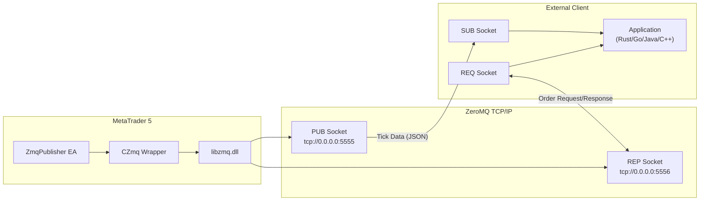
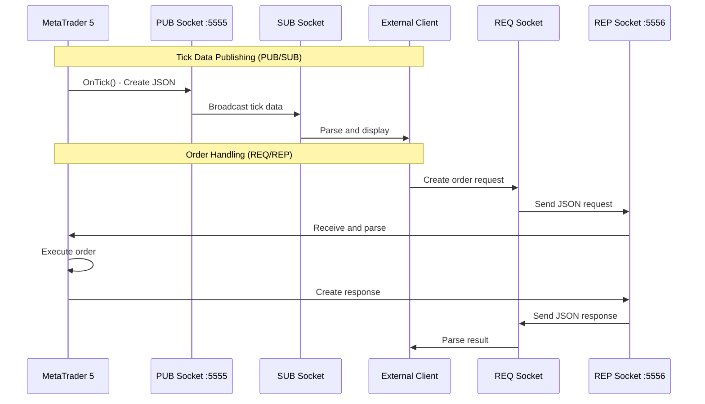
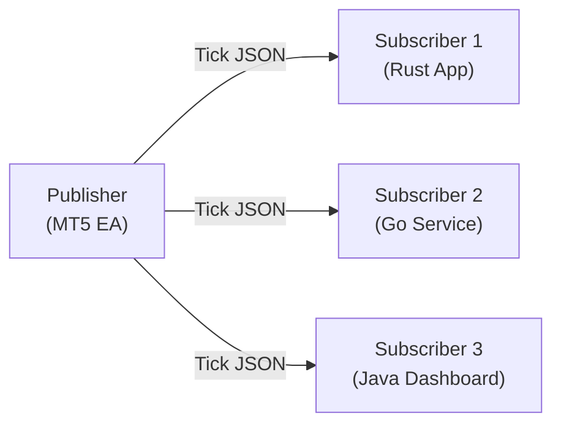
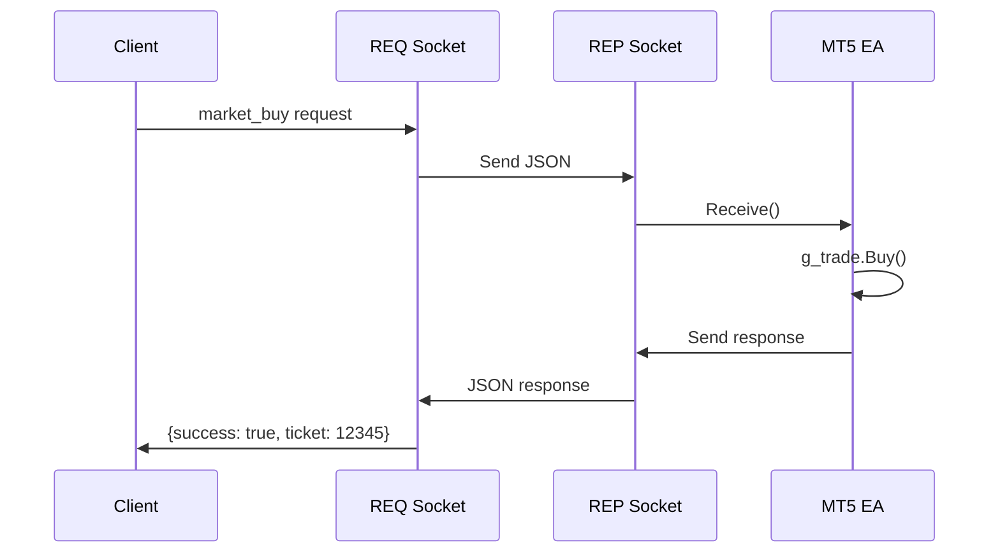

# MQL5 ZeroMQ Wrapper Library

A comprehensive reusable MQL5 wrapper library for ZeroMQ socket operations, designed for real-time communication between MetaTrader 5 and external applications.

---

## Table of Contents

1. [Overview](#overview)
2. [Architecture](#architecture)
3. [Prerequisites and Installation](#prerequisites-and-installation)
4. [API Reference](#api-reference)
5. [Usage Guide](#usage-guide)
6. [Socket Patterns](#socket-patterns)
7. [Message Protocol](#message-protocol)
8. [Complete Examples](#complete-examples)
9. [Error Handling](#error-handling)
10. [Best Practices](#best-practices)
11. [Troubleshooting](#troubleshooting)

---

## Overview

This library provides a high-level MQL5 wrapper around the native ZeroMQ (libzmq) library, enabling MetaTrader 5 Expert Advisors and indicators to communicate with external applications via TCP sockets.

> [!NOTE]
> For the companion Rust client library, see [Rust-ZMQ Library for SUM3API](Rust-ZMQ%20Library%20for%20SUM3API.md).

### Key Features

- **Simple API**: Object-oriented wrapper class with intuitive methods
- **Multiple Socket Types**: Support for PUB, SUB, REQ, and REP patterns
- **Non-blocking Operations**: Configurable blocking/non-blocking send and receive
- **UTF-8 Support**: Automatic string encoding/decoding
- **Resource Management**: Automatic cleanup on destruction

### Supported Socket Types

| Constant | Value | Description |
|----------|-------|-------------|
| `ZMQ_PUB` | 1 | Publisher socket for broadcasting messages |
| `ZMQ_SUB` | 2 | Subscriber socket for receiving broadcasts |
| `ZMQ_REQ` | 3 | Request socket for request/reply pattern (client) |
| `ZMQ_REP` | 4 | Reply socket for request/reply pattern (server) |

---

## Architecture

### System Overview



### Communication Flow



### Pattern Details

1. **Tick Data Publishing** (PUB/SUB Pattern)
   - EA binds PUB socket to `tcp://0.0.0.0:5555`
   - External client subscribes via SUB socket
   - EA publishes tick data as JSON on every tick

2. **Order Handling** (REQ/REP Pattern)
   - EA binds REP socket to `tcp://0.0.0.0:5556`
   - External client sends order requests via REQ socket
   - EA processes orders and sends responses

---

## Prerequisites and Installation

### Required Files

Place the following files in your MetaTrader 5 installation directory:

```
MQL5/
  |-- Libraries/
  |     |-- libzmq.dll          # ZeroMQ core library
  |     |-- libsodium.dll       # Cryptographic dependency for libzmq
  |
  |-- Include/
  |     |-- Zmq/
  |           |-- Zmq.mqh       # MQL5 wrapper class
  |
  |-- Experts/
        |-- ZmqPublisher.mq5    # Example Expert Advisor
```

### Installation Steps

1. **Download ZeroMQ Libraries**
   - Download `libzmq.dll` (v4.3.x or later) from [ZeroMQ releases](https://github.com/zeromq/libzmq/releases)
   - Download `libsodium.dll` from [libsodium releases](https://github.com/jedisct1/libsodium/releases)
   - Both DLLs must be the same architecture (x64 for 64-bit MT5)

2. **Copy Files**
   ```
   Copy libzmq.dll    --> MQL5/Libraries/
   Copy libsodium.dll --> MQL5/Libraries/
   Copy Zmq.mqh       --> MQL5/Include/Zmq/
   ```

3. **Enable DLL Imports in MetaTrader 5**
   - Go to `Tools > Options > Expert Advisors`
   - Enable "Allow DLL imports"
   - Disable "Allow DLL imports only for signed DLLs" (or sign the DLLs)

4. **Compile Your EA**
   - Open MetaEditor
   - Include the wrapper: `#include <Zmq/Zmq.mqh>`
   - Compile your Expert Advisor

---

## API Reference

### Class: CZmq

The main wrapper class for ZeroMQ operations.

#### Constructor and Destructor

```cpp
CZmq()
```
Creates a new CZmq instance. Does not initialize any ZMQ resources.

```cpp
~CZmq()
```
Destructor. Automatically calls `Shutdown()` to clean up resources.

---

#### Init

```cpp
bool Init(int type)
```

Initializes the ZeroMQ context and creates a socket of the specified type.

**Parameters:**
| Name | Type | Description |
|------|------|-------------|
| `type` | `int` | Socket type: `ZMQ_PUB`, `ZMQ_SUB`, `ZMQ_REQ`, or `ZMQ_REP` |

**Returns:**
- `true` if initialization succeeded
- `false` if context or socket creation failed

**Example:**
```cpp
CZmq *publisher = new CZmq();
if(!publisher.Init(ZMQ_PUB)) {
    Print("Failed to initialize ZMQ publisher");
    return INIT_FAILED;
}
```

---

#### Bind

```cpp
bool Bind(string endpoint)
```

Binds the socket to a local endpoint. Typically used by server-side sockets (PUB, REP).

**Parameters:**
| Name | Type | Description |
|------|------|-------------|
| `endpoint` | `string` | ZMQ endpoint URL (e.g., `"tcp://0.0.0.0:5555"`) |

**Returns:**
- `true` if binding succeeded
- `false` if binding failed (check logs for error code)

**Endpoint Formats:**
| Format | Description |
|--------|-------------|
| `tcp://*:5555` | Bind to all interfaces on port 5555 |
| `tcp://0.0.0.0:5555` | Same as above |
| `tcp://127.0.0.1:5555` | Bind to localhost only |
| `ipc:///tmp/socket` | Inter-process communication (Unix only) |

**Example:**
```cpp
if(!publisher.Bind("tcp://0.0.0.0:5555")) {
    Print("Failed to bind to port 5555");
    return INIT_FAILED;
}
```

---

#### Connect

```cpp
bool Connect(string endpoint)
```

Connects the socket to a remote endpoint. Typically used by client-side sockets (SUB, REQ).

**Parameters:**
| Name | Type | Description |
|------|------|-------------|
| `endpoint` | `string` | ZMQ endpoint URL (e.g., `"tcp://127.0.0.1:5555"`) |

**Returns:**
- `true` if connection initiated successfully
- `false` if connection failed

**Example:**
```cpp
CZmq *subscriber = new CZmq();
subscriber.Init(ZMQ_SUB);
if(!subscriber.Connect("tcp://127.0.0.1:5555")) {
    Print("Failed to connect to publisher");
}
```

---

#### Send

```cpp
int Send(string message, bool nonBlocking = true)
```

Sends a string message through the socket.

**Parameters:**
| Name | Type | Description |
|------|------|-------------|
| `message` | `string` | The message to send (UTF-8 encoded) |
| `nonBlocking` | `bool` | If `true`, returns immediately. If `false`, blocks until sent. Default: `true` |

**Returns:**
- Number of bytes sent on success
- `-1` on failure

**Example:**
```cpp
string json = "{\"symbol\":\"EURUSD\",\"bid\":1.1234}";
int bytes = publisher.Send(json, false);  // Blocking send
if(bytes < 0) {
    Print("Send failed");
}
```

---

#### Receive

```cpp
string Receive(bool nonBlocking = true)
```

Receives a message from the socket.

**Parameters:**
| Name | Type | Description |
|------|------|-------------|
| `nonBlocking` | `bool` | If `true`, returns immediately with empty string if no message. If `false`, blocks until message received. Default: `true` |

**Returns:**
- Received message as string on success
- Empty string `""` if no message available (non-blocking) or on error

**Buffer Size:**
- Maximum receive buffer is 4096 bytes
- For larger messages, modify the `buffer[4096]` in `Zmq.mqh`

**Example:**
```cpp
// Non-blocking receive (polling)
string msg = responder.Receive(true);
if(msg != "") {
    Print("Received: ", msg);
}

// Blocking receive (waits for message)
string msg = requester.Receive(false);
```

---

#### Shutdown

```cpp
void Shutdown()
```

Closes the socket and terminates the ZMQ context. Should be called during cleanup.

**Example:**
```cpp
void OnDeinit(const int reason) {
    if(g_publisher != NULL) {
        g_publisher.Shutdown();
        delete g_publisher;
        g_publisher = NULL;
    }
}
```

---

## Usage Guide

### Step 1: Include the Library

```cpp
#include <Zmq/Zmq.mqh>
```

### Step 2: Declare Global Instance

```cpp
CZmq *g_publisher;  // Declare as pointer for proper lifecycle management
```

### Step 3: Initialize in OnInit()

```cpp
int OnInit() {
    g_publisher = new CZmq();
    
    if(!g_publisher.Init(ZMQ_PUB)) {
        Print("ZMQ initialization failed");
        return INIT_FAILED;
    }
    
    if(!g_publisher.Bind("tcp://0.0.0.0:5555")) {
        Print("ZMQ bind failed");
        return INIT_FAILED;
    }
    
    Print("ZMQ Publisher ready on port 5555");
    return INIT_SUCCEEDED;
}
```

### Step 4: Use in OnTick()

```cpp
void OnTick() {
    MqlTick tick;
    if(SymbolInfoTick(_Symbol, tick)) {
        string json;
        StringConcatenate(json, 
            "{\"symbol\":\"", _Symbol, 
            "\",\"bid\":", DoubleToString(tick.bid, _Digits),
            ",\"ask\":", DoubleToString(tick.ask, _Digits), 
            "}");
        
        g_publisher.Send(json);
    }
}
```

### Step 5: Cleanup in OnDeinit()

```cpp
void OnDeinit(const int reason) {
    if(g_publisher != NULL) {
        g_publisher.Shutdown();
        delete g_publisher;
        g_publisher = NULL;
    }
}
```

---

## Socket Patterns

### PUB/SUB Pattern (One-to-Many Broadcasting)



Used for real-time data streaming where the publisher broadcasts to all connected subscribers.

**MQL5 Side (Publisher):**
```cpp
CZmq *publisher = new CZmq();
publisher.Init(ZMQ_PUB);
publisher.Bind("tcp://0.0.0.0:5555");

// In OnTick
publisher.Send("{\"bid\": 1.1234}");
```

**Rust Client Side (Subscriber):**
```rust
use zeromq::{Socket, SubSocket};

let mut socket = SubSocket::new();
socket.connect("tcp://127.0.0.1:5555").await?;
socket.subscribe("").await?;  // Subscribe to all messages

loop {
    let msg = socket.recv().await?;
    println!("Received: {:?}", msg);
}
```

**Go Client Side (Subscriber):**
```go
package main

import (
    "fmt"
    zmq "github.com/pebbe/zmq4"
)

func main() {
    subscriber, _ := zmq.NewSocket(zmq.SUB)
    defer subscriber.Close()
    
    subscriber.Connect("tcp://127.0.0.1:5555")
    subscriber.SetSubscribe("")  // Subscribe to all messages
    
    for {
        msg, _ := subscriber.Recv(0)
        fmt.Printf("Received: %s\n", msg)
    }
}
```

---

### REQ/REP Pattern (Request-Reply)



Used for command-response communication, such as order execution.

**MQL5 Side (Responder):**
```cpp
CZmq *responder = new CZmq();
responder.Init(ZMQ_REP);
responder.Bind("tcp://0.0.0.0:5556");

// In OnTick (non-blocking poll)
string request = responder.Receive(true);
if(request != "") {
    // Process request
    string response = ProcessOrderRequest(request);
    responder.Send(response, false);  // Blocking send required for REP
}
```

**Rust Client Side (Requester):**
```rust
use zeromq::{Socket, ReqSocket};

let mut socket = ReqSocket::new();
socket.connect("tcp://127.0.0.1:5556").await?;

// Send order request
let request = r#"{"type":"market_buy","symbol":"EURUSD","volume":0.01}"#;
socket.send(request.into()).await?;

// Wait for response
let response = socket.recv().await?;
println!("Response: {:?}", response);
```

**Go Client Side (Requester):**
```go
package main

import (
    "fmt"
    zmq "github.com/pebbe/zmq4"
)

func main() {
    requester, _ := zmq.NewSocket(zmq.REQ)
    defer requester.Close()
    
    requester.Connect("tcp://127.0.0.1:5556")
    
    // Send order request
    request := `{"type":"market_buy","symbol":"EURUSD","volume":0.01}`
    requester.Send(request, 0)
    
    // Wait for response
    response, _ := requester.Recv(0)
    fmt.Printf("Response: %s\n", response)
}
```

---

## Message Protocol

### Tick Data Message (PUB Socket)

Published on every tick from MQL5 to connected subscribers.

```json
{
    "symbol": "XAUUSDc",
    "bid": 2345.67,
    "ask": 2345.89,
    "time": 1706400000,
    "volume": 100,
    "balance": 10000.00,
    "equity": 10150.50,
    "margin": 500.00,
    "free_margin": 9650.50,
    "min_lot": 0.01,
    "max_lot": 100.00,
    "lot_step": 0.01,
    "positions": [
        {
            "ticket": 12345,
            "type": "BUY",
            "volume": 0.10,
            "price": 2340.50,
            "profit": 15.25
        }
    ],
    "orders": [
        {
            "ticket": 12346,
            "type": "BUY LIMIT",
            "volume": 0.05,
            "price": 2330.00
        }
    ]
}
```

### Order Request Message (REQ Socket)

Sent from external client to MQL5 for order execution.

**Market Order:**
```json
{
    "type": "market_buy",
    "symbol": "XAUUSDc",
    "volume": 0.01,
    "price": 0
}
```

**Limit Order:**
```json
{
    "type": "limit_buy",
    "symbol": "XAUUSDc",
    "volume": 0.01,
    "price": 2340.00
}
```

**Close Position:**
```json
{
    "type": "close_position",
    "ticket": 12345
}
```

**Cancel Order:**
```json
{
    "type": "cancel_order",
    "ticket": 12346
}
```

**Download History:**
```json
{
    "type": "download_history",
    "symbol": "XAUUSDc",
    "timeframe": "M1",
    "start": "2024.01.01",
    "end": "2024.01.31",
    "mode": "OHLC"
}
```

### Order Response Message (REP Socket)

Sent from MQL5 back to the client.

**Success:**
```json
{
    "success": true,
    "ticket": 12347
}
```

**Failure:**
```json
{
    "success": false,
    "error": "Error 10019: Not enough money"
}
```

### Supported Order Types

| Type String | Description |
|-------------|-------------|
| `market_buy` | Execute market buy order |
| `market_sell` | Execute market sell order |
| `limit_buy` | Place buy limit pending order |
| `limit_sell` | Place sell limit pending order |
| `stop_buy` | Place buy stop pending order |
| `stop_sell` | Place sell stop pending order |
| `close_position` | Close existing position by ticket |
| `cancel_order` | Delete pending order by ticket |
| `download_history` | Request historical data download |

---

## Complete Examples

### Example 1: Simple Tick Publisher

```cpp
//+------------------------------------------------------------------+
//|                                           SimpleTickPublisher.mq5 |
//+------------------------------------------------------------------+
#include <Zmq/Zmq.mqh>

input string InpAddress = "tcp://0.0.0.0:5555";

CZmq *g_publisher;

int OnInit() {
    g_publisher = new CZmq();
    
    if(!g_publisher.Init(ZMQ_PUB)) {
        Print("Failed to init ZMQ");
        return INIT_FAILED;
    }
    
    if(!g_publisher.Bind(InpAddress)) {
        Print("Failed to bind");
        return INIT_FAILED;
    }
    
    Print("Publisher ready on ", InpAddress);
    return INIT_SUCCEEDED;
}

void OnDeinit(const int reason) {
    if(g_publisher != NULL) {
        g_publisher.Shutdown();
        delete g_publisher;
    }
}

void OnTick() {
    MqlTick tick;
    if(SymbolInfoTick(_Symbol, tick)) {
        string json;
        StringConcatenate(json,
            "{\"symbol\":\"", _Symbol,
            "\",\"bid\":", DoubleToString(tick.bid, _Digits),
            ",\"ask\":", DoubleToString(tick.ask, _Digits),
            ",\"time\":", IntegerToString(tick.time),
            "}");
        
        g_publisher.Send(json);
    }
}
```

### Example 2: Order Executor Service

```cpp
//+------------------------------------------------------------------+
//|                                              OrderExecutor.mq5    |
//+------------------------------------------------------------------+
#include <Zmq/Zmq.mqh>
#include <Trade/Trade.mqh>

input string InpAddress = "tcp://0.0.0.0:5556";

CZmq *g_responder;
CTrade g_trade;

int OnInit() {
    g_responder = new CZmq();
    
    if(!g_responder.Init(ZMQ_REP))
        return INIT_FAILED;
    
    if(!g_responder.Bind(InpAddress))
        return INIT_FAILED;
    
    g_trade.SetDeviationInPoints(10);
    
    Print("Order executor ready on ", InpAddress);
    return INIT_SUCCEEDED;
}

void OnDeinit(const int reason) {
    if(g_responder != NULL) {
        g_responder.Shutdown();
        delete g_responder;
    }
}

void OnTick() {
    // Non-blocking receive
    string request = g_responder.Receive(true);
    
    if(request == "") return;
    
    Print("Request: ", request);
    
    // Parse and execute (simplified)
    string response;
    if(StringFind(request, "market_buy") >= 0) {
        double ask = SymbolInfoDouble(_Symbol, SYMBOL_ASK);
        if(g_trade.Buy(0.01, _Symbol, ask)) {
            StringConcatenate(response, 
                "{\"success\":true,\"ticket\":", 
                IntegerToString(g_trade.ResultOrder()), "}");
        } else {
            response = "{\"success\":false,\"error\":\"Buy failed\"}";
        }
    } else {
        response = "{\"success\":false,\"error\":\"Unknown command\"}";
    }
    
    g_responder.Send(response, false);  // Blocking send for REP
    Print("Response: ", response);
}
```

### Example 3: Rust Client (Complete)

```rust
// Cargo.toml dependencies:
// zeromq = "0.3"
// tokio = { version = "1", features = ["full"] }
// serde = { version = "1", features = ["derive"] }
// serde_json = "1"

use serde::{Deserialize, Serialize};
use tokio::sync::mpsc;
use zeromq::{Socket, SocketRecv, SocketSend};

#[derive(Debug, Deserialize)]
struct TickData {
    symbol: String,
    bid: f64,
    ask: f64,
    time: i64,
}

#[derive(Debug, Serialize)]
struct OrderRequest {
    #[serde(rename = "type")]
    order_type: String,
    symbol: String,
    volume: f64,
}

#[tokio::main]
async fn main() -> Result<(), Box<dyn std::error::Error>> {
    // Subscribe to tick data
    let (tx, mut rx) = mpsc::channel::<TickData>(100);
    
    tokio::spawn(async move {
        let mut socket = zeromq::SubSocket::new();
        socket.connect("tcp://127.0.0.1:5555").await.unwrap();
        socket.subscribe("").await.unwrap();
        
        loop {
            if let Ok(msg) = socket.recv().await {
                if let Some(bytes) = msg.get(0) {
                    if let Ok(json) = std::str::from_utf8(bytes) {
                        if let Ok(tick) = serde_json::from_str::<TickData>(json) {
                            let _ = tx.send(tick).await;
                        }
                    }
                }
            }
        }
    });
    
    // Process ticks
    while let Some(tick) = rx.recv().await {
        println!("{}: Bid={}, Ask={}", tick.symbol, tick.bid, tick.ask);
    }
    
    Ok(())
}
```

### Example 4: Java Client (Complete)

```java
// Maven dependency: org.zeromq:jeromq:0.5.3
import org.zeromq.SocketType;
import org.zeromq.ZContext;
import org.zeromq.ZMQ;
import com.google.gson.Gson;

public class MT5Client {
    private ZContext context;
    private ZMQ.Socket subscriber;
    private ZMQ.Socket requester;
    private Gson gson = new Gson();
    
    public MT5Client(int tickPort, int orderPort) {
        context = new ZContext();
        
        // Subscriber for tick data
        subscriber = context.createSocket(SocketType.SUB);
        subscriber.connect("tcp://127.0.0.1:" + tickPort);
        subscriber.subscribe("".getBytes());
        
        // Requester for orders
        requester = context.createSocket(SocketType.REQ);
        requester.connect("tcp://127.0.0.1:" + orderPort);
    }
    
    public void startTickStream() {
        new Thread(() -> {
            while (!Thread.currentThread().isInterrupted()) {
                String msg = subscriber.recvStr(ZMQ.DONTWAIT);
                if (msg != null) {
                    TickData tick = gson.fromJson(msg, TickData.class);
                    System.out.printf("%s: Bid=%.5f, Ask=%.5f%n", 
                        tick.symbol, tick.bid, tick.ask);
                }
                try { Thread.sleep(1); } catch (InterruptedException e) { break; }
            }
        }).start();
    }
    
    public OrderResponse sendOrder(String type, String symbol, double volume) {
        OrderRequest request = new OrderRequest(type, symbol, volume);
        requester.send(gson.toJson(request));
        String response = requester.recvStr();
        return gson.fromJson(response, OrderResponse.class);
    }
    
    public void close() {
        context.close();
    }
    
    // Data classes
    static class TickData {
        String symbol;
        double bid, ask;
        long time;
    }
    
    static class OrderRequest {
        String type, symbol;
        double volume;
        OrderRequest(String t, String s, double v) { type=t; symbol=s; volume=v; }
    }
    
    static class OrderResponse {
        boolean success;
        Long ticket;
        String error;
    }
    
    public static void main(String[] args) {
        MT5Client client = new MT5Client(5555, 5556);
        client.startTickStream();
        
        // Execute a buy order
        OrderResponse response = client.sendOrder("market_buy", "EURUSD", 0.01);
        System.out.println("Order result: " + response.success);
    }
}
```

### Example 5: C++ Client (Complete)

```cpp
// Requires: libzmq, cppzmq, nlohmann/json
// Compile: g++ -std=c++17 -o mt5_client mt5_client.cpp -lzmq -lpthread

#include <zmq.hpp>
#include <nlohmann/json.hpp>
#include <iostream>
#include <thread>
#include <atomic>

using json = nlohmann::json;

class MT5Client {
private:
    zmq::context_t context;
    zmq::socket_t subscriber;
    zmq::socket_t requester;
    std::atomic<bool> running{false};
    std::thread tick_thread;

public:
    MT5Client(int tick_port = 5555, int order_port = 5556)
        : context(1), subscriber(context, zmq::socket_type::sub),
          requester(context, zmq::socket_type::req) {
        
        subscriber.connect("tcp://127.0.0.1:" + std::to_string(tick_port));
        subscriber.set(zmq::sockopt::subscribe, "");
        
        requester.connect("tcp://127.0.0.1:" + std::to_string(order_port));
    }
    
    void start_tick_stream() {
        running = true;
        tick_thread = std::thread([this]() {
            while (running) {
                zmq::message_t message;
                auto result = subscriber.recv(message, zmq::recv_flags::dontwait);
                if (result) {
                    std::string msg(static_cast<char*>(message.data()), message.size());
                    json tick = json::parse(msg);
                    std::cout << tick["symbol"].get<std::string>() 
                              << ": Bid=" << tick["bid"].get<double>()
                              << ", Ask=" << tick["ask"].get<double>() << std::endl;
                }
                std::this_thread::sleep_for(std::chrono::milliseconds(1));
            }
        });
    }
    
    json send_order(const std::string& type, const std::string& symbol, double volume) {
        json request = {{"type", type}, {"symbol", symbol}, {"volume", volume}};
        std::string req_str = request.dump();
        
        zmq::message_t req_msg(req_str.begin(), req_str.end());
        requester.send(req_msg, zmq::send_flags::none);
        
        zmq::message_t reply;
        requester.recv(reply);
        
        std::string reply_str(static_cast<char*>(reply.data()), reply.size());
        return json::parse(reply_str);
    }
    
    json market_buy(const std::string& symbol, double volume) {
        return send_order("market_buy", symbol, volume);
    }
    
    json market_sell(const std::string& symbol, double volume) {
        return send_order("market_sell", symbol, volume);
    }
    
    void stop() {
        running = false;
        if (tick_thread.joinable()) tick_thread.join();
    }
    
    ~MT5Client() { stop(); }
};

int main() {
    MT5Client client;
    client.start_tick_stream();
    
    // Execute a buy order
    json response = client.market_buy("EURUSD", 0.01);
    std::cout << "Order result: " << response.dump() << std::endl;
    
    // Keep running
    std::this_thread::sleep_for(std::chrono::seconds(60));
    return 0;
}
```

---

## Error Handling

### ZMQ Error Codes

The library uses `zmq_errno()` to retrieve error codes. Common errors:

| Error Code | Description | Solution |
|------------|-------------|----------|
| 11 | EAGAIN (resource unavailable) | Normal for non-blocking ops when no data |
| 48 | EADDRINUSE (address in use) | Port already bound, use different port |
| 111 | ECONNREFUSED | Remote endpoint not available |
| 156384713 | ETERM (context terminated) | ZMQ context was terminated |

### Defensive Programming

```cpp
// Always check initialization
if(!g_publisher.Init(ZMQ_PUB)) {
    Print("ZMQ Init failed");
    return INIT_FAILED;
}

// Always check bind/connect
if(!g_publisher.Bind("tcp://0.0.0.0:5555")) {
    Print("ZMQ Bind failed, errno: ", zmq_errno());
    g_publisher.Shutdown();
    return INIT_FAILED;
}

// Handle empty receive gracefully
string msg = g_responder.Receive(true);
if(msg == "") {
    // No message available, continue
    return;
}
```

---

## Best Practices

### 1. Resource Management

Always use pointers and proper cleanup:

```cpp
CZmq *g_socket = NULL;  // Initialize to NULL

int OnInit() {
    g_socket = new CZmq();
    // ... init and bind
}

void OnDeinit(const int reason) {
    if(g_socket != NULL) {
        g_socket.Shutdown();
        delete g_socket;
        g_socket = NULL;
    }
}
```

### 2. Non-Blocking in OnTick()

Never use blocking operations in `OnTick()` - they will freeze the terminal:

```cpp
void OnTick() {
    // GOOD: Non-blocking receive
    string msg = g_responder.Receive(true);
    
    // BAD: This would freeze the terminal
    // string msg = g_responder.Receive(false);
}
```

### 3. REQ/REP Pattern Compliance

The REP socket must always send a reply after receiving a request:

```cpp
void OnTick() {
    string request = g_responder.Receive(true);
    if(request != "") {
        // MUST send response for every request
        string response = ProcessRequest(request);
        g_responder.Send(response, false);  // Use blocking send
    }
}
```

### 4. Buffer Size Considerations

The default receive buffer is 4096 bytes. For larger messages:

```cpp
// In Zmq.mqh, modify:
uchar buffer[16384];  // Increase to 16KB
```

### 5. JSON Message Construction

Use `StringConcatenate` for efficient string building:

```cpp
string json;
StringConcatenate(json,
    "{\"symbol\":\"", _Symbol,
    "\",\"value\":", DoubleToString(value, 5),
    "}");
```

---

## Troubleshooting

### Common Issues

**Issue: "dll imports are not allowed"**
- Solution: Enable `Allow DLL imports` in Tools > Options > Expert Advisors

**Issue: "Cannot load library 'libzmq.dll'"**
- Solution: Ensure libzmq.dll is in MQL5/Libraries/ folder
- Solution: Ensure libsodium.dll is also present (dependency)
- Solution: Verify DLLs are 64-bit if using 64-bit MT5

**Issue: "ZMQ Bind failed"**
- Solution: Check if port is already in use
- Solution: Try a different port number
- Solution: Ensure firewall allows the port

**Issue: No data received on subscriber**
- Solution: Ensure subscriber connects AFTER publisher binds
- Solution: Add a small delay after connect before expecting data
- Solution: Verify network connectivity

**Issue: "Request not answered" on REQ socket**
- Solution: Ensure REP socket always sends a response for every receive
- Solution: Check for crashes in request processing logic

### Debug Logging

Add print statements to trace execution:

```cpp
void OnTick() {
    string request = g_responder.Receive(true);
    if(request != "") {
        Print("Received request: ", request);
        
        string response = ProcessRequest(request);
        Print("Sending response: ", response);
        
        int sent = g_responder.Send(response, false);
        Print("Bytes sent: ", sent);
    }
}
```

---

## Version History

| Version | Date | Changes |
|---------|------|---------|
| 2.00 | 2026-01-27 | Added REP socket support, order handling, account info streaming |
| 1.00 | 2024-01-01 | Initial release with PUB socket support |

---

## License

Copyright 2026, Algorembrant. All rights reserved.

---

## References

- [ZeroMQ Official Documentation](https://zeromq.org/get-started/)
- [ZeroMQ Socket Types Guide](https://zeromq.org/socket-api/)
- [MQL5 DLL Import Guide](https://www.mql5.com/en/docs/runtime/imports)
- [GitHub Repository](https://github.com/algorembrant/SUM3API)
