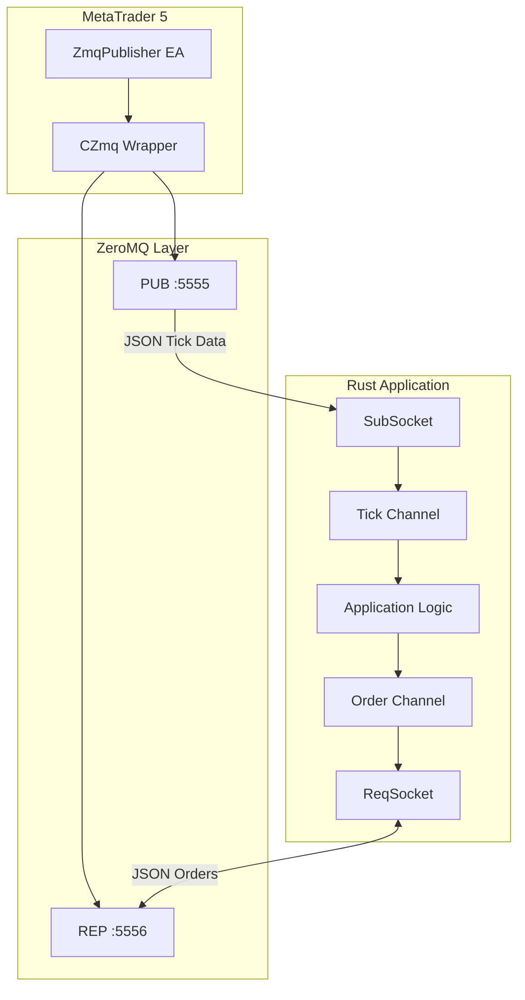
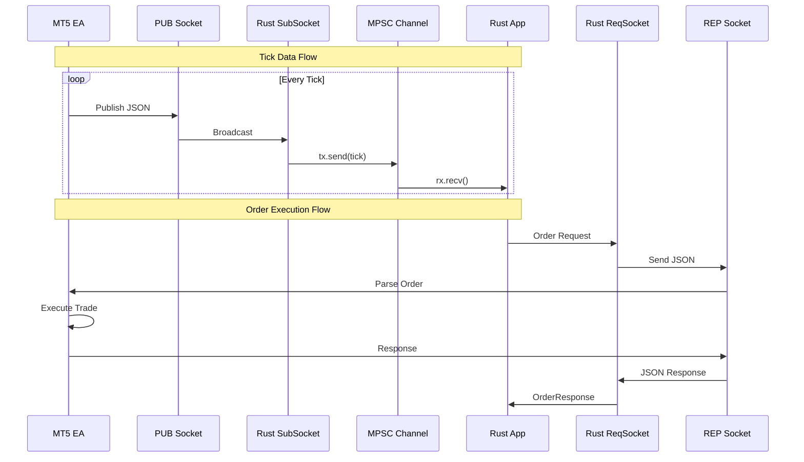

# Rust ZeroMQ Wrapper Library for MT5 Communication

A comprehensive reusable Rust library for ZeroMQ socket operations, designed for real-time communication with MetaTrader 5 via the MQL5-ZMQ bridge.

---

## Table of Contents

1. [Overview](#overview)
2. [Architecture](#architecture)
3. [Prerequisites and Installation](#prerequisites-and-installation)
4. [API Reference](#api-reference)
5. [Usage Guide](#usage-guide)
6. [Data Structures](#data-structures)
7. [Complete Examples](#complete-examples)
8. [Error Handling](#error-handling)
9. [Best Practices](#best-practices)
10. [Integration with Other Languages](#integration-with-other-languages)

---

## Overview

This library provides a high-level Rust wrapper for ZeroMQ socket operations, specifically designed to communicate with MetaTrader 5 Expert Advisors running the MQL5-ZMQ bridge.

> [!NOTE]
> For the companion MQL5 server library, see [MQL5-ZMQ Library for SUM3API](MQL5-ZMQ%20Library%20for%20SUM3API.md).

### Key Features

- **Async/Await Support**: Built on Tokio for non-blocking operations
- **Type-Safe Messages**: Serde-based JSON serialization with strongly typed structs
- **Dual Socket Pattern**: SUB socket for tick streaming, REQ socket for order execution
- **Channel-Based Architecture**: Uses MPSC channels for thread-safe message passing
- **Automatic Reconnection**: Resilient connection handling

### Supported Socket Types

| Pattern | Rust Socket | MQL5 Socket | Purpose |
|---------|-------------|-------------|---------|
| PUB/SUB | `SubSocket` | `ZMQ_PUB` | Real-time tick data streaming |
| REQ/REP | `ReqSocket` | `ZMQ_REP` | Order execution and commands |

---

## Architecture

### System Integration



### Data Flow



---

## Prerequisites and Installation

### Cargo.toml Dependencies

```toml
[dependencies]
zeromq = "0.3"
tokio = { version = "1", features = ["full"] }
serde = { version = "1", features = ["derive"] }
serde_json = "1"
chrono = "0.4"
```

### System Requirements

- Rust 1.70 or later
- ZeroMQ library installed on system (for zeromq crate)
- MetaTrader 5 with MQL5-ZMQ EA running

### Installation Steps

1. **Add dependencies to Cargo.toml** (see above)

2. **Build the project**
   ```bash
   cargo build --release
   ```

3. **Verify MT5 EA is running**
   - Ensure `ZmqPublisher.mq5` is attached to a chart
   - Verify ports 5555 (tick data) and 5556 (orders) are accessible

---

## API Reference

### Data Structures

#### TickData

Represents real-time market data received from MT5.

```rust
#[derive(Clone, Debug, Deserialize)]
pub struct TickData {
    pub symbol: String,
    pub bid: f64,
    pub ask: f64,
    pub time: i64,
    #[serde(default)]
    pub volume: u64,
    #[serde(default)]
    pub balance: f64,
    #[serde(default)]
    pub equity: f64,
    #[serde(default)]
    pub margin: f64,
    #[serde(default)]
    pub free_margin: f64,
    #[serde(default)]
    pub min_lot: f64,
    #[serde(default)]
    pub max_lot: f64,
    #[serde(default)]
    pub lot_step: f64,
    #[serde(default)]
    pub positions: Vec<PositionData>,
    #[serde(default)]
    pub orders: Vec<PendingOrderData>,
}
```

| Field | Type | Description |
|-------|------|-------------|
| `symbol` | `String` | Trading symbol (e.g., "EURUSD") |
| `bid` | `f64` | Current bid price |
| `ask` | `f64` | Current ask price |
| `time` | `i64` | Unix timestamp |
| `volume` | `u64` | Tick volume |
| `balance` | `f64` | Account balance |
| `equity` | `f64` | Account equity |
| `margin` | `f64` | Used margin |
| `free_margin` | `f64` | Available margin |
| `min_lot` | `f64` | Minimum lot size |
| `max_lot` | `f64` | Maximum lot size |
| `lot_step` | `f64` | Lot size increment |
| `positions` | `Vec<PositionData>` | Active positions |
| `orders` | `Vec<PendingOrderData>` | Pending orders |

---

#### PositionData

Represents an active trading position.

```rust
#[derive(Clone, Debug, Deserialize)]
pub struct PositionData {
    pub ticket: u64,
    #[serde(rename = "type")]
    pub pos_type: String,  // "BUY" or "SELL"
    pub volume: f64,
    pub price: f64,
    pub profit: f64,
}
```

---

#### PendingOrderData

Represents a pending order.

```rust
#[derive(Clone, Debug, Deserialize)]
pub struct PendingOrderData {
    pub ticket: u64,
    #[serde(rename = "type")]
    pub order_type: String,  // "BUY LIMIT", "SELL STOP", etc.
    pub volume: f64,
    pub price: f64,
}
```

---

#### OrderRequest

Request structure for sending orders to MT5.

```rust
#[derive(Clone, Debug, Serialize)]
pub struct OrderRequest {
    #[serde(rename = "type")]
    pub order_type: String,
    pub symbol: String,
    pub volume: f64,
    pub price: f64,
    #[serde(default)]
    pub ticket: u64,
    #[serde(skip_serializing_if = "Option::is_none")]
    pub timeframe: Option<String>,
    #[serde(skip_serializing_if = "Option::is_none")]
    pub start: Option<String>,
    #[serde(skip_serializing_if = "Option::is_none")]
    pub end: Option<String>,
    #[serde(skip_serializing_if = "Option::is_none")]
    pub mode: Option<String>,
}
```

**Supported Order Types:**

| Type | Description |
|------|-------------|
| `market_buy` | Execute market buy order |
| `market_sell` | Execute market sell order |
| `limit_buy` | Place buy limit pending order |
| `limit_sell` | Place sell limit pending order |
| `stop_buy` | Place buy stop pending order |
| `stop_sell` | Place sell stop pending order |
| `close_position` | Close position by ticket |
| `cancel_order` | Cancel pending order by ticket |
| `download_history` | Request historical data |

---

#### OrderResponse

Response structure from MT5 order execution.

```rust
#[derive(Clone, Debug, Deserialize)]
pub struct OrderResponse {
    pub success: bool,
    pub ticket: Option<i64>,
    pub error: Option<String>,
    pub message: Option<String>,
}
```

---

## Usage Guide

### Step 1: Create Channels

```rust
use tokio::sync::mpsc;

// Channel for tick data (MT5 -> App)
let (tick_tx, tick_rx) = mpsc::channel::<TickData>(100);

// Channel for order requests (App -> MT5)
let (order_tx, order_rx) = mpsc::channel::<OrderRequest>(10);

// Channel for order responses (MT5 -> App)
let (response_tx, response_rx) = mpsc::channel::<OrderResponse>(10);
```

### Step 2: Spawn Tick Subscriber Task

```rust
tokio::spawn(async move {
    let mut socket = zeromq::SubSocket::new();
    socket.connect("tcp://127.0.0.1:5555").await.unwrap();
    socket.subscribe("").await.unwrap();

    loop {
        match socket.recv().await {
            Ok(msg) => {
                if let Some(bytes) = msg.get(0) {
                    if let Ok(json) = std::str::from_utf8(bytes) {
                        if let Ok(tick) = serde_json::from_str::<TickData>(json) {
                            let _ = tick_tx.send(tick).await;
                        }
                    }
                }
            }
            Err(e) => {
                eprintln!("Tick recv error: {}", e);
                tokio::time::sleep(Duration::from_secs(1)).await;
            }
        }
    }
});
```

### Step 3: Spawn Order Handler Task

```rust
tokio::spawn(async move {
    let mut socket = zeromq::ReqSocket::new();
    socket.connect("tcp://127.0.0.1:5556").await.unwrap();

    while let Some(request) = order_rx.recv().await {
        let json = serde_json::to_string(&request).unwrap();
        
        if let Err(e) = socket.send(json.into()).await {
            let _ = response_tx.send(OrderResponse {
                success: false,
                ticket: None,
                error: Some(format!("Send failed: {}", e)),
                message: None,
            }).await;
            continue;
        }

        match socket.recv().await {
            Ok(msg) => {
                if let Some(bytes) = msg.get(0) {
                    if let Ok(json) = std::str::from_utf8(bytes) {
                        if let Ok(response) = serde_json::from_str::<OrderResponse>(json) {
                            let _ = response_tx.send(response).await;
                        }
                    }
                }
            }
            Err(e) => {
                let _ = response_tx.send(OrderResponse {
                    success: false,
                    ticket: None,
                    error: Some(format!("Recv failed: {}", e)),
                    message: None,
                }).await;
            }
        }
    }
});
```

### Step 4: Process Ticks and Send Orders

```rust
// Process incoming ticks
while let Some(tick) = tick_rx.recv().await {
    println!("{}: Bid={}, Ask={}", tick.symbol, tick.bid, tick.ask);
    
    // Example: Send a buy order when certain condition is met
    if some_trading_condition(&tick) {
        let order = OrderRequest {
            order_type: "market_buy".to_string(),
            symbol: tick.symbol.clone(),
            volume: 0.01,
            price: 0.0,
            ticket: 0,
            timeframe: None,
            start: None,
            end: None,
            mode: None,
        };
        let _ = order_tx.send(order).await;
    }
}
```

---

## Complete Examples

### Example 1: Basic Tick Subscriber

```rust
use serde::Deserialize;
use zeromq::{Socket, SocketRecv};

#[derive(Debug, Deserialize)]
struct TickData {
    symbol: String,
    bid: f64,
    ask: f64,
    time: i64,
}

#[tokio::main]
async fn main() -> Result<(), Box<dyn std::error::Error>> {
    let mut socket = zeromq::SubSocket::new();
    socket.connect("tcp://127.0.0.1:5555").await?;
    socket.subscribe("").await?;
    
    println!("Connected to MT5 tick publisher");

    loop {
        let msg = socket.recv().await?;
        if let Some(bytes) = msg.get(0) {
            if let Ok(json) = std::str::from_utf8(bytes) {
                if let Ok(tick) = serde_json::from_str::<TickData>(json) {
                    println!("{}: {:.5} / {:.5}", tick.symbol, tick.bid, tick.ask);
                }
            }
        }
    }
}
```

### Example 2: Order Execution Client

```rust
use serde::{Deserialize, Serialize};
use zeromq::{Socket, SocketRecv, SocketSend};

#[derive(Serialize)]
struct OrderRequest {
    #[serde(rename = "type")]
    order_type: String,
    symbol: String,
    volume: f64,
    price: f64,
}

#[derive(Debug, Deserialize)]
struct OrderResponse {
    success: bool,
    ticket: Option<i64>,
    error: Option<String>,
}

#[tokio::main]
async fn main() -> Result<(), Box<dyn std::error::Error>> {
    let mut socket = zeromq::ReqSocket::new();
    socket.connect("tcp://127.0.0.1:5556").await?;
    
    println!("Connected to MT5 order handler");

    // Send a market buy order
    let order = OrderRequest {
        order_type: "market_buy".to_string(),
        symbol: "EURUSD".to_string(),
        volume: 0.01,
        price: 0.0,
    };

    let json = serde_json::to_string(&order)?;
    println!("Sending: {}", json);
    
    socket.send(json.into()).await?;

    let response = socket.recv().await?;
    if let Some(bytes) = response.get(0) {
        if let Ok(json) = std::str::from_utf8(bytes) {
            let resp: OrderResponse = serde_json::from_str(json)?;
            if resp.success {
                println!("Order executed! Ticket: {:?}", resp.ticket);
            } else {
                println!("Order failed: {:?}", resp.error);
            }
        }
    }

    Ok(())
}
```

### Example 3: Full Trading Application

```rust
use serde::{Deserialize, Serialize};
use tokio::sync::mpsc;
use zeromq::{Socket, SocketRecv, SocketSend};
use std::time::Duration;

// ============================================================================
// Data Structures
// ============================================================================

#[derive(Clone, Debug, Deserialize)]
struct PositionData {
    ticket: u64,
    #[serde(rename = "type")]
    pos_type: String,
    volume: f64,
    price: f64,
    profit: f64,
}

#[derive(Clone, Debug, Deserialize)]
struct TickData {
    symbol: String,
    bid: f64,
    ask: f64,
    time: i64,
    #[serde(default)]
    balance: f64,
    #[serde(default)]
    equity: f64,
    #[serde(default)]
    positions: Vec<PositionData>,
}

#[derive(Clone, Debug, Serialize)]
struct OrderRequest {
    #[serde(rename = "type")]
    order_type: String,
    symbol: String,
    volume: f64,
    #[serde(default)]
    price: f64,
    #[serde(default)]
    ticket: u64,
}

#[derive(Clone, Debug, Deserialize)]
struct OrderResponse {
    success: bool,
    ticket: Option<i64>,
    error: Option<String>,
}

// ============================================================================
// Main Application
// ============================================================================

#[tokio::main]
async fn main() -> Result<(), Box<dyn std::error::Error>> {
    // Create channels
    let (tick_tx, mut tick_rx) = mpsc::channel::<TickData>(100);
    let (order_tx, mut order_rx) = mpsc::channel::<OrderRequest>(10);
    let (response_tx, mut response_rx) = mpsc::channel::<OrderResponse>(10);

    // Spawn tick subscriber
    tokio::spawn(async move {
        let mut socket = zeromq::SubSocket::new();
        if let Err(e) = socket.connect("tcp://127.0.0.1:5555").await {
            eprintln!("Failed to connect to tick publisher: {}", e);
            return;
        }
        let _ = socket.subscribe("").await;
        println!("Tick subscriber connected");

        loop {
            match socket.recv().await {
                Ok(msg) => {
                    if let Some(bytes) = msg.get(0) {
                        if let Ok(json) = std::str::from_utf8(bytes) {
                            if let Ok(tick) = serde_json::from_str::<TickData>(json) {
                                if tick_tx.send(tick).await.is_err() {
                                    break;
                                }
                            }
                        }
                    }
                }
                Err(e) => {
                    eprintln!("Tick error: {}", e);
                    tokio::time::sleep(Duration::from_secs(1)).await;
                }
            }
        }
    });

    // Spawn order handler
    let resp_tx = response_tx.clone();
    tokio::spawn(async move {
        let mut socket = zeromq::ReqSocket::new();
        if let Err(e) = socket.connect("tcp://127.0.0.1:5556").await {
            eprintln!("Failed to connect to order handler: {}", e);
            return;
        }
        println!("Order handler connected");

        while let Some(request) = order_rx.recv().await {
            let json = match serde_json::to_string(&request) {
                Ok(j) => j,
                Err(e) => {
                    let _ = resp_tx.send(OrderResponse {
                        success: false,
                        ticket: None,
                        error: Some(format!("Serialize error: {}", e)),
                    }).await;
                    continue;
                }
            };

            println!("Sending order: {}", json);

            if let Err(e) = socket.send(json.into()).await {
                let _ = resp_tx.send(OrderResponse {
                    success: false,
                    ticket: None,
                    error: Some(format!("Send error: {}", e)),
                }).await;
                continue;
            }

            match socket.recv().await {
                Ok(msg) => {
                    if let Some(bytes) = msg.get(0) {
                        if let Ok(json) = std::str::from_utf8(bytes) {
                            if let Ok(resp) = serde_json::from_str::<OrderResponse>(json) {
                                let _ = resp_tx.send(resp).await;
                            }
                        }
                    }
                }
                Err(e) => {
                    let _ = resp_tx.send(OrderResponse {
                        success: false,
                        ticket: None,
                        error: Some(format!("Recv error: {}", e)),
                    }).await;
                }
            }
        }
    });

    // Spawn response handler
    tokio::spawn(async move {
        while let Some(response) = response_rx.recv().await {
            if response.success {
                println!("Order SUCCESS: Ticket {:?}", response.ticket);
            } else {
                println!("Order FAILED: {:?}", response.error);
            }
        }
    });

    // Main loop - process ticks
    println!("Starting main loop...");
    let mut tick_count = 0u64;

    while let Some(tick) = tick_rx.recv().await {
        tick_count += 1;
        
        // Print every 100th tick to avoid spam
        if tick_count % 100 == 0 {
            println!(
                "[{}] {}: Bid={:.5}, Ask={:.5}, Balance={:.2}, Positions={}",
                tick_count,
                tick.symbol,
                tick.bid,
                tick.ask,
                tick.balance,
                tick.positions.len()
            );
        }

        // Example trading logic: buy when no positions exist
        if tick.positions.is_empty() && tick_count == 500 {
            let order = OrderRequest {
                order_type: "market_buy".to_string(),
                symbol: tick.symbol.clone(),
                volume: 0.01,
                price: 0.0,
                ticket: 0,
            };
            let _ = order_tx.send(order).await;
        }
    }

    Ok(())
}
```

---

## Error Handling

### Common Error Patterns

```rust
// Connection error handling
match socket.connect("tcp://127.0.0.1:5555").await {
    Ok(_) => println!("Connected"),
    Err(e) => {
        eprintln!("Connection failed: {}", e);
        // Implement retry logic
        tokio::time::sleep(Duration::from_secs(5)).await;
    }
}

// Receive error handling with retry
loop {
    match socket.recv().await {
        Ok(msg) => process_message(msg),
        Err(e) => {
            eprintln!("Recv error: {}", e);
            tokio::time::sleep(Duration::from_millis(100)).await;
            continue;
        }
    }
}

// JSON parsing error handling
match serde_json::from_str::<TickData>(json) {
    Ok(tick) => handle_tick(tick),
    Err(e) => eprintln!("JSON parse error: {} - Data: {}", e, json),
}
```

### Error Response Structure

Always check `OrderResponse.success` before using other fields:

```rust
if response.success {
    let ticket = response.ticket.unwrap_or(0);
    println!("Order executed with ticket: {}", ticket);
} else {
    let error = response.error.unwrap_or_else(|| "Unknown error".to_string());
    eprintln!("Order failed: {}", error);
}
```

---

## Best Practices

### 1. Use Bounded Channels

Prevent memory issues with bounded channels:

```rust
// Good: Bounded channel with reasonable capacity
let (tx, rx) = mpsc::channel::<TickData>(100);

// Avoid: Unbounded channels can grow infinitely
// let (tx, rx) = mpsc::unbounded_channel();
```

### 2. Handle Channel Errors

Check for send/receive errors:

```rust
// Check if receiver is dropped
if tx.send(tick).await.is_err() {
    eprintln!("Receiver dropped, exiting");
    break;
}

// Use try_send for non-blocking with backpressure
match tx.try_send(tick) {
    Ok(_) => {},
    Err(mpsc::error::TrySendError::Full(_)) => {
        eprintln!("Channel full, dropping tick");
    }
    Err(mpsc::error::TrySendError::Closed(_)) => break,
}
```

### 3. Graceful Shutdown

Implement proper shutdown handling:

```rust
use tokio::signal;

tokio::select! {
    _ = process_ticks(&mut tick_rx) => {},
    _ = signal::ctrl_c() => {
        println!("Shutting down...");
    }
}
```

### 4. Connection Resilience

Implement reconnection logic:

```rust
async fn connect_with_retry(addr: &str, max_retries: u32) -> Result<SubSocket, Error> {
    for attempt in 1..=max_retries {
        let mut socket = zeromq::SubSocket::new();
        match socket.connect(addr).await {
            Ok(_) => return Ok(socket),
            Err(e) => {
                eprintln!("Attempt {}/{} failed: {}", attempt, max_retries, e);
                tokio::time::sleep(Duration::from_secs(attempt as u64)).await;
            }
        }
    }
    Err(Error::ConnectionFailed)
}
```

---

## Integration with Other Languages

This Rust library is designed to work alongside the MQL5-ZMQ bridge. The same protocol can be implemented in other languages:

### Go Integration

```go
// See MQL5-ZMQ Library documentation for Go examples
import zmq "github.com/pebbe/zmq4"
```

### Java Integration

```java
// See MQL5-ZMQ Library documentation for Java examples
import org.zeromq.ZMQ;
```

### C++ Integration

```cpp
// See MQL5-ZMQ Library documentation for C++ examples
#include <zmq.hpp>
```

All clients use the same JSON message protocol defined in the [MQL5-ZMQ Library](MQL5-ZMQ%20Library%20for%20SUM3API.md#message-protocol).

---

## Version History

| Version | Date | Changes |
|---------|------|---------|
| 2.00 | 2026-01-27 | Added order handling, position tracking, full async support |
| 1.00 | 2026-01-20 | Initial release with tick subscription |

---

## License

MIT License

Copyright (c) 2026 Albeos Rembrant

Permission is hereby granted, free of charge, to any person obtaining a copy
of this software and associated documentation files (the "Software"), to deal
in the Software without restriction, including without limitation the rights
to use, copy, modify, merge, publish, distribute, sublicense, and/or sell
copies of the Software, and to permit persons to whom the Software is
furnished to do so, subject to the following conditions:

The above copyright notice and this permission notice shall be included in all
copies or substantial portions of the Software.

THE SOFTWARE IS PROVIDED "AS IS", WITHOUT WARRANTY OF ANY KIND, EXPRESS OR
IMPLIED, INCLUDING BUT NOT LIMITED TO THE WARRANTIES OF MERCHANTABILITY,
FITNESS FOR A PARTICULAR PURPOSE AND NONINFRINGEMENT. IN NO EVENT SHALL THE
AUTHORS OR COPYRIGHT HOLDERS BE LIABLE FOR ANY CLAIM, DAMAGES OR OTHER
LIABILITY, WHETHER IN AN ACTION OF CONTRACT, TORT OR OTHERWISE, ARISING FROM,
OUT OF OR IN CONNECTION WITH THE SOFTWARE OR THE USE OR OTHER DEALINGS IN THE
SOFTWARE.

---

## References

- [ZeroMQ Rust Crate](https://crates.io/crates/zeromq)
- [Tokio Async Runtime](https://tokio.rs/)
- [Serde JSON](https://serde.rs/)
- [MQL5-ZMQ Library](MQL5-ZMQ%20Library%20for%20SUM3API.md)
- [GitHub Repository](https://github.com/algorembrant/Rust-ZMQ-MT5)

---

## Citation

If you use this library in your research or project, please cite:

```bibtex
@software{rembrant2026sum3api,
  author       = {Rembrant, Albeos},
  title        = {{SUM3API}: Using Rust, ZeroMQ, and MetaQuotes Language (MQL5) API Combination to Extract, Communicate, and Externally Project Financial Data from MetaTrader 5 (MT5)},
  year         = {2026},
  publisher    = {GitHub},
  url          = {https://github.com/algorembrant/Rust-ZMQ-MT5},
  version      = {2.00}
}
```

//end of documentattion