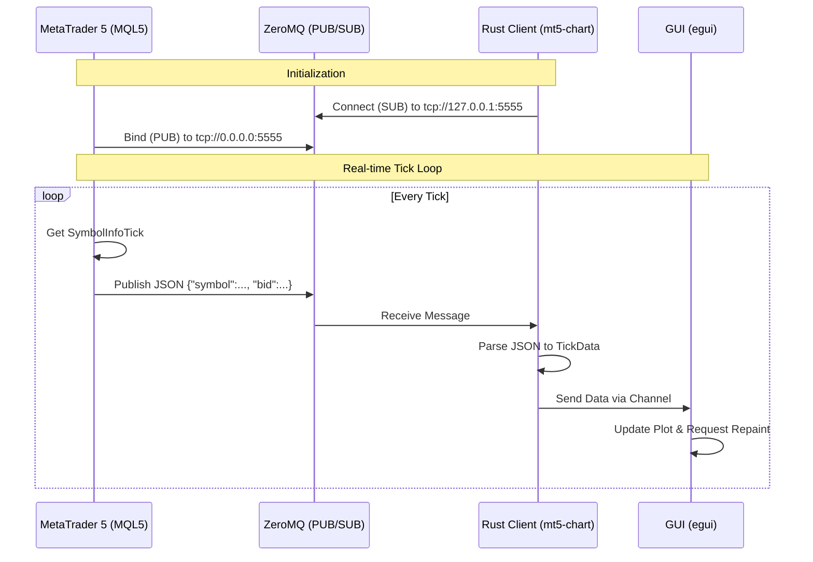

### Workflow Algorithm

```mermaid
sequenceDiagram
    participant MT5 as MetaTrader 5 (MQL5)
    participant ZMQ as ZeroMQ (PUB/SUB)
    participant Rust as Rust Client (mt5-chart)
    participant GUI as GUI (egui)

    Note over MT5, Rust: Initialization
    Rust->>ZMQ: Connect (SUB) to tcp://127.0.0.1:5555
    MT5->>ZMQ: Bind (PUB) to tcp://0.0.0.0:5555
    
    Note over MT5, GUI: Real-time Tick Loop
    loop Every Tick
        MT5->>MT5: Get SymbolInfoTick
        MT5->>ZMQ: Publish JSON {"symbol":..., "bid":...}
        ZMQ->>Rust: Receive Message
        Rust->>Rust: Parse JSON to TickData
        Rust->>GUI: Send Data via Channel
        GUI->>GUI: Update Plot & Request Repaint
    end
```
