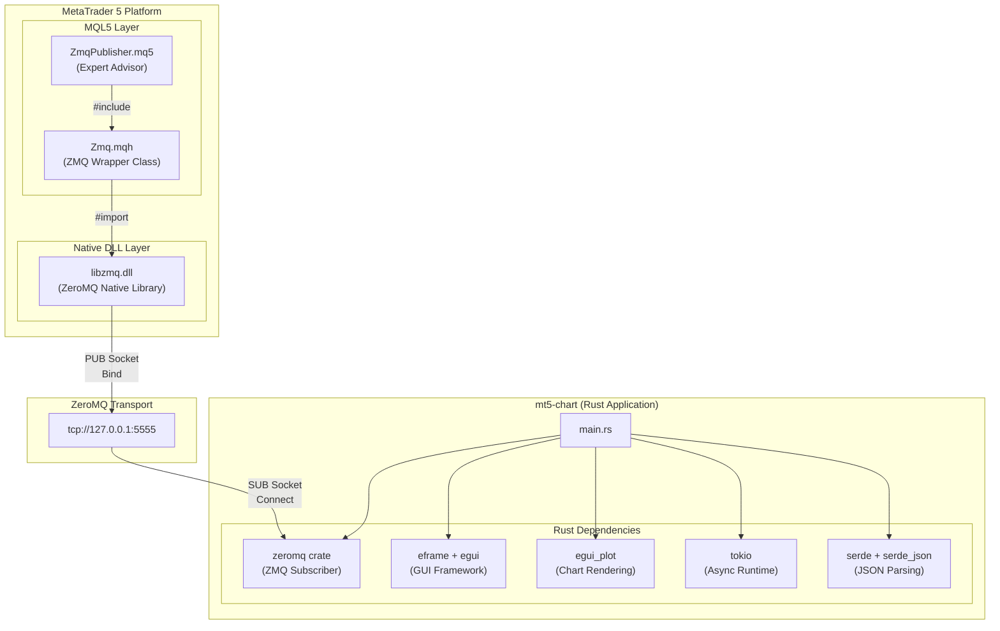
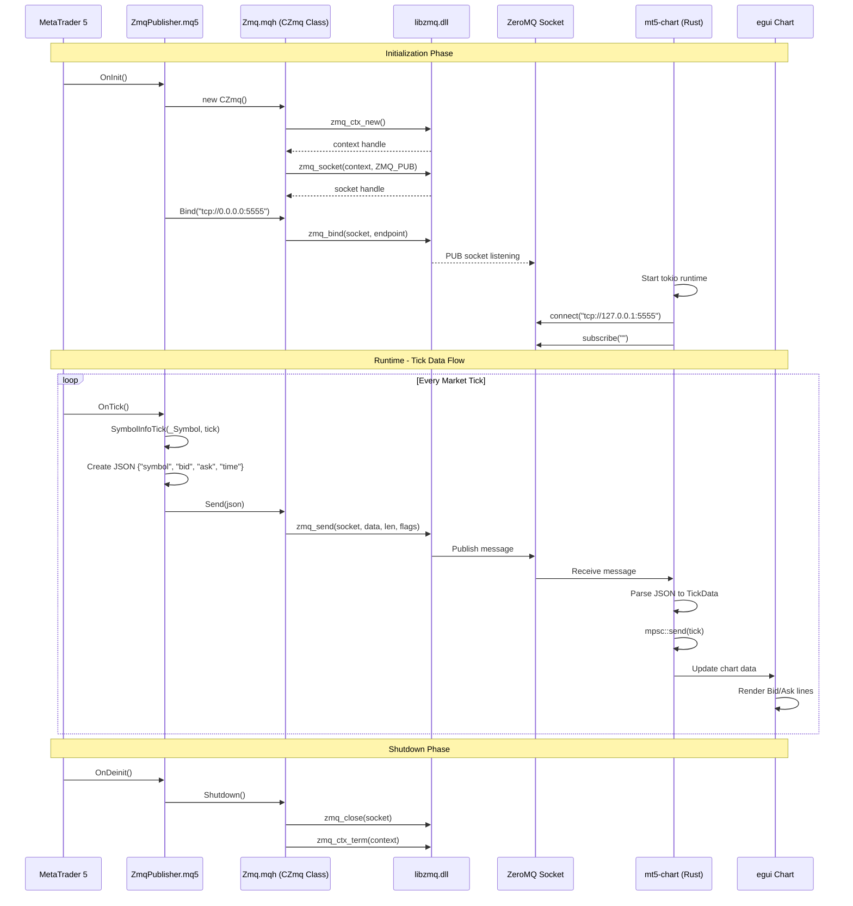
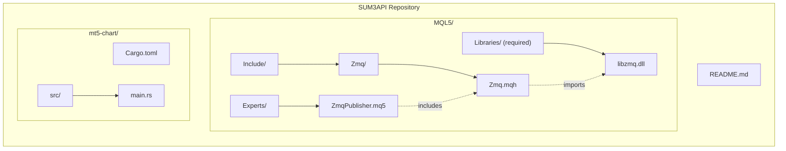

# MT5 ZeroMQ Chart System - Architecture Diagram

This diagram illustrates the complete data flow and component integration of the MT5-Chart system, including the **DLL layer** that enables ZeroMQ communication in MQL5.

## System Architecture



## Detailed Component Interaction



## File Structure & Dependencies



## DLL Import Details

The `Zmq.mqh` header file imports the following functions from `libzmq.dll`:

| Function | Purpose |
|----------|---------|
| `zmq_ctx_new()` | Create new ZMQ context |
| `zmq_ctx_term(context)` | Terminate ZMQ context |
| `zmq_socket(context, type)` | Create socket of specified type |
| `zmq_close(socket)` | Close a socket |
| `zmq_bind(socket, endpoint)` | Bind socket to address |
| `zmq_connect(socket, endpoint)` | Connect socket to address |
| `zmq_send(socket, buf, len, flags)` | Send message |
| `zmq_recv(socket, buf, len, flags)` | Receive message |
| `zmq_errno()` | Get last error code |

> [!IMPORTANT]
> The `libzmq.dll` must be placed in the `MQL5/Libraries/` folder of your MetaTrader 5 data directory for the Expert Advisor to function.

## Data Flow Summary

```mermaid
flowchart LR
    A["MT5 Market Tick"] --> B["ZmqPublisher.mq5"]
    B --> C["CZmq.Send()"]
    C --> D["libzmq.dll"]
    D --> E["TCP Socket<br/>:5555"]
    E --> F["Rust zeromq crate"]
    F --> G["JSON Parser"]
    G --> H["mpsc Channel"]
    H --> I["egui Chart"]
    
    style D fill:#ff6b6b,stroke:#333,color:#fff
    style E fill:#4ecdc4,stroke:#333,color:#fff
