# MT5 ZeroMQ Trading System - Architecture Diagram

This diagram illustrates the complete data flow and component integration of the MT5-Chart trading system with **bidirectional ZeroMQ communication** for real-time tick data, order execution, data recording, and historical data retrieval.

## System Overview


## Bidirectional Communication Flow


## Data Structures

### Tick Data JSON (PUB → SUB)
Updated to include active positions and pending orders for chart visualization.
```json
{
    "symbol": "XAUUSD",
    "bid": 2000.50,
    "ask": 2000.80,
    "time": 1706188800,
    "volume": 150,
    "balance": 10000.00,
    "equity": 10050.00,
    "margin": 200.00,
    "free_margin": 9850.00,
    "min_lot": 0.01,
    "max_lot": 100.00,
    "lot_step": 0.01,
    "positions": [
        {"ticket": 12345, "type": "BUY", "volume": 1.0, "price": 2000.50, "profit": 50.0}
    ],
    "orders": [
        {"ticket": 12346, "type": "BUY LIMIT", "volume": 0.1, "price": 1990.00}
    ]
}
```

### Order Request JSON (REQ → REP)
Supported request `type`s now include history download actions.
```json
{
    "type": "download_history",
    "symbol": "XAUUSD",
    "timeframe": "M1",
    "start": "2024.01.01",
    "end": "2024.01.02",
    "mode": "OHLC"
}
```

**Supported Actions:**
| Action Type | Description | Required Fields |
|-------------|-------------|-----------------|
| `market_buy/sell` | Instant execution | `symbol`, `volume` |
| `limit_buy/sell` | Pending limit order | `symbol`, `volume`, `price` |
| `stop_buy/sell` | Pending stop order | `symbol`, `volume`, `price` |
| `close_position` | Close active position | `ticket` |
| `cancel_order` | Delete pending order | `ticket` |
| `download_history` | Download OHLC/Tick CSV | `start`, `end`, `timeframe`, `mode` |

## Visualization Logic

### 1. Index-Based Charting (Flexible Axis)
-   **X-Axis**: Represents **Index** (0, 1, 2, ... N).
    -   This allows for uniform spacing regardless of time gaps (e.g., weekends).
    -   Enables flexible zooming and stretching (unconstrained by time steps).
-   **Formatter**: Maps Index `i` back to `Time` from the data vector for display.
-   **Volume**: Removed entirely to maximize price visibility.

### 2. Live Data Recording
-   **Mechanism**: The Rust client appends every received tick to a local CSV file.
-   **Format**: `Time, Bid, Ask, Volume`.
-   **Control**: Toggle button in the UI.

### 3. UI Component Layout

```mermaid
flowchart LR
    subgraph Window["MT5 Trading Chart Window"]
        subgraph SidePanel["Left Side Panel (250px)"]
            direction TB
            AccountInfo["💰 Account Info"]
            History["📂 Historical Data<br/>(Download Control)"]
            Recording["🔴 Live Recording"]
            TradeControls["⚡ Order Controls<br/>(Market/Limit/Stop)"]
            ActivePos["💼 Active Positions"]
            PendingOrd["⏳ Pending Orders"]
            
            AccountInfo --> History
            History --> Recording
            Recording --> TradeControls
            TradeControls --> ActivePos
            ActivePos --> PendingOrd
        end
        
        subgraph MainPanel["Central Panel"]
            direction TB
            Header["Symbol + Prices"]
            PriceChart2["Price Chart (Index-Axis)<br/>• Bid/Ask Lines<br/>• Order Lines (Blue/Red)<br/>• Flexible Zoom/Stretch"]
            
            Header --> PriceChart2
        end
    end
```

