# MQL5 ↔ Rustmt5-chart Integration Library

> **Version**: 2.0.0  
> **Last Updated**: 2026-01-27  
> **Author**: Algorembrant  
> **GitHub**: [https://github.com/algorembrant/Rust-ZMQ-MT5](https://github.com/algorembrant/Rust-ZMQ-MT5)

A comprehensive real-time trading bridge connecting MetaTrader 5 (MT5) with a Rust-based GUI trading application using ZeroMQ messaging.

---

## Table of Contents

1. [System Overview](#system-overview)
2. [Architecture Diagram](#architecture-diagram)
3. [File Structure](#file-structure)
4. [Component Deep Dive](#component-deep-dive)
5. [Communication Flow](#communication-flow)
6. [Data Structures](#data-structures)
7. [Supported Actions](#supported-actions)
8. [Setup Guide](#setup-guide)
9. [Running the System](#running-the-system)
10. [Common Errors & Debugging](#common-errors--debugging)
11. [API Reference](#api-reference)

---

## System Overview

This system provides **bidirectional real-time communication** between MetaTrader 5 and a Rust desktop application using **ZeroMQ** as the transport layer.

### Key Capabilities

| Feature | Description |
|---------|-------------|
| **Live Tick Streaming** | Real-time bid/ask data at tick-level granularity with timestamps |
| **Account Monitoring** | Balance, equity, margin, free margin updated on every tick |
| **Trade Execution** | Market, Limit, and Stop orders from Rust GUI |
| **Position Management** | View and close active positions with real-time P&L |
| **Order Management** | View and cancel pending limit/stop orders |
| **Historical Data** | Download OHLC or Tick data as CSV (up to 100k/50k rows) |
| **Live Recording** | Record live tick stream to timestamped CSV files |
| **Chart Visualization** | Bid/ask lines, position levels, order execution breaklines |

### Technology Stack


---

## Architecture Diagram

### Complete System Architecture

```mermaid
flowchart LR
    subgraph MT5_PLATFORM["MetaTrader 5 Platform"]
        direction TB
        MARKET[(Market Data Feed<br/>OnTick Events)]
        ACCOUNT[(Account State<br/>Balance/Equity/Margin)]
        POSITIONS[(Positions DB<br/>Active Trades)]
        ORDERS[(Orders DB<br/>Pending Orders)]
        HISTORY[(Historical DB<br/>OHLC/Ticks)]
        TRADE_ENGINE[(Trade Engine<br/>Order Execution)]
        
        EA["ZmqPublisher.mq5<br/>+ CZmq Wrapper"]
        
        MARKET --> EA
        ACCOUNT --> EA
        POSITIONS --> EA
        ORDERS --> EA
        HISTORY --> EA
        EA --> TRADE_ENGINE
    end
    
    subgraph ZMQ_LAYER["ZeroMQ Layer"]
        direction TB
        PUB["📡 PUB Socket<br/>tcp://0.0.0.0:5555<br/>Non-blocking Send"]
        REP["📮 REP Socket<br/>tcp://0.0.0.0:5556<br/>Blocking Response"]
    end
    
    subgraph RUST_APP["Rust mt5-chart Application"]
        direction TB
        SUB_TASK["🔄 Async Task<br/>SubSocket<br/>zeromq crate"]
        REQ_TASK["🔄 Async Task<br/>ReqSocket<br/>zeromq crate"]
        
        CHANNELS["📬 MPSC Channels<br/>tick_channel (100)<br/>order_channel (10)<br/>response_channel (10)"]
        
        APP_STATE["📊 Mt5ChartApp State<br/>• 2000 tick buffer<br/>• 50 order breaklines<br/>• Position tracking"]
        
        subgraph GUI_COMPONENTS["egui GUI Panels"]
            CHART["📈 Price Chart<br/>(Bid/Ask/Position Lines)"]
            ACCOUNT_PANEL["💰 Account Info<br/>(Balance/Equity/Margin)"]
            HIST_PANEL["📂 History Download<br/>(OHLC/TICKS CSV)"]
            REC_PANEL["🔴 Live Recording<br/>(CSV Output)"]
            TRADE_PANEL["📦 Trade Controls<br/>(Market/Limit/Stop)"]
            POSITIONS_PANEL["💼 Active Positions<br/>(Close Button)"]
            ORDERS_PANEL["⏳ Pending Orders<br/>(Cancel Button)"]
            MSG_PANEL["📨 Messages<br/>(Order Results)"]
        end
        
        SUB_TASK --> CHANNELS
        REQ_TASK <--> CHANNELS
        CHANNELS <--> APP_STATE
        APP_STATE --> GUI_COMPONENTS
    end
    
    EA --> PUB
    EA <--> REP
    
    PUB -.->|JSON Tick Stream| SUB_TASK
    REQ_TASK -.->|JSON Request| REP
    REP -.->|JSON Response| REQ_TASK
```



### Tick Data Flow Diagram


### Historical Data Download Flow


---

## File Structure

```
SUM3API/
├── MQL5/
│   ├── Experts/
│   │   └── ZmqPublisher.mq5     # Main EA (451 lines)
│   ├── Include/
│   │   └── Zmq/
│   │       └── Zmq.mqh          # ZMQ wrapper class (145 lines)
│   └── Libraries/
│       ├── libzmq.dll           # ZeroMQ native library (451 KB)
│       └── libsodium.dll        # Sodium crypto library (303 KB)
│
├── Rustmt5-chart/
│   ├── Cargo.toml               # Rust dependencies
│   ├── Cargo.lock               # Dependency lock file
│   ├── src/
│   │   └── main.rs              # Main application (853 lines)
│   └── output/                  # CSV output directory
│       ├── History_*.csv        # Downloaded historical data
│       └── Live_*.csv           # Live recorded tick data
│
└── MQL5-Rustmt5-chart-Documentation.md  # This file
```

### Rust Dependencies (Cargo.toml)

| Crate | Version | Purpose |
|-------|---------|---------|
| eframe | 0.27.1 | Native application framework |
| egui | 0.27.1 | Immediate-mode GUI library |
| egui_plot | 0.27.1 | Chart visualization |
| zeromq | 0.5.0-pre | ZeroMQ bindings (async) |
| serde | 1.0.197 | Serialization framework |
| serde_json | 1.0.114 | JSON serialization |
| tokio | 1.36.0 | Async runtime (full features) |
| chrono | 0.4.43 | Date/time handling |
| futures | 0.3.30 | Async utilities |

---

## Component Deep Dive

### 1. MQL5 Expert Advisor: ZmqPublisher.mq5

The Expert Advisor runs on a chart in MT5 and performs two primary functions:

#### Input Parameters

| Parameter | Default | Description |
|-----------|---------|-------------|
| `InpPubAddress` | `tcp://0.0.0.0:5555` | Tick publisher binding address |
| `InpRepAddress` | `tcp://0.0.0.0:5556` | Order handler binding address |
| `InpDefaultSlippage` | `10` | Default slippage in points |

#### Core Functions


#### Order Processing Logic


---

### 2. ZMQ Wrapper: Zmq.mqh

A lightweight MQL5 wrapper around `libzmq.dll`:


#### Socket Type Constants

| Constant | Value | Usage |
|----------|-------|-------|
| `ZMQ_PUB` | 1 | Publisher socket |
| `ZMQ_SUB` | 2 | Subscriber socket |
| `ZMQ_REQ` | 3 | Request socket |
| `ZMQ_REP` | 4 | Reply socket |
| `ZMQ_NOBLOCK` | 1 | Non-blocking flag |

---

### 3. Rust Application: main.rs

The Rust application is structured with async tasks and a main GUI loop:


#### Rust Application State


---

## Communication Flow

### Detailed Port Mapping

```mermaid
flowchart TB
    subgraph PUB_SUB["PUB → SUB (Port 5555)"]
        direction LR
        EA_PUB["EA: OnTick()<br/>Publish JSON<br/>(every tick)"]
        ARROW1["→ TCP →"]
        RUST_SUB["Rust: SubSocket<br/>Receive JSON<br/>(async loop)"]
        
        EA_PUB --> ARROW1 --> RUST_SUB
    end
    
    subgraph REQ_REP["REQ ↔ REP (Port 5556)"]
        direction LR
        RUST_REQ["Rust: ReqSocket<br/>Send Request"]
        ARROW2["→ TCP →"]
        EA_REP["EA: Process<br/>Order"]
        ARROW3["← TCP ←"]
        
        RUST_REQ --> ARROW2 --> EA_REP
        EA_REP --> ARROW3 --> RUST_REQ
    end
    
    subgraph FEATURES["Supported Features via REQ/REP"]
        direction TB
        F1["🟢 Market Buy/Sell"]
        F2["🔵 Limit Buy/Sell"]
        F3["🟡 Stop Buy/Sell"]
        F4["❌ Close Position"]
        F5["🚫 Cancel Order"]
        F6["📊 Download History (OHLC/TICKS)"]
    end
    
    REQ_REP --> FEATURES
```



---

## Data Structures

### PUB → SUB: Tick Data JSON

Published on **every tick** from MT5:

```json
{
    "symbol": "XAUUSDc",
    "bid": 2650.55,
    "ask": 2650.75,
    "time": 1706284800,
    "volume": 100,
    "balance": 10000.00,
    "equity": 10150.25,
    "margin": 500.00,
    "free_margin": 9650.25,
    "min_lot": 0.01,
    "max_lot": 100.00,
    "lot_step": 0.01,
    "positions": [
        {
            "ticket": 12345678,
            "type": "BUY",
            "volume": 0.10,
            "price": 2645.50,
            "profit": 50.50
        }
    ],
    "orders": [
        {
            "ticket": 87654321,
            "type": "BUY LIMIT",
            "volume": 0.05,
            "price": 2600.00
        }
    ]
}
```

---

## Supported Actions

### PUB → SUB Actions (Port 5555)

| Data Type | Frequency | Description |
|-----------|-----------|-------------|
| Tick Data | Every tick | symbol, bid, ask, time, volume |
| Account Info | Every tick | balance, equity, margin, free_margin |
| Symbol Constraints | Every tick | min_lot, max_lot, lot_step |
| Positions | Every tick | All active positions for current symbol |
| Pending Orders | Every tick | All pending orders for current symbol |

---

### REQ → REP Actions (Port 5556)

#### Market Orders

```json
// Request
{"type": "market_buy", "symbol": "XAUUSDc", "volume": 0.01, "price": 0, "ticket": 0}
{"type": "market_sell", "symbol": "XAUUSDc", "volume": 0.01, "price": 0, "ticket": 0}

// Response (Success)
{"success": true, "ticket": 12345678}

// Response (Failure)
{"success": false, "error": "Error 10019: Not enough money"}
```

#### Pending Orders

```json
// Limit Orders
{"type": "limit_buy", "symbol": "XAUUSDc", "volume": 0.01, "price": 2600.00, "ticket": 0}
{"type": "limit_sell", "symbol": "XAUUSDc", "volume": 0.01, "price": 2700.00, "ticket": 0}

// Stop Orders
{"type": "stop_buy", "symbol": "XAUUSDc", "volume": 0.01, "price": 2700.00, "ticket": 0}
{"type": "stop_sell", "symbol": "XAUUSDc", "volume": 0.01, "price": 2600.00, "ticket": 0}
```

#### Position/Order Management

```json
// Close an existing position
{"type": "close_position", "symbol": "XAUUSDc", "volume": 0, "price": 2650.00, "ticket": 12345678}

// Cancel a pending order
{"type": "cancel_order", "symbol": "XAUUSDc", "volume": 0, "price": 2600.00, "ticket": 87654321}
```

#### Historical Data Download

```json
// Request OHLC data
{
    "type": "download_history",
    "symbol": "XAUUSDc",
    "volume": 0,
    "price": 0,
    "ticket": 0,
    "timeframe": "M1",
    "start": "2024.01.01",
    "end": "2024.01.31",
    "mode": "OHLC",
    "request_id": 1
}

// Request Tick data
{
    "type": "download_history",
    "symbol": "XAUUSDc",
    "volume": 0,
    "price": 0,
    "ticket": 0,
    "timeframe": "M1",
    "start": "2024.01.01",
    "end": "2024.01.02",
    "mode": "TICKS",
    "request_id": 2
}

// Response (Success with CSV data)
{
    "success": true,
    "message": "1000 records||CSV_DATA||Time,Open,High,Low,Close,TickVol,Spread|NL|2024.01.01 00:00,2650.50,2651.00,2650.00,2650.75,100,3|NL|..."
}
```

### Action Summary Table

| Action | Type Field | Required Fields | Optional Fields |
|--------|------------|-----------------|-----------------| 
| Market Buy | `market_buy` | symbol, volume | - |
| Market Sell | `market_sell` | symbol, volume | - |
| Limit Buy | `limit_buy` | symbol, volume, price | - |
| Limit Sell | `limit_sell` | symbol, volume, price | - |
| Stop Buy | `stop_buy` | symbol, volume, price | - |
| Stop Sell | `stop_sell` | symbol, volume, price | - |
| Close Position | `close_position` | ticket | price (optional) |
| Cancel Order | `cancel_order` | ticket | price (optional) |
| Download History | `download_history` | symbol, timeframe, start, end | mode (OHLC/TICKS), request_id |

---

## Setup Guide

### Prerequisites

- **MetaTrader 5** (Build 2xxx+)
- **Rust** (1.70+) with Cargo
- **Visual C++ Runtime 2015** (for libzmq.dll)

### Step 1: Install ZeroMQ Libraries

1. Copy `libzmq.dll` and `libsodium.dll` to:
   ```
   C:\Users\<USER>\AppData\Roaming\MetaQuotes\Terminal\<TERMINAL_ID>\MQL5\Libraries\
   ```

### Step 2: Install MQL5 Files

1. Copy `Zmq.mqh` to:
   ```
   MQL5\Include\Zmq\Zmq.mqh
   ```

2. Copy `ZmqPublisher.mq5` to:
   ```
   MQL5\Experts\ZmqPublisher.mq5
   ```

3. **Compile** the EA in MetaEditor (F7)

### Step 3: Configure MT5 Settings

1. **Tools → Options → Expert Advisors**:
   - ✅ Allow algorithmic trading
   - ✅ Allow DLL imports

2. **Common tab** when attaching EA:
   - ✅ Allow live trading
   - ✅ Allow DLL imports

### Step 4: Build Rust Application

```bash
cd Rustmt5-chart
cargo build --release
```

---

## Running the System

### Startup Sequence


### Quick Start Commands

**Terminal - Start Rust Application:**
```bash
cd C:\Users\User\Desktop\VSCode\SUM3API\Rustmt5-chart
cargo run --release
```

**MetaTrader 5:**
1. Open a chart (e.g., XAUUSDc, M1 timeframe)
2. Drag `ZmqPublisher` EA onto the chart
3. Enable "Allow DLL imports" and "Allow live trading"
4. Click OK

---

## Common Errors & Debugging

### MQL5 Errors

| Error | Cause | Solution |
|-------|-------|----------|
| `Failed to initialize ZMQ Publisher` | libzmq.dll not found | Copy libzmq.dll to MQL5/Libraries |
| `Failed to bind publisher to tcp://...` | Port already in use | Close other EA instances or change port |
| `Error 10019: Not enough money` | Insufficient margin | Reduce lot size or deposit funds |
| `Error 10017: Trade disabled` | Trading not allowed | Enable algorithmic trading in MT5 options |
| `Error 10027: Autotrading disabled by client` | AutoTrading button off | Click AutoTrading button in MT5 toolbar |
| `Error 10018: Market is closed` | Market closed | Wait for market to open |

### Rust Errors

| Error | Cause | Solution |
|-------|-------|----------|
| `Failed to connect to ZMQ tick publisher` | EA not running | Start the EA first |
| `"Connection refused" on port 5555/5556` | EA not bound yet | Wait for EA to initialize fully |
| `Parse error: ...` | Malformed JSON from MT5 | Check EA logs for publishing errors |
| `Tick channel error` | Channel buffer full | Increase buffer size or process faster |

### Port Conflict Resolution

```mql5
// Change ports if defaults are occupied:
input string InpPubAddress = "tcp://0.0.0.0:5565";  // Custom pub port
input string InpRepAddress = "tcp://0.0.0.0:5566";  // Custom rep port
```

Update Rust connection strings in `main.rs`:
```rust
socket.connect("tcp://127.0.0.1:5565").await  // Match new pub port
socket.connect("tcp://127.0.0.1:5566").await  // Match new rep port
```

---

## API Reference

### MQL5 Functions

#### CZmq Class Methods

| Method | Parameters | Returns | Description |
|--------|------------|---------|-------------|
| `Init` | `int type` | `bool` | Initialize socket with type (PUB/SUB/REQ/REP) |
| `Bind` | `string endpoint` | `bool` | Bind socket to address (server side) |
| `Connect` | `string endpoint` | `bool` | Connect socket to address (client side) |
| `Send` | `string msg, bool nonBlock` | `int` | Send message, returns bytes sent |
| `Receive` | `bool nonBlock` | `string` | Receive message, returns empty if none |
| `Shutdown` | none | `void` | Close socket and context |

#### EA Helper Functions

| Function | Parameters | Returns | Description |
|----------|------------|---------|-------------|
| `ProcessOrderRequest` | `string request` | `string` | Parse and execute order, return JSON response |
| `DownloadHistory` | `symbol, tf, start, end, mode, &resultMsg` | `bool` | Fetch and format historical data as CSV |
| `ExtractJsonString` | `string json, string key` | `string` | Extract string value from JSON |
| `ExtractJsonDouble` | `string json, string key` | `double` | Extract numeric value from JSON |
| `GetLastErrorDescription` | none | `string` | Format last error for response |
| `ErrorDescription` | `int error` | `string` | Map error code to human-readable message |

### Rust Channel Types

```rust
// Tick data channel (high throughput)
mpsc::channel::<TickData>(100)

// Order request channel
mpsc::channel::<OrderRequest>(10)

// Order response channel
mpsc::channel::<OrderResponse>(10)
```

---

## Live Chart Features

### Chart Visualization

```mermaid
flowchart LR
    subgraph CHART["Trading Chart (egui_plot)"]
        BID_LINE["🟢 Bid Line (Green)"]
        ASK_LINE["🔴 Ask Line (Red)"]
        POS_LINES["📍 Position Lines (Dashed, Blue/Red)"]
        BREAK_LINES["⚡ Order Breaklines (Vertical)"]
    end
    
    subgraph CONTROLS["Side Panel (280px)"]
        ACC["💰 Account Info (Collapsible)"]
        HIST["📂 History Download"]
        REC["🔴 Live Recording"]
        TRADE["📦 Trade Controls"]
        MSG["📨 Last Message"]
        POS["💼 Active Positions (Collapsible)"]
        ORDERS["⏳ Pending Orders (Collapsible)"]
    end
```



### Output Files

| Pattern | Content | Example |
|---------|---------|---------|
| `History_*_OHLC_*.csv` | Downloaded OHLC bars | `History_XAUUSDc_M1_OHLC_ID0001_20240126_143022.csv` |
| `History_*_TICKS_*.csv` | Downloaded ticks | `History_XAUUSDc_M1_TICKS_ID0002_20240126_143055.csv` |
| `Live_*_*.csv` | Live recorded ticks | `Live_XAUUSDc_ID0003_20240126_143100.csv` |

### CSV Formats

**OHLC Format:**
```csv
Time,Open,High,Low,Close,TickVol,Spread
2024.01.26 00:00,2650.50,2651.00,2650.00,2650.75,100,3
2024.01.26 00:01,2650.75,2651.25,2650.50,2651.00,85,3
```

**Tick Format:**
```csv
Time,Bid,Ask,Volume
2024.01.26 00:00:00,2650.50,2650.70,10
2024.01.26 00:00:01,2650.55,2650.75,5
```

**Live Recording Format:**
```csv
Time,Bid,Ask,Volume
1706284800,2650.50,2650.70,10
1706284801,2650.55,2650.75,5
```

---

## Changelog

### v2.0.0 (2026-01-27)
- Added REQ/REP pattern for trade execution
- Added position and order management with Close/Cancel buttons
- Added historical data download (OHLC/TICKS up to 100k/50k rows)
- Added live recording feature with timestamped CSV files
- Added order breaklines on chart for executed orders
- Added collapsible UI panels for account/positions/orders
- Added symbol trading constraints (min_lot, max_lot, lot_step)
- Updated documentation with comprehensive Mermaid diagrams

### v1.0.0
- Initial release with tick streaming only

---

> **Note**: This documentation covers the complete integration between MQL5 and Rust. For updates or issues, refer to the source files directly or visit [https://github.com/algorembrant/Rust-ZMQ-MT5](https://github.com/algorembrant/Rust-ZMQ-MT5).
