# MQL5 ↔ Rustmt5-chart Integration Library

> **Version**: 2.0.0  
> **Last Updated**: 2026-01-26  
> **Author**: Algorembrant  

A comprehensive real-time trading bridge connecting MetaTrader 5 (MT5) with a Rust-based GUI trading application using ZeroMQ messaging.

---

## Table of Contents

1. [System Overview](#system-overview)
2. [Architecture Diagram](#architecture-diagram)
3. [File Structure](#file-structure)
4. [Component Deep Dive](#component-deep-dive)
5. [Communication Flow](#communication-flow)
6. [Data Structures](#data-structures)
7. [Supported Actions](#supported-actions)
8. [Setup Guide](#setup-guide)
9. [Running the System](#running-the-system)
10. [Common Errors & Debugging](#common-errors--debugging)
11. [API Reference](#api-reference)

---

## System Overview

This system provides **bidirectional real-time communication** between MetaTrader 5 and a Rust desktop application using **ZeroMQ** as the transport layer.

### Key Capabilities

| Feature | Description |
|---------|-------------|
| **Live Tick Streaming** | Real-time bid/ask data at tick-level granularity |
| **Account Monitoring** | Balance, equity, margin, free margin in real-time |
| **Trade Execution** | Market, Limit, and Stop orders from Rust GUI |
| **Position Management** | View and close active positions |
| **Order Management** | View and cancel pending orders |
| **Historical Data** | Download OHLC or Tick data as CSV |
| **Live Recording** | Record live tick stream to CSV |

### Technology Stack


---

## Architecture Diagram

### Complete System Architecture

```mermaid
flowchart LR
    subgraph MT5_PLATFORM["MetaTrader 5 Platform"]
        direction TB
        MARKET[(Market Data Feed)]
        ACCOUNT[(Account State)]
        POSITIONS[(Positions DB)]
        ORDERS[(Orders DB)]
        HISTORY[(Historical DB)]
        
        EA["ZmqPublisher.mq5"]
        
        MARKET --> EA
        ACCOUNT --> EA
        POSITIONS --> EA
        ORDERS --> EA
        HISTORY --> EA
    end
    
    subgraph ZMQ_LAYER["ZeroMQ Layer"]
        direction TB
        PUB["📡 PUB Socket<br/>tcp://0.0.0.0:5555"]
        REP["📮 REP Socket<br/>tcp://0.0.0.0:5556"]
    end
    
    subgraph RUST_APP["Rust mt5-chart Application"]
        direction TB
        SUB_TASK["🔄 Async Task<br/>SubSocket"]
        REQ_TASK["🔄 Async Task<br/>ReqSocket"]
        
        CHANNELS["📬 MPSC Channels"]
        
        APP_STATE["📊 Mt5ChartApp State"]
        
        subgraph GUI_COMPONENTS["egui GUI"]
            CHART["📈 Price Chart<br/>(Bid/Ask Lines)"]
            ACCOUNT_PANEL["💰 Account Info"]
            TRADE_PANEL["📦 Trade Controls"]
            HISTORY_PANEL["📂 History Download"]
            POSITIONS_PANEL["💼 Active Positions"]
            ORDERS_PANEL["⏳ Pending Orders"]
        end
        
        SUB_TASK --> CHANNELS
        REQ_TASK <--> CHANNELS
        CHANNELS <--> APP_STATE
        APP_STATE --> GUI_COMPONENTS
    end
    
    EA --> PUB
    EA <--> REP
    
    PUB -.->|JSON Tick Stream| SUB_TASK
    REQ_TASK -.->|JSON Request| REP
    REP -.->|JSON Response| REQ_TASK
```



### Data Flow Diagram


---

## File Structure

```
SUM3API/
├── MQL5/
│   ├── Experts/
│   │   └── ZmqPublisher.mq5     # Main EA (451 lines)
│   └── Include/
│       └── Zmq/
│           └── Zmq.mqh          # ZMQ wrapper class (144 lines)
│
├── Rustmt5-chart/
│   ├── Cargo.toml               # Rust dependencies
│   ├── Cargo.lock               # Dependency lock file
│   ├── src/
│   │   └── main.rs              # Main application (843 lines)
│   ├── output/                  # CSV output directory
│   │   ├── History_*.csv        # Downloaded historical data
│   │   └── Live_*.csv           # Live recorded tick data
│   └── target/                  # Build artifacts
│
└── MQL5-Rustmt5-chart-Documentation.md  # This file
```

### MQL5 Dependencies

```
MQL5/Libraries/
└── libzmq.dll                   # ZeroMQ native library (required)
```

---

## Component Deep Dive

### 1. MQL5 Expert Advisor: [ZmqPublisher.mq5](file:///c:/Users/User/Desktop/VSCode/SUM3API/MQL5/Experts/ZmqPublisher.mq5)

The Expert Advisor runs on a chart in MT5 and performs two primary functions:

#### Input Parameters

| Parameter | Default | Description |
|-----------|---------|-------------|
| `InpPubAddress` | `tcp://0.0.0.0:5555` | Tick publisher binding address |
| `InpRepAddress` | `tcp://0.0.0.0:5556` | Order handler binding address |
| `InpDefaultSlippage` | `10` | Default slippage in points |

#### Socket Initialization

```mql5
// PUB socket for broadcasting tick data
g_publisher = new CZmq();
g_publisher.Init(ZMQ_PUB);
g_publisher.Bind(InpPubAddress);

// REP socket for handling order requests
g_responder = new CZmq();
g_responder.Init(ZMQ_REP);
g_responder.Bind(InpRepAddress);
```

#### OnTick() Processing

Every tick triggers:
1. **Non-blocking check** for incoming order requests on REP socket
2. **Gathering** of tick data, account info, positions, and orders
3. **Publishing** comprehensive JSON to PUB socket

---

### 2. ZMQ Wrapper: [Zmq.mqh](file:///c:/Users/User/Desktop/VSCode/SUM3API/MQL5/Include/Zmq/Zmq.mqh)

A lightweight MQL5 wrapper around `libzmq.dll`:


#### Socket Type Constants

| Constant | Value | Usage |
|----------|-------|-------|
| `ZMQ_PUB` | 1 | Publisher socket |
| `ZMQ_SUB` | 2 | Subscriber socket |
| `ZMQ_REQ` | 3 | Request socket |
| `ZMQ_REP` | 4 | Reply socket |

---

### 3. Rust Application: [main.rs](file:///c:/Users/User/Desktop/VSCode/SUM3API/Rustmt5-chart/src/main.rs)

The Rust application is structured as:


---

## Communication Flow

### Detailed Communication Flow

```mermaid
flowchart TB
    subgraph PUB_SUB["PUB → SUB (Port 5555)"]
        direction LR
        EA_PUB["EA: OnTick()<br/>Publish JSON"]
        ARROW1["→ TCP →"]
        RUST_SUB["Rust: SubSocket<br/>Receive JSON"]
        
        EA_PUB --> ARROW1 --> RUST_SUB
    end
    
    subgraph REQ_REP["REQ ↔ REP (Port 5556)"]
        direction LR
        RUST_REQ["Rust: ReqSocket<br/>Send Request"]
        ARROW2["→ TCP →"]
        EA_REP["EA: Process<br/>Order"]
        ARROW3["← TCP ←"]
        
        RUST_REQ --> ARROW2 --> EA_REP
        EA_REP --> ARROW3 --> RUST_REQ
    end
    
    subgraph FEATURES["Supported Features via REQ/REP"]
        F1["Market Buy/Sell"]
        F2["Limit Buy/Sell"]
        F3["Stop Buy/Sell"]
        F4["Close Position"]
        F5["Cancel Order"]
        F6["Download History"]
    end
    
    REQ_REP --> FEATURES
```



---

## Data Structures

### PUB → SUB: Tick Data JSON

Published on **every tick** from MT5:

```json
{
    "symbol": "XAUUSD",
    "bid": 2650.55,
    "ask": 2650.75,
    "time": 1706284800,
    "volume": 100,
    "balance": 10000.00,
    "equity": 10150.25,
    "margin": 500.00,
    "free_margin": 9650.25,
    "min_lot": 0.01,
    "max_lot": 100.00,
    "lot_step": 0.01,
    "positions": [
        {
            "ticket": 12345678,
            "type": "BUY",
            "volume": 0.10,
            "price": 2645.50,
            "profit": 50.50
        }
    ],
    "orders": [
        {
            "ticket": 87654321,
            "type": "BUY LIMIT",
            "volume": 0.05,
            "price": 2600.00
        }
    ]
}
```

### Rust Data Structures

```rust
// Core tick data received from MT5
struct TickData {
    symbol: String,
    bid: f64,
    ask: f64,
    time: i64,
    volume: u64,
    balance: f64,
    equity: f64,
    margin: f64,
    free_margin: f64,
    min_lot: f64,
    max_lot: f64,
    lot_step: f64,
    positions: Vec<PositionData>,
    orders: Vec<PendingOrderData>,
}

// Active position information
struct PositionData {
    ticket: u64,
    pos_type: String,  // "BUY" or "SELL"
    volume: f64,
    price: f64,
    profit: f64,
}

// Pending order information
struct PendingOrderData {
    ticket: u64,
    order_type: String,  // "BUY LIMIT", "SELL STOP", etc.
    volume: f64,
    price: f64,
}
```

---

## Supported Actions

### PUB → SUB Actions (Port 5555)

| Data Type | Frequency | Description |
|-----------|-----------|-------------|
| Tick Data | Every tick | Bid, Ask, Volume, Time |
| Account Info | Every tick | Balance, Equity, Margin, Free Margin |
| Positions | Every tick | All active positions for current symbol |
| Pending Orders | Every tick | All pending orders for current symbol |
| Symbol Constraints | Every tick | Min lot, Max lot, Lot step |

---

### REQ → REP Actions (Port 5556)

#### Market Orders

```json
// Request
{"type": "market_buy", "symbol": "XAUUSD", "volume": 0.01}
{"type": "market_sell", "symbol": "XAUUSD", "volume": 0.01}

// Response (Success)
{"success": true, "ticket": 12345678}

// Response (Failure)
{"success": false, "error": "Error 10019: Not enough money"}
```

#### Pending Orders

```json
// Limit Orders
{"type": "limit_buy", "symbol": "XAUUSD", "volume": 0.01, "price": 2600.00}
{"type": "limit_sell", "symbol": "XAUUSD", "volume": 0.01, "price": 2700.00}

// Stop Orders
{"type": "stop_buy", "symbol": "XAUUSD", "volume": 0.01, "price": 2700.00}
{"type": "stop_sell", "symbol": "XAUUSD", "volume": 0.01, "price": 2600.00}
```

#### Position/Order Management

```json
// Close an existing position
{"type": "close_position", "ticket": 12345678}

// Cancel a pending order
{"type": "cancel_order", "ticket": 87654321}
```

#### Historical Data Download

```json
// Request OHLC data
{
    "type": "download_history",
    "symbol": "XAUUSD",
    "timeframe": "M1",
    "start": "2024.01.01",
    "end": "2024.01.31",
    "mode": "OHLC"
}

// Request Tick data
{
    "type": "download_history",
    "symbol": "XAUUSD",
    "timeframe": "M1",
    "start": "2024.01.01",
    "end": "2024.01.02",
    "mode": "TICKS"
}

// Response (Success with CSV data)
{
    "success": true,
    "message": "1000 records||CSV_DATA||Time,Open,High,Low,Close,TickVol,Spread|NL|2024.01.01 00:00,2650.50,2651.00,2650.00,2650.75,100,3|NL|..."
}
```

### Action Summary Table

| Action | Type Field | Required Fields | Optional Fields |
|--------|------------|-----------------|-----------------|
| Market Buy | `market_buy` | symbol, volume | - |
| Market Sell | `market_sell` | symbol, volume | - |
| Limit Buy | `limit_buy` | symbol, volume, price | - |
| Limit Sell | `limit_sell` | symbol, volume, price | - |
| Stop Buy | `stop_buy` | symbol, volume, price | - |
| Stop Sell | `stop_sell` | symbol, volume, price | - |
| Close Position | `close_position` | ticket | - |
| Cancel Order | `cancel_order` | ticket | - |
| Download History | `download_history` | symbol, timeframe, start, end | mode (OHLC/TICKS) |

---

## Setup Guide

### Prerequisites

- **MetaTrader 5** (Build 2xxx+)
- **Rust** (1.70+) with Cargo
- **ZeroMQ** `libzmq.dll` library

### Step 1: Install ZeroMQ Library

1. Download `libzmq.dll` from [ZeroMQ releases](https://github.com/zeromq/libzmq/releases)
2. Copy `libzmq.dll` to:
   ```
   C:\Users\<USER>\AppData\Roaming\MetaQuotes\Terminal\<TERMINAL_ID>\MQL5\Libraries\
   ```

### Step 2: Install MQL5 Files

1. Copy `Zmq.mqh` to:
   ```
   MQL5\Include\Zmq\Zmq.mqh
   ```

2. Copy `ZmqPublisher.mq5` to:
   ```
   MQL5\Experts\ZmqPublisher.mq5
   ```

3. **Compile** the EA in MetaEditor (F7)

### Step 3: Configure MT5 Settings

1. **Tools → Options → Expert Advisors**:
   - ✅ Allow algorithmic trading
   - ✅ Allow DLL imports

2. **Common tab** when attaching EA:
   - ✅ Allow live trading
   - ✅ Allow DLL imports

### Step 4: Build Rust Application

```bash
cd Rustmt5-chart
cargo build --release
```

### Step 5: Create Output Directory

The application automatically creates `output/` directory, but you can pre-create it:

```bash
mkdir output
```

---

## Running the System

### Startup Sequence


### Quick Start Commands

**Terminal 1 - Start Rust Application:**
```bash
cd C:\Users\User\Desktop\VSCode\SUM3API\Rustmt5-chart
cargo run --release
```

**MetaTrader 5:**
1. Open a chart (e.g., XAUUSD, M1 timeframe)
2. Drag `ZmqPublisher` EA onto the chart
3. Confirm settings and click OK

---

## Common Errors & Debugging

### MQL5 Errors

| Error | Cause | Solution |
|-------|-------|----------|
| `Failed to initialize ZMQ Publisher` | libzmq.dll not found | Copy libzmq.dll to MQL5/Libraries |
| `Failed to bind publisher to tcp://...` | Port already in use | Close other EA instances or change port |
| `Error 10019: Not enough money` | Insufficient margin | Reduce lot size or deposit funds |
| `Error 10017: Trade disabled` | Trading not allowed | Enable algorithmic trading in MT5 options |
| `Error 10027: Autotrading disabled by client` | AutoTrading button off | Click AutoTrading button in MT5 toolbar |

### Rust Errors

| Error | Cause | Solution |
|-------|-------|----------|
| `Failed to connect to ZMQ tick publisher` | EA not running | Start the EA first |
| `"Connection refused" on port 5555/5556` | EA not bound yet | Wait for EA to initialize fully |
| `Parse error: ...` | Malformed JSON from MT5 | Check EA logs for publishing errors |
| `Tick channel error` | Channel buffer full | Increase buffer size or process faster |

### Debugging Tips

#### Enable MT5 Logging
```mql5
// Add to OnTick() temporarily:
Print("Published: ", json);
```

#### Check Rust Console Output
The Rust app prints connection status and any errors to stdout:
```
Connected to ZMQ Tick Publisher on port 5555
Connected to ZMQ Order Handler on port 5556
Sending request: {"type":"market_buy","symbol":"XAUUSD",...}
Received response: {"success":true,"ticket":12345678}
```

#### Firewall Configuration
If running on separate machines, ensure ports 5555 and 5556 are open:
```powershell
# Windows Firewall rule
netsh advfirewall firewall add rule name="ZMQ MT5" dir=in action=allow protocol=TCP localport=5555,5556
```

### Port Conflict Resolution

```mql5
// Change ports if defaults are occupied:
input string InpPubAddress = "tcp://0.0.0.0:5565";  // Custom pub port
input string InpRepAddress = "tcp://0.0.0.0:5566";  // Custom rep port
```

Update Rust connection strings accordingly in `main.rs`:
```rust
socket.connect("tcp://127.0.0.1:5565").await  // Match new pub port
socket.connect("tcp://127.0.0.1:5566").await  // Match new rep port
```

---

## API Reference

### MQL5 Functions

#### CZmq Class Methods

| Method | Parameters | Returns | Description |
|--------|------------|---------|-------------|
| `Init` | `int type` | `bool` | Initialize socket with type (PUB/SUB/REQ/REP) |
| `Bind` | `string endpoint` | `bool` | Bind socket to address (server side) |
| `Connect` | `string endpoint` | `bool` | Connect socket to address (client side) |
| `Send` | `string msg, bool nonBlock` | `int` | Send message, returns bytes sent |
| `Receive` | `bool nonBlock` | `string` | Receive message, returns empty if none |
| `Shutdown` | none | `void` | Close socket and context |

#### EA Helper Functions

| Function | Parameters | Returns | Description |
|----------|------------|---------|-------------|
| `ProcessOrderRequest` | `string request` | `string` | Parse and execute order, return JSON response |
| `DownloadHistory` | `symbol, tf, start, end, mode, &resultMsg` | `bool` | Fetch and format historical data as CSV |
| `ExtractJsonString` | `string json, string key` | `string` | Extract string value from JSON |
| `ExtractJsonDouble` | `string json, string key` | `double` | Extract numeric value from JSON |
| `GetLastErrorDescription` | none | `string` | Format last error for response |

### Rust Structs

| Struct | Purpose |
|--------|---------|
| `TickData` | Incoming tick data with account info |
| `PositionData` | Active position details |
| `PendingOrderData` | Pending order details |
| `OrderRequest` | Outgoing order/command request |
| `OrderResponse` | Incoming command response |
| `OrderBreakline` | Chart visualization of executed orders |
| `Mt5ChartApp` | Main application state |

### Rust Channel Types

```rust
// Tick data channel (high throughput)
mpsc::channel<TickData>(100)

// Order request channel
mpsc::channel<OrderRequest>(10)

// Order response channel
mpsc::channel<OrderResponse>(10)
```

---

## Live Chart Features

### Chart Visualization

```mermaid
flowchart LR
    subgraph CHART["Trading Chart"]
        BID_LINE["🟢 Bid Line (Green)"]
        ASK_LINE["🔴 Ask Line (Red)"]
        POS_LINES["📍 Position Lines (Dashed)"]
        BREAK_LINES["⚡ Order Breaklines (Vertical)"]
    end
    
    subgraph CONTROLS["Side Panel"]
        ACC["💰 Account Info"]
        HIST["📂 History Download"]
        REC["🔴 Live Recording"]
        TRADE["📦 Trade Controls"]
        POS["💼 Active Positions"]
        ORDERS["⏳ Pending Orders"]
    end
```



### Output Files

| Pattern | Content | Example |
|---------|---------|---------|
| `History_*_OHLC_*.csv` | Downloaded OHLC bars | `History_XAUUSD_M1_OHLC_ID0001_20240126_143022.csv` |
| `History_*_TICKS_*.csv` | Downloaded ticks | `History_XAUUSD_M1_TICKS_ID0002_20240126_143055.csv` |
| `Live_*_*.csv` | Live recorded ticks | `Live_XAUUSD_ID0003_20240126_143100.csv` |

### CSV Formats

**OHLC Format:**
```csv
Time,Open,High,Low,Close,TickVol,Spread
2024.01.26 00:00,2650.50,2651.00,2650.00,2650.75,100,3
2024.01.26 00:01,2650.75,2651.25,2650.50,2651.00,85,3
```

**Tick Format:**
```csv
Time,Bid,Ask,Volume
2024.01.26 00:00:00,2650.50,2650.70,10
2024.01.26 00:00:01,2650.55,2650.75,5
```

---

## Changelog

### v2.0.0
- Added REQ/REP pattern for trade execution
- Added position and order management
- Added historical data download
- Added live recording feature
- Added order breaklines on chart

### v1.0.0
- Initial release with tick streaming only

---

> **Note**: This documentation covers the complete integration between MQL5 and Rust. For updates or issues, refer to the source files directly.
