**Author:** <br>
Rembrant Oyangoren Albeos [](https://orcid.org/0009-0006-8743-4419)<br><br>
**Title:** <br>
*SUM3API: Using Rust, ZeroMQ, and MetaQuotes
Language (MQL5) API Combination to Extract,
Communicate, and Externally Project Financial
Data from MetaTrader 5 (MT5)* <br><br>
**Abstract**:<br>
MetaTrader 5 (MT5), when connected to preferred exchanges or brokers, supports automated algorithmic trading via Expert Advisors (EAs) written in MetaQuotes Language (MQL5). While MetaQuotes Ltd. provides an official Python integration package, publicly documented methods for internally extracting and externally projecting MT5 financial data remain limited. To address this gap, we implemented a novel approach that bridges MQL5 and Rust via ZeroMQ publisher– subscriber and request–reply bindings. This benchmark-based methodology enables quantitative researchers, feature engineers, and algorithmic traders to develop trading systems leveraging MT5 data feeds using Rust, thereby bypassing the limitations inherent to pure MQL5 Expert Advisors. The methodology was validated through integration within a functional trad- ing terminal application demonstrating low-latency capabilities including: real-time account information monitoring (balance, equity, free and used margin), downloadable historical data requests (OHLC bars and raw tick data), downloadable forward data streaming (live tick recording), trade execution controls (market, limit, and stop orders with lot sizing and cancellation), messaging and notifications for debugging & recent calls, and a live microsecond-resolution raw tick-level bid/ask price formation chart.<br><br>
**Keywords:**<br>
MetaTrader 5, ZeroMQ, Rust, MetaQuotes Language 5, algorithmic trading, inter-process communication, financial data extraction, low-latency systems<br><br>

## Simple SUM3API System Framework


<br><br><br><br>
## A proof of the SUM3API System Framework demonstration through a Software (Trading Terminal)

<br><br>

_This is what it looked like from the perspective of a ‘stress-Following-this-GUIDE-tester.’ Following this [GUIDE](https://github.com/algorembrant/SUM3API/blob/main/A%20GUIDE%20to%20open%20SUM3API%20software%20(trading%20terminal).pdf) from the very start to the finish._


<br><br><br><br>
The following pages will cover **Complete End-to-End System Architecture**, **MQL5-ZMQ Wrapper library**, and **RUST-ZMQ Wrapper library** for the SUM3API System.

<br><br><br><br>
# The Complete End-to-End System Architecture: MQL5 ↔ ZeroMQ ↔ Rust for SUM3API

**Version**: 2.0.0  
**Last Updated**: 2026-01-28  
**Purpose**: Comprehensive technical documentation covering all micro-level implementation details

---

## Table of Contents

1. [System Overview](#system-overview)
2. [Complete Architecture Diagram](#complete-architecture-diagram)
3. [Security Architecture](#security-architecture)
4. [Component Deep Dive](#component-deep-dive)
5. [Data Flow & Communication Patterns](#data-flow--communication-patterns)
6. [Account Information Fetching](#account-information-fetching)
7. [Complete Data Structures](#complete-data-structures)
8. [ZeroMQ Layer Details](#zeromq-layer-details)
9. [Async Task Management](#async-task-management)
10. [File Structure & Dependencies](#file-structure--dependencies)

---

## System Overview

This system implements a **secure, real-time bidirectional trading bridge** between MetaTrader 5 and a Rust-based GUI application using ZeroMQ as the transport layer.

### Core Design Principles

1. **Security First**: No credentials in code or transmitted over network
2. **Real-time Performance**: Tick-level granularity with minimal latency
3. **Separation of Concerns**: Authentication vs. Trading logic
4. **Async Architecture**: Non-blocking I/O for maximum throughput
5. **Type Safety**: Strong typing in both MQL5 and Rust

---

## Complete Architecture Diagram

### High-Level System Architecture

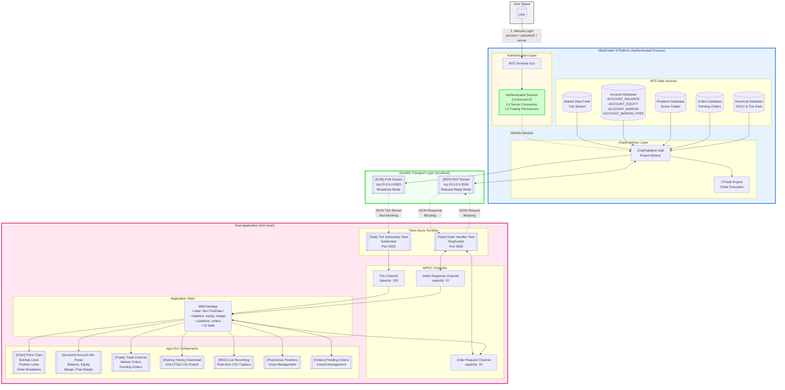
```mermaid
flowchart TB
    subgraph USER_SPACE["User Space"]
        USER[("User")]
    end
    
    subgraph MT5_PLATFORM["MetaTrader 5 Platform (Authenticated Process)"]
        direction TB
        
        subgraph AUTH["Authentication Layer"]
            MT5_GUI[MT5 Terminal GUI]
            SESSION["Authenticated Session<br/>[+] Account ID<br/>[+] Server Connection<br/>[+] Trading Permissions"]
        end
        
        subgraph DATA_SOURCES["MT5 Data Sources"]
            direction TB
            MARKET[("Market Data Feed<br/>Tick Stream")]
            ACCOUNT_DB[("Account Database<br/>ACCOUNT_BALANCE<br/>ACCOUNT_EQUITY<br/>ACCOUNT_MARGIN<br/>ACCOUNT_MARGIN_FREE")]
            POSITIONS_DB[("Positions Database<br/>Active Trades")]
            ORDERS_DB[("Orders Database<br/>Pending Orders")]
            HISTORY_DB[("Historical Database<br/>OHLC & Tick Data")]
        end
        
        subgraph EA_LAYER["Expert Advisor Layer"]
            EA[ZmqPublisher.mq5<br/>Expert Advisor]
            TRADE_ENGINE[CTrade Engine<br/>Order Execution]
        end
        
        USER -->|1. Manual Login<br/>account + password + server| MT5_GUI
        MT5_GUI --> SESSION
        SESSION -.->|Inherits Session| EA
        
        MARKET --> EA
        ACCOUNT_DB --> EA
        POSITIONS_DB --> EA
        ORDERS_DB --> EA
        HISTORY_DB --> EA
        EA --> TRADE_ENGINE
    end
    
    subgraph ZMQ_LAYER["ZeroMQ Transport Layer (localhost)"]
        direction TB
        PUB_SOCKET[["[PUB] PUB Socket<br/>tcp://0.0.0.0:5555<br/>Broadcast Mode"]]
        REP_SOCKET[["[REP] REP Socket<br/>tcp://0.0.0.0:5556<br/>Request-Reply Mode"]]
    end
    
    subgraph RUST_APP["Rust Application (mt5-chart)"]
        direction TB
        
        subgraph ASYNC_RUNTIME["Tokio Async Runtime"]
            TICK_TASK[["[Task] Tick Subscriber Task<br/>SubSocket<br/>Port 5555"]]
            ORDER_TASK[["[Task] Order Handler Task<br/>ReqSocket<br/>Port 5556"]]
        end
        
        subgraph CHANNELS["MPSC Channels"]
            direction TB
            TICK_CHAN[Tick Channel<br/>capacity: 100]
            ORDER_CHAN[Order Request Channel<br/>capacity: 10]
            RESPONSE_CHAN[Order Response Channel<br/>capacity: 10]
        end
        
        subgraph APP_STATE["Application State"]
            STATE[Mt5ChartApp<br/>• data: Vec&lt;TickData&gt;<br/>• balance, equity, margin<br/>• positions, orders<br/>• UI state]
        end
        
        subgraph GUI["egui GUI Components"]
            direction TB
            CHART[["[Chart] Price Chart<br/>Bid/Ask Lines<br/>Position Lines<br/>Order Breaklines"]]
            ACCOUNT_PANEL[["[Account] Account Info Panel<br/>Balance, Equity<br/>Margin, Free Margin"]]
            TRADE_PANEL[["[Trade] Trade Controls<br/>Market Orders<br/>Pending Orders"]]
            HISTORY_PANEL[["[History] History Download<br/>OHLC/Tick CSV Export"]]
            RECORD_PANEL[["[REC] Live Recording<br/>Real-time CSV Capture"]]
            POSITIONS_PANEL[["[Pos] Active Positions<br/>Close Management"]]
            ORDERS_PANEL[["[Orders] Pending Orders<br/>Cancel Management"]]
        end
        
        TICK_TASK --> TICK_CHAN
        ORDER_TASK <--> ORDER_CHAN
        ORDER_TASK <--> RESPONSE_CHAN
        
        TICK_CHAN --> STATE
        STATE <--> ORDER_CHAN
        RESPONSE_CHAN --> STATE
        
        STATE --> CHART
        STATE --> ACCOUNT_PANEL
        STATE --> TRADE_PANEL
        STATE --> HISTORY_PANEL
        STATE --> RECORD_PANEL
        STATE --> POSITIONS_PANEL
        STATE --> ORDERS_PANEL
    end
    
    EA --> PUB_SOCKET
    EA <--> REP_SOCKET
    
    PUB_SOCKET -.->|JSON Tick Stream<br/>Non-blocking| TICK_TASK
    ORDER_TASK -.->|JSON Request<br/>Blocking| REP_SOCKET
    REP_SOCKET -.->|JSON Response<br/>Blocking| ORDER_TASK
    
    style USER_SPACE fill:#f0f0f0,stroke:#666,stroke-width:2px
    style MT5_PLATFORM fill:#e6f3ff,stroke:#0066cc,stroke-width:3px
    style AUTH fill:#fff9e6,stroke:#ffcc00,stroke-width:2px
    style ZMQ_LAYER fill:#f0fff0,stroke:#00cc00,stroke-width:3px
    style RUST_APP fill:#ffe6f0,stroke:#cc0066,stroke-width:3px
    style SESSION fill:#ccffcc,stroke:#00cc00,stroke-width:2px
```

---

## Security Architecture

### Authentication Flow & Credential Isolation

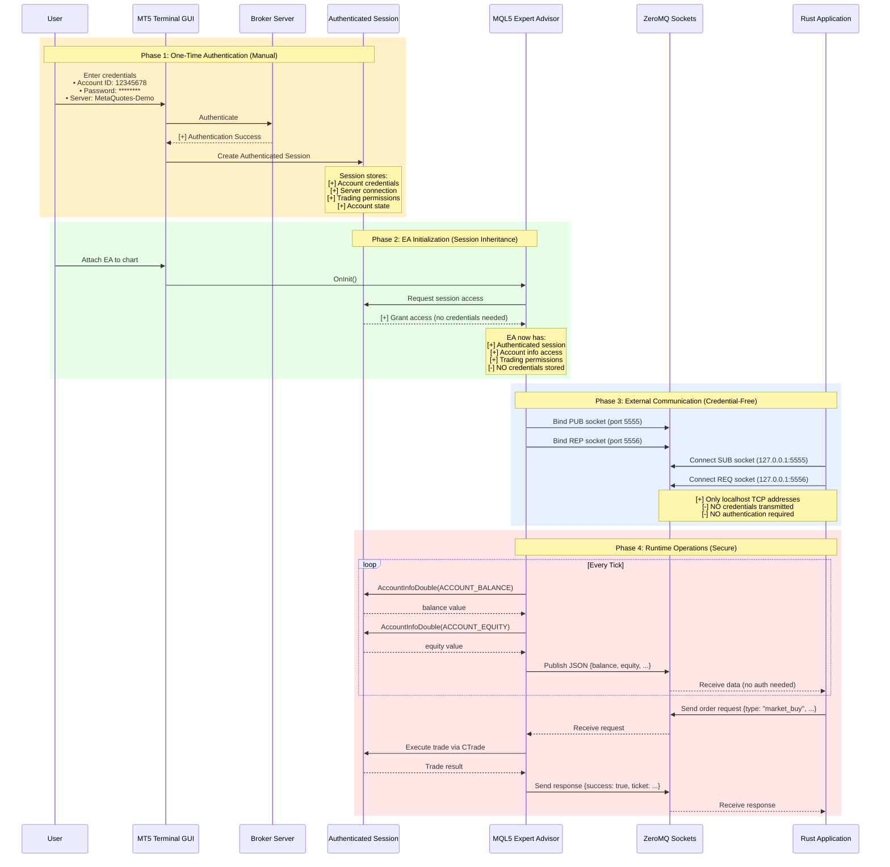
```mermaid
sequenceDiagram
    participant User
    participant MT5_GUI as MT5 Terminal GUI
    participant Broker as Broker Server
    participant Session as Authenticated Session
    participant EA as MQL5 Expert Advisor
    participant ZMQ as ZeroMQ Sockets
    participant Rust as Rust Application
    
    rect rgb(255, 240, 200)
        Note over User,Session: Phase 1: One-Time Authentication (Manual)
        User->>MT5_GUI: Enter credentials<br/>• Account ID: 12345678<br/>• Password: ********<br/>• Server: MetaQuotes-Demo
        MT5_GUI->>Broker: Authenticate
        Broker-->>MT5_GUI: [+] Authentication Success
        MT5_GUI->>Session: Create Authenticated Session
        Note over Session: Session stores:<br/>[+] Account credentials<br/>[+] Server connection<br/>[+] Trading permissions<br/>[+] Account state
    end
    
    rect rgb(230, 255, 230)
        Note over Session,EA: Phase 2: EA Initialization (Session Inheritance)
        User->>MT5_GUI: Attach EA to chart
        MT5_GUI->>EA: OnInit()
        EA->>Session: Request session access
        Session-->>EA: [+] Grant access (no credentials needed)
        Note over EA: EA now has:<br/>[+] Authenticated session<br/>[+] Account info access<br/>[+] Trading permissions<br/>[-] NO credentials stored
    end
    
    rect rgb(230, 240, 255)
        Note over EA,Rust: Phase 3: External Communication (Credential-Free)
        EA->>ZMQ: Bind PUB socket (port 5555)
        EA->>ZMQ: Bind REP socket (port 5556)
        Rust->>ZMQ: Connect SUB socket (127.0.0.1:5555)
        Rust->>ZMQ: Connect REQ socket (127.0.0.1:5556)
        Note over ZMQ,Rust: [+] Only localhost TCP addresses<br/>[-] NO credentials transmitted<br/>[-] NO authentication required
    end
    
    rect rgb(255, 230, 230)
        Note over EA,Rust: Phase 4: Runtime Operations (Secure)
        loop Every Tick
            EA->>Session: AccountInfoDouble(ACCOUNT_BALANCE)
            Session-->>EA: balance value
            EA->>Session: AccountInfoDouble(ACCOUNT_EQUITY)
            Session-->>EA: equity value
            EA->>ZMQ: Publish JSON {balance, equity, ...}
            ZMQ-->>Rust: Receive data (no auth needed)
        end
        
        Rust->>ZMQ: Send order request {type: "market_buy", ...}
        ZMQ-->>EA: Receive request
        EA->>Session: Execute trade via CTrade
        Session-->>EA: Trade result
        EA->>ZMQ: Send response {success: true, ticket: ...}
        ZMQ-->>Rust: Receive response
    end
```

### Security Comparison: MT5 Python API vs. MQL5+ZMQ+Rust

| Security Aspect | MT5 Python API | MQL5 + ZeroMQ + Rust |
|----------------|----------------|----------------------|
| **Credentials in Code** | Required (`account`, `password`, `server`) | Not Required |
| **Credential Storage** | Must store in config/env vars | No storage needed |
| **Credential Transmission** | Transmitted via Python API | Never transmitted |
| **Authentication Method** | Programmatic (code-based) | Manual (GUI-based) |
| **Session Model** | Python creates new session | EA inherits existing session |
| **Attack Surface** | High (credentials exposed) | Low (no credentials) |
| **Version Control Risk** | High (accidental commits) | None |
| **Network Exposure** | Depends on configuration | Localhost only (default) |
| **Credential Interception** | Possible during transmission | Not applicable |
| **Separation of Concerns** | Mixed (auth + trading) | Clear (auth separate) |

### Account Information Access Pattern

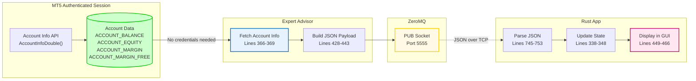
```mermaid
flowchart LR
    subgraph MT5["MT5 Authenticated Session"]
        ACC_API["Account Info API<br/>AccountInfoDouble()"]
        ACC_DATA[(Account Data<br/>ACCOUNT_BALANCE<br/>ACCOUNT_EQUITY<br/>ACCOUNT_MARGIN<br/>ACCOUNT_MARGIN_FREE)]
    end
    
    subgraph EA["Expert Advisor"]
        FETCH[Fetch Account Info<br/>Lines 366-369]
        JSON_BUILD[Build JSON Payload<br/>Lines 428-443]
    end
    
    subgraph ZMQ["ZeroMQ"]
        PUB[PUB Socket<br/>Port 5555]
    end
    
    subgraph RUST["Rust App"]
        PARSE[Parse JSON<br/>Lines 745-753]
        UPDATE[Update State<br/>Lines 338-348]
        DISPLAY[Display in GUI<br/>Lines 449-466]
    end
    
    ACC_API --> ACC_DATA
    ACC_DATA -->|No credentials needed| FETCH
    FETCH --> JSON_BUILD
    JSON_BUILD --> PUB
    PUB -.->|JSON over TCP| PARSE
    PARSE --> UPDATE
    UPDATE --> DISPLAY
    
    style ACC_DATA fill:#ccffcc,stroke:#00cc00,stroke-width:2px
    style FETCH fill:#e6f3ff,stroke:#0066cc,stroke-width:2px
    style PUB fill:#fff9e6,stroke:#ffcc00,stroke-width:2px
    style DISPLAY fill:#ffe6f0,stroke:#cc0066,stroke-width:2px
```

---

## Component Deep Dive

### 1. MQL5 Expert Advisor: ZmqPublisher.mq5

#### File Structure
- **Location**: `MQL5/Experts/ZmqPublisher.mq5`
- **Lines**: 451
- **Size**: 19,014 bytes
- **Dependencies**: `Zmq.mqh`, `Trade.mqh`

#### Input Parameters

```mql5
input string InpPubAddress = "tcp://0.0.0.0:5555"; // Tick Publisher Address
input string InpRepAddress = "tcp://0.0.0.0:5556"; // Order Handler Address
input double InpDefaultSlippage = 10;              // Default Slippage (points)
```

#### Global Variables

```mql5
CZmq *g_publisher;  // PUB socket for tick data broadcasting
CZmq *g_responder;  // REP socket for order request handling
CTrade g_trade;     // MT5 trading helper class
```

#### Initialization Sequence (OnInit)

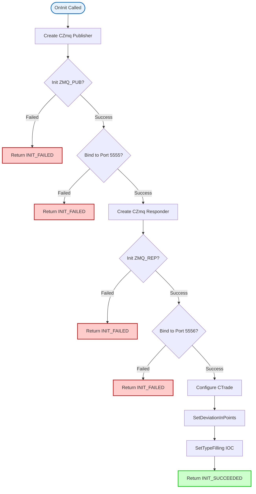
```mermaid
flowchart TD
    START([OnInit Called]) --> INIT_PUB[Create CZmq Publisher]
    INIT_PUB --> PUB_INIT{Init ZMQ_PUB?}
    PUB_INIT -->|Failed| FAIL1[Return INIT_FAILED]
    PUB_INIT -->|Success| PUB_BIND{Bind to Port 5555?}
    PUB_BIND -->|Failed| FAIL2[Return INIT_FAILED]
    PUB_BIND -->|Success| INIT_REP[Create CZmq Responder]
    
    INIT_REP --> REP_INIT{Init ZMQ_REP?}
    REP_INIT -->|Failed| FAIL3[Return INIT_FAILED]
    REP_INIT -->|Success| REP_BIND{Bind to Port 5556?}
    REP_BIND -->|Failed| FAIL4[Return INIT_FAILED]
    REP_BIND -->|Success| CONFIG_TRADE[Configure CTrade]
    
    CONFIG_TRADE --> SET_SLIP[SetDeviationInPoints]
    SET_SLIP --> SET_FILL[SetTypeFilling IOC]
    SET_FILL --> SUCCESS[Return INIT_SUCCEEDED]
    
    style START fill:#e6f3ff,stroke:#0066cc,stroke-width:2px
    style SUCCESS fill:#ccffcc,stroke:#00cc00,stroke-width:2px
    style FAIL1 fill:#ffcccc,stroke:#cc0000,stroke-width:2px
    style FAIL2 fill:#ffcccc,stroke:#cc0000,stroke-width:2px
    style FAIL3 fill:#ffcccc,stroke:#cc0000,stroke-width:2px
    style FAIL4 fill:#ffcccc,stroke:#cc0000,stroke-width:2px
```

#### OnTick() Processing Flow

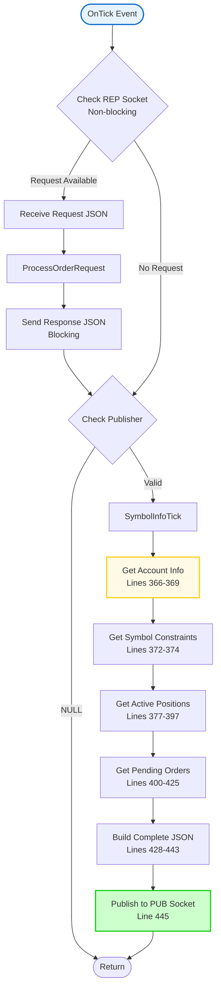
```mermaid
flowchart TB
    TICK([OnTick Event]) --> CHECK_REQ{Check REP Socket<br/>Non-blocking}
    
    CHECK_REQ -->|Request Available| RECV_REQ[Receive Request JSON]
    RECV_REQ --> PROCESS[ProcessOrderRequest]
    PROCESS --> SEND_RESP[Send Response JSON<br/>Blocking]
    SEND_RESP --> CHECK_PUB
    
    CHECK_REQ -->|No Request| CHECK_PUB{Check Publisher}
    
    CHECK_PUB -->|NULL| END([Return])
    CHECK_PUB -->|Valid| GET_TICK[SymbolInfoTick]
    
    GET_TICK --> GET_ACCOUNT[Get Account Info<br/>Lines 366-369]
    GET_ACCOUNT --> GET_CONSTRAINTS[Get Symbol Constraints<br/>Lines 372-374]
    GET_CONSTRAINTS --> GET_POSITIONS[Get Active Positions<br/>Lines 377-397]
    GET_POSITIONS --> GET_ORDERS[Get Pending Orders<br/>Lines 400-425]
    GET_ORDERS --> BUILD_JSON[Build Complete JSON<br/>Lines 428-443]
    BUILD_JSON --> PUBLISH[Publish to PUB Socket<br/>Line 445]
    PUBLISH --> END
    
    style TICK fill:#e6f3ff,stroke:#0066cc,stroke-width:2px
    style GET_ACCOUNT fill:#fff9e6,stroke:#ffcc00,stroke-width:2px
    style PUBLISH fill:#ccffcc,stroke:#00cc00,stroke-width:2px
```

#### Account Information Fetching (Detailed)

**Lines 366-369: Account Info Retrieval**

```mql5
// Get account info
double balance = AccountInfoDouble(ACCOUNT_BALANCE);
double equity = AccountInfoDouble(ACCOUNT_EQUITY);
double margin = AccountInfoDouble(ACCOUNT_MARGIN);
double freeMargin = AccountInfoDouble(ACCOUNT_MARGIN_FREE);
```

**MQL5 Account Info Functions**:
- `AccountInfoDouble(ACCOUNT_BALANCE)` - Current account balance
- `AccountInfoDouble(ACCOUNT_EQUITY)` - Current equity (balance + floating P/L)
- `AccountInfoDouble(ACCOUNT_MARGIN)` - Margin currently used
- `AccountInfoDouble(ACCOUNT_MARGIN_FREE)` - Free margin available

**Security Note**: These functions access the authenticated session's account data **without requiring credentials**. The EA inherits the session from the MT5 terminal.

#### Symbol Trading Constraints (Lines 372-374)

```mql5
// Get symbol trading constraints
double minLot = SymbolInfoDouble(_Symbol, SYMBOL_VOLUME_MIN);
double maxLot = SymbolInfoDouble(_Symbol, SYMBOL_VOLUME_MAX);
double lotStep = SymbolInfoDouble(_Symbol, SYMBOL_VOLUME_STEP);
```

#### Position Fetching Loop (Lines 377-397)

```mql5
// Get Active Positions (Only for current symbol to simplify)
string positionsJson = "[";
int posCount = PositionsTotal();
bool firstPos = true;
for(int i = 0; i < posCount; i++) {
   ulong ticket = PositionGetTicket(i);
   if(PositionSelectByTicket(ticket)) {
      if(PositionGetString(POSITION_SYMBOL) == _Symbol) {
         if(!firstPos) StringAdd(positionsJson, ",");
         
         string posType = (PositionGetInteger(POSITION_TYPE) == POSITION_TYPE_BUY) ? "BUY" : "SELL";
         StringAdd(positionsJson, "{\"ticket\":" + IntegerToString(ticket) + 
                   ",\"type\":\"" + posType + "\"" +
                   ",\"volume\":" + DoubleToString(PositionGetDouble(POSITION_VOLUME), 2) +
                   ",\"price\":" + DoubleToString(PositionGetDouble(POSITION_PRICE_OPEN), _Digits) +
                   ",\"profit\":" + DoubleToString(PositionGetDouble(POSITION_PROFIT), 2) + 
                   "}");
         firstPos = false;
      }
   }
}
StringAdd(positionsJson, "]");
```

#### Order Request Processing (Lines 87-188)

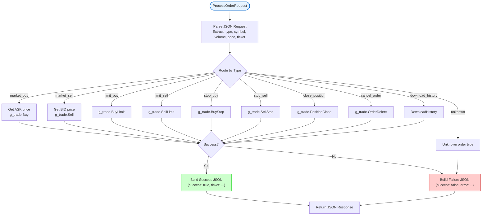
```mermaid
flowchart TD
    START([ProcessOrderRequest]) --> PARSE[Parse JSON Request<br/>Extract: type, symbol, volume, price, ticket]
    
    PARSE --> ROUTE{Route by Type}
    
    ROUTE -->|market_buy| MB[Get ASK price<br/>g_trade.Buy]
    ROUTE -->|market_sell| MS[Get BID price<br/>g_trade.Sell]
    ROUTE -->|limit_buy| LB[g_trade.BuyLimit]
    ROUTE -->|limit_sell| LS[g_trade.SellLimit]
    ROUTE -->|stop_buy| SB[g_trade.BuyStop]
    ROUTE -->|stop_sell| SS[g_trade.SellStop]
    ROUTE -->|close_position| CP[g_trade.PositionClose]
    ROUTE -->|cancel_order| CO[g_trade.OrderDelete]
    ROUTE -->|download_history| DH[DownloadHistory]
    ROUTE -->|unknown| ERR[Unknown order type]
    
    MB --> CHECK{Success?}
    MS --> CHECK
    LB --> CHECK
    LS --> CHECK
    SB --> CHECK
    SS --> CHECK
    CP --> CHECK
    CO --> CHECK
    DH --> CHECK
    ERR --> BUILD_FAIL
    
    CHECK -->|Yes| BUILD_SUCCESS["Build Success JSON<br/>{success: true, ticket: ...}"]
    CHECK -->|No| BUILD_FAIL["Build Failure JSON<br/>{success: false, error: ...}"]
    
    BUILD_SUCCESS --> RETURN[Return JSON Response]
    BUILD_FAIL --> RETURN
    
    style START fill:#e6f3ff,stroke:#0066cc,stroke-width:2px
    style BUILD_SUCCESS fill:#ccffcc,stroke:#00cc00,stroke-width:2px
    style BUILD_FAIL fill:#ffcccc,stroke:#cc0000,stroke-width:2px
```

### 2. ZMQ Wrapper: Zmq.mqh

#### File Structure
- **Location**: `MQL5/Include/Zmq/Zmq.mqh`
- **Lines**: 145
- **Size**: 4,100 bytes
- **Purpose**: MQL5 wrapper around libzmq.dll

#### Class Structure

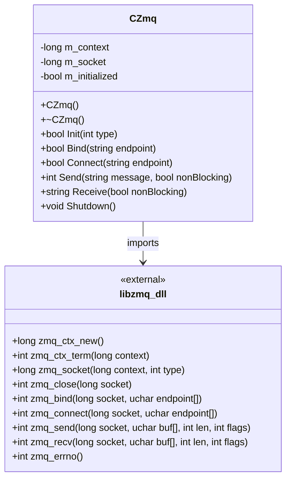
```mermaid
classDiagram
    class CZmq {
        -long m_context
        -long m_socket
        -bool m_initialized
        +CZmq()
        +~CZmq()
        +bool Init(int type)
        +bool Bind(string endpoint)
        +bool Connect(string endpoint)
        +int Send(string message, bool nonBlocking)
        +string Receive(bool nonBlocking)
        +void Shutdown()
    }
    
    class libzmq_dll {
        <<external>>
        +long zmq_ctx_new()
        +int zmq_ctx_term(long context)
        +long zmq_socket(long context, int type)
        +int zmq_close(long socket)
        +int zmq_bind(long socket, uchar endpoint[])
        +int zmq_connect(long socket, uchar endpoint[])
        +int zmq_send(long socket, uchar buf[], int len, int flags)
        +int zmq_recv(long socket, uchar buf[], int len, int flags)
        +int zmq_errno()
    }
    
    CZmq --> libzmq_dll : imports
```

#### Socket Type Constants

```mql5
#define ZMQ_PUB 1    // Publisher socket (one-to-many)
#define ZMQ_SUB 2    // Subscriber socket (many-to-one)
#define ZMQ_REQ 3    // Request socket (synchronous client)
#define ZMQ_REP 4    // Reply socket (synchronous server)
#define ZMQ_NOBLOCK 1 // Non-blocking flag
```

#### Method Details

**Init(int type)** - Lines 51-68
```mql5
bool Init(int type) {
   if(m_initialized) return true;
   
   m_context = zmq_ctx_new();  // Create ZMQ context
   if(m_context == 0) {
      Print("ZMQ Init failed: Context creation error");
      return false;
   }
   
   m_socket = zmq_socket(m_context, type);  // Create socket of specified type
   if(m_socket == 0) {
      Print("ZMQ Init failed: Socket creation error");
      return false;
   }
   
   m_initialized = true;
   return true;
}
```

**Send(string message, bool nonBlocking)** - Lines 98-114
```mql5
int Send(string message, bool nonBlocking = true) {
   if(!m_initialized) return -1;
   
   uchar data[];
   StringToCharArray(message, data, 0, WHOLE_ARRAY, CP_UTF8);
   int len = ArraySize(data) - 1; // Exclude null terminator
   if (len < 0) len = 0;

   int flags = 0;
   if(nonBlocking) flags = ZMQ_NOBLOCK;
   
   int bytesSent = zmq_send(m_socket, data, len, flags);
   return bytesSent;
}
```

**Receive(bool nonBlocking)** - Lines 117-131
```mql5
string Receive(bool nonBlocking = true) {
   if(!m_initialized) return "";
   
   uchar buffer[4096];
   ArrayInitialize(buffer, 0);
   
   int flags = 0;
   if(nonBlocking) flags = ZMQ_NOBLOCK;
   
   int bytesReceived = zmq_recv(m_socket, buffer, ArraySize(buffer) - 1, flags);
   
   if(bytesReceived <= 0) return "";
   
   return CharArrayToString(buffer, 0, bytesReceived, CP_UTF8);
}
```

### 3. Rust Application: main.rs

#### File Structure
- **Location**: `Rustmt5-chart/src/main.rs`
- **Lines**: 853
- **Size**: 35,504 bytes
- **Language**: Rust 2021 Edition

#### Dependencies (Cargo.toml)

```toml
[dependencies]
eframe = "0.27"           # egui framework
egui = "0.27"             # Immediate mode GUI
egui_plot = "0.27"        # Plotting library
serde = { version = "1.0", features = ["derive"] }
serde_json = "1.0"        # JSON serialization
tokio = { version = "1", features = ["full"] }
zeromq = "0.3"            # ZeroMQ bindings
chrono = "0.4"            # Date/time handling
```

#### Data Structure Hierarchy

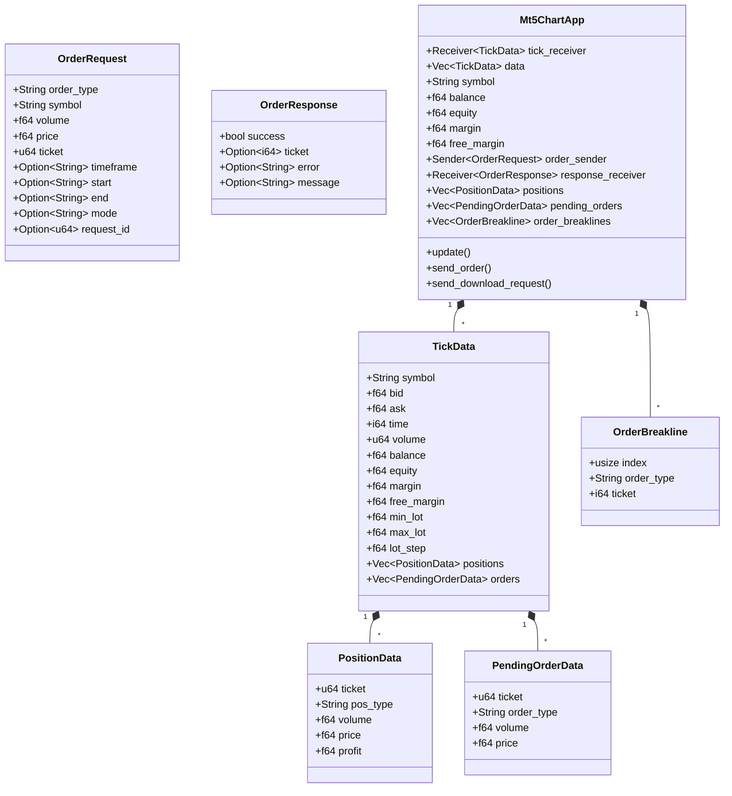
```mermaid
classDiagram
    class TickData {
        +String symbol
        +f64 bid
        +f64 ask
        +i64 time
        +u64 volume
        +f64 balance
        +f64 equity
        +f64 margin
        +f64 free_margin
        +f64 min_lot
        +f64 max_lot
        +f64 lot_step
        +Vec~PositionData~ positions
        +Vec~PendingOrderData~ orders
    }
    
    class PositionData {
        +u64 ticket
        +String pos_type
        +f64 volume
        +f64 price
        +f64 profit
    }
    
    class PendingOrderData {
        +u64 ticket
        +String order_type
        +f64 volume
        +f64 price
    }
    
    class OrderRequest {
        +String order_type
        +String symbol
        +f64 volume
        +f64 price
        +u64 ticket
        +Option~String~ timeframe
        +Option~String~ start
        +Option~String~ end
        +Option~String~ mode
        +Option~u64~ request_id
    }
    
    class OrderResponse {
        +bool success
        +Option~i64~ ticket
        +Option~String~ error
        +Option~String~ message
    }
    
    class OrderBreakline {
        +usize index
        +String order_type
        +i64 ticket
    }
    
    class Mt5ChartApp {
        +Receiver~TickData~ tick_receiver
        +Vec~TickData~ data
        +String symbol
        +f64 balance
        +f64 equity
        +f64 margin
        +f64 free_margin
        +Sender~OrderRequest~ order_sender
        +Receiver~OrderResponse~ response_receiver
        +Vec~PositionData~ positions
        +Vec~PendingOrderData~ pending_orders
        +Vec~OrderBreakline~ order_breaklines
        +update()
        +send_order()
        +send_download_request()
    }
    
    TickData "1" *-- "*" PositionData
    TickData "1" *-- "*" PendingOrderData
    Mt5ChartApp "1" *-- "*" TickData
    Mt5ChartApp "1" *-- "*" OrderBreakline
```

---

## Data Flow & Communication Patterns

### Complete Tick Data Flow

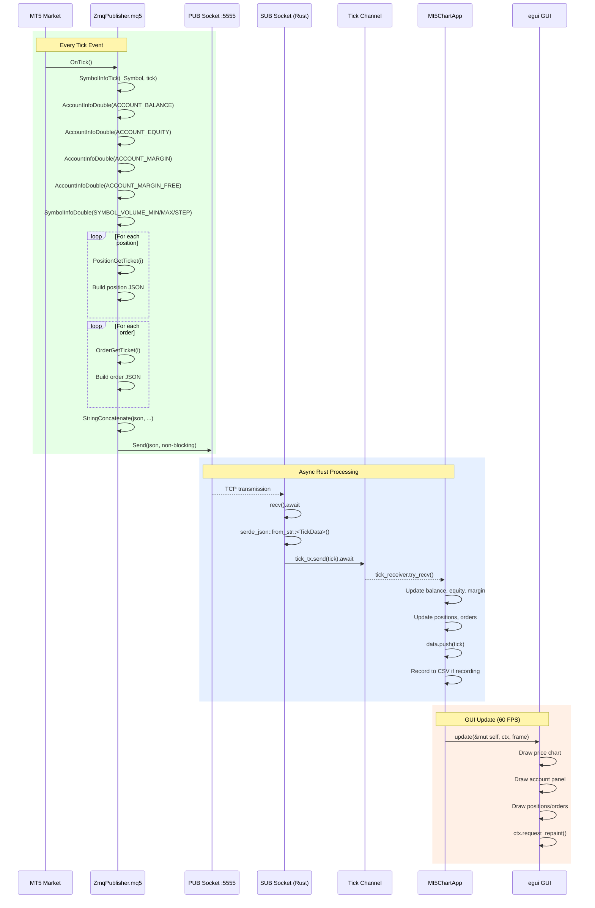
```mermaid
sequenceDiagram
    participant MT5 as MT5 Market
    participant EA as ZmqPublisher.mq5
    participant PUB as PUB Socket :5555
    participant SUB as SUB Socket (Rust)
    participant CHAN as Tick Channel
    participant APP as Mt5ChartApp
    participant GUI as egui GUI
    
    rect rgb(230, 255, 230)
        Note over MT5,EA: Every Tick Event
        MT5->>EA: OnTick()
        
        EA->>EA: SymbolInfoTick(_Symbol, tick)
        EA->>EA: AccountInfoDouble(ACCOUNT_BALANCE)
        EA->>EA: AccountInfoDouble(ACCOUNT_EQUITY)
        EA->>EA: AccountInfoDouble(ACCOUNT_MARGIN)
        EA->>EA: AccountInfoDouble(ACCOUNT_MARGIN_FREE)
        EA->>EA: SymbolInfoDouble(SYMBOL_VOLUME_MIN/MAX/STEP)
        
        loop For each position
            EA->>EA: PositionGetTicket(i)
            EA->>EA: Build position JSON
        end
        
        loop For each order
            EA->>EA: OrderGetTicket(i)
            EA->>EA: Build order JSON
        end
        
        EA->>EA: StringConcatenate(json, ...)
        EA->>PUB: Send(json, non-blocking)
    end
    
    rect rgb(230, 240, 255)
        Note over PUB,APP: Async Rust Processing
        PUB-->>SUB: TCP transmission
        SUB->>SUB: recv().await
        SUB->>SUB: serde_json::from_str::<TickData>()
        SUB->>CHAN: tick_tx.send(tick).await
        
        CHAN-->>APP: tick_receiver.try_recv()
        APP->>APP: Update balance, equity, margin
        APP->>APP: Update positions, orders
        APP->>APP: data.push(tick)
        APP->>APP: Record to CSV if recording
    end
    
    rect rgb(255, 240, 230)
        Note over APP,GUI: GUI Update (60 FPS)
        APP->>GUI: update(&mut self, ctx, frame)
        GUI->>GUI: Draw price chart
        GUI->>GUI: Draw account panel
        GUI->>GUI: Draw positions/orders
        GUI->>GUI: ctx.request_repaint()
    end
```

### Complete Order Execution Flow

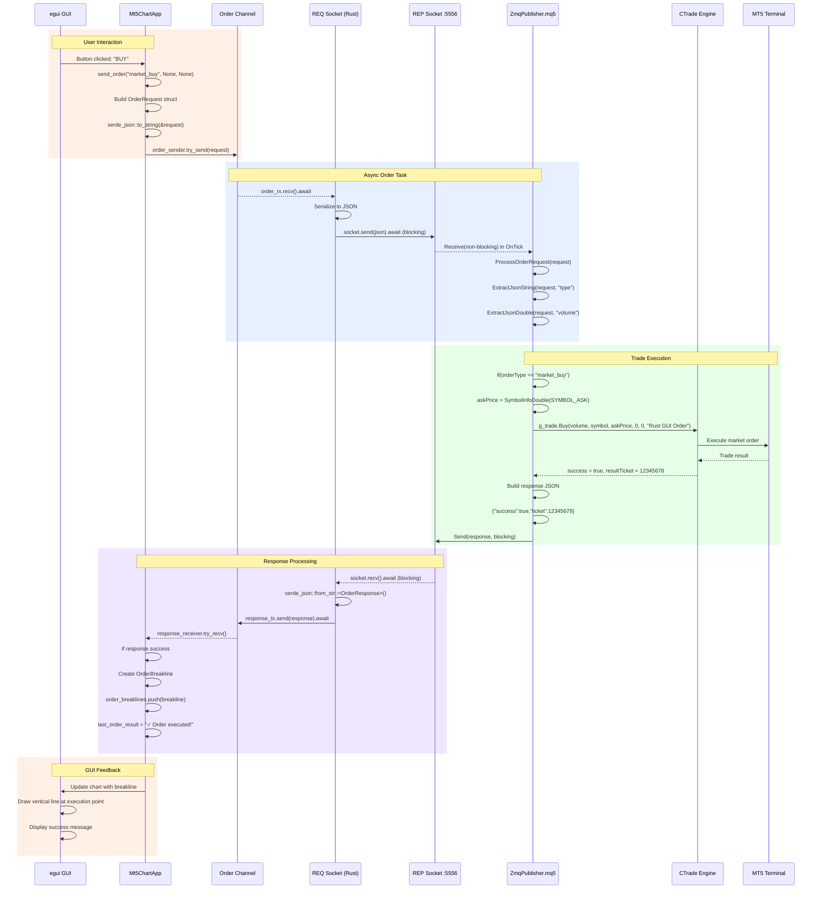
```mermaid
sequenceDiagram
    participant GUI as egui GUI
    participant APP as Mt5ChartApp
    participant CHAN as Order Channel
    participant REQ as REQ Socket (Rust)
    participant REP as REP Socket :5556
    participant EA as ZmqPublisher.mq5
    participant TRADE as CTrade Engine
    participant MT5 as MT5 Terminal
    
    rect rgb(255, 240, 230)
        Note over GUI,APP: User Interaction
        GUI->>APP: Button clicked: "BUY"
        APP->>APP: send_order("market_buy", None, None)
        APP->>APP: Build OrderRequest struct
        APP->>APP: serde_json::to_string(&request)
        APP->>CHAN: order_sender.try_send(request)
    end
    
    rect rgb(230, 240, 255)
        Note over CHAN,EA: Async Order Task
        CHAN-->>REQ: order_rx.recv().await
        REQ->>REQ: Serialize to JSON
        REQ->>REP: socket.send(json).await (blocking)
        
        REP-->>EA: Receive(non-blocking) in OnTick
        EA->>EA: ProcessOrderRequest(request)
        EA->>EA: ExtractJsonString(request, "type")
        EA->>EA: ExtractJsonDouble(request, "volume")
    end
    
    rect rgb(230, 255, 230)
        Note over EA,MT5: Trade Execution
        EA->>EA: if(orderType == "market_buy")
        EA->>EA: askPrice = SymbolInfoDouble(SYMBOL_ASK)
        EA->>TRADE: g_trade.Buy(volume, symbol, askPrice, 0, 0, "Rust GUI Order")
        TRADE->>MT5: Execute market order
        MT5-->>TRADE: Trade result
        TRADE-->>EA: success = true, resultTicket = 12345678
        
        EA->>EA: Build response JSON
        EA->>EA: {"success":true,"ticket":12345678}
        EA->>REP: Send(response, blocking)
    end
    
    rect rgb(240, 230, 255)
        Note over REP,APP: Response Processing
        REP-->>REQ: socket.recv().await (blocking)
        REQ->>REQ: serde_json::from_str::<OrderResponse>()
        REQ->>CHAN: response_tx.send(response).await
        
        CHAN-->>APP: response_receiver.try_recv()
        APP->>APP: if response.success
        APP->>APP: Create OrderBreakline
        APP->>APP: order_breaklines.push(breakline)
        APP->>APP: last_order_result = "✓ Order executed!"
    end
    
    rect rgb(255, 240, 230)
        Note over APP,GUI: GUI Feedback
        APP->>GUI: Update chart with breakline
        GUI->>GUI: Draw vertical line at execution point
        GUI->>GUI: Display success message
    end
```

---

## Account Information Fetching

### MQL5 Account Info API

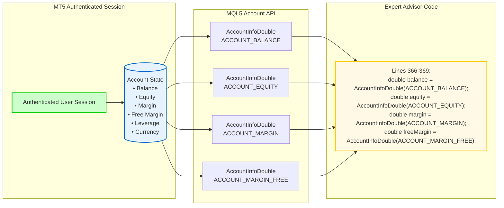
```mermaid
flowchart LR
    subgraph MT5_SESSION["MT5 Authenticated Session"]
        AUTH[Authenticated User Session]
        ACC_STATE[(Account State<br/>• Balance<br/>• Equity<br/>• Margin<br/>• Free Margin<br/>• Leverage<br/>• Currency)]
    end
    
    subgraph MQL5_API["MQL5 Account API"]
        API1[AccountInfoDouble<br/>ACCOUNT_BALANCE]
        API2[AccountInfoDouble<br/>ACCOUNT_EQUITY]
        API3[AccountInfoDouble<br/>ACCOUNT_MARGIN]
        API4[AccountInfoDouble<br/>ACCOUNT_MARGIN_FREE]
    end
    
    subgraph EA_CODE["Expert Advisor Code"]
        FETCH["Lines 366-369:<br/>double balance = AccountInfoDouble(ACCOUNT_BALANCE);<br/>double equity = AccountInfoDouble(ACCOUNT_EQUITY);<br/>double margin = AccountInfoDouble(ACCOUNT_MARGIN);<br/>double freeMargin = AccountInfoDouble(ACCOUNT_MARGIN_FREE);"]
    end
    
    AUTH --> ACC_STATE
    ACC_STATE --> API1
    ACC_STATE --> API2
    ACC_STATE --> API3
    ACC_STATE --> API4
    
    API1 --> FETCH
    API2 --> FETCH
    API3 --> FETCH
    API4 --> FETCH
    
    style AUTH fill:#ccffcc,stroke:#00cc00,stroke-width:2px
    style ACC_STATE fill:#e6f3ff,stroke:#0066cc,stroke-width:2px
    style FETCH fill:#fff9e6,stroke:#ffcc00,stroke-width:2px
```

### Account Info Constants (MQL5)

| Constant | Type | Description |
|----------|------|-------------|
| `ACCOUNT_BALANCE` | double | Account balance in deposit currency |
| `ACCOUNT_EQUITY` | double | Account equity (balance + floating P/L) |
| `ACCOUNT_MARGIN` | double | Margin currently used |
| `ACCOUNT_MARGIN_FREE` | double | Free margin available for trading |
| `ACCOUNT_MARGIN_LEVEL` | double | Margin level percentage |
| `ACCOUNT_PROFIT` | double | Current profit on all positions |
| `ACCOUNT_CREDIT` | double | Credit amount |
| `ACCOUNT_LEVERAGE` | long | Account leverage (e.g., 100 for 1:100) |
| `ACCOUNT_CURRENCY` | string | Account currency (e.g., "USD") |

### Rust Account Info Reception

**Lines 338-348: Account Info Update**

```rust
// Update account info from latest tick
if tick.balance > 0.0 {
    self.balance = tick.balance;
    self.equity = tick.equity;
    self.margin = tick.margin;
    self.free_margin = tick.free_margin;
    self.min_lot = tick.min_lot;
    self.max_lot = tick.max_lot;
    if tick.lot_step > 0.0 {
        self.lot_step = tick.lot_step;
    }
}
```

**Lines 449-466: Account Info Display**

```rust
ui.collapsing("Account Info", |ui| {
    egui::Grid::new("account_grid")
        .num_columns(2)
        .spacing([10.0, 4.0])
        .show(ui, |ui| {
            ui.label("Balance:");
            ui.colored_label(egui::Color32::from_rgb(100, 200, 100), format!("${:.2}", self.balance));
            ui.end_row();
            ui.label("Equity:");
            ui.colored_label(egui::Color32::from_rgb(100, 180, 255), format!("${:.2}", self.equity));
            ui.end_row();
            ui.label("Margin Used:");
            ui.colored_label(egui::Color32::from_rgb(255, 200, 100), format!("${:.2}", self.margin));
            ui.end_row();
            ui.label("Free Margin:");
            ui.colored_label(egui::Color32::from_rgb(100, 255, 200), format!("${:.2}", self.free_margin));
            ui.end_row();
        });
});
```

---

## Complete Data Structures

### JSON Tick Data Format (PUB/SUB Port 5555)

```json
{
    "symbol": "XAUUSDc",
    "bid": 2650.55,
    "ask": 2650.75,
    "time": 1706284800,
    "volume": 100,
    "balance": 10000.00,
    "equity": 10150.25,
    "margin": 500.00,
    "free_margin": 9650.25,
    "min_lot": 0.01,
    "max_lot": 100.00,
    "lot_step": 0.01,
    "positions": [
        {
            "ticket": 12345678,
            "type": "BUY",
            "volume": 0.10,
            "price": 2645.50,
            "profit": 50.50
        },
        {
            "ticket": 12345679,
            "type": "SELL",
            "volume": 0.05,
            "price": 2655.00,
            "profit": -25.00
        }
    ],
    "orders": [
        {
            "ticket": 87654321,
            "type": "BUY LIMIT",
            "volume": 0.05,
            "price": 2600.00
        },
        {
            "ticket": 87654322,
            "type": "SELL STOP",
            "volume": 0.10,
            "price": 2700.00
        }
    ]
}
```

### JSON Order Request Format (REQ/REP Port 5556)

**Market Order Request**:
```json
{
    "type": "market_buy",
    "symbol": "XAUUSDc",
    "volume": 0.01,
    "price": 0.0,
    "ticket": 0
}
```

**Pending Order Request**:
```json
{
    "type": "limit_buy",
    "symbol": "XAUUSDc",
    "volume": 0.05,
    "price": 2600.00,
    "ticket": 0
}
```

**Close Position Request**:
```json
{
    "type": "close_position",
    "symbol": "XAUUSDc",
    "volume": 0.0,
    "price": 0.0,
    "ticket": 12345678
}
```

**History Download Request**:
```json
{
    "type": "download_history",
    "symbol": "XAUUSDc",
    "volume": 0.0,
    "price": 0.0,
    "ticket": 0,
    "timeframe": "M1",
    "start": "2024.01.01",
    "end": "2024.01.31",
    "mode": "OHLC",
    "request_id": 1
}
```

### JSON Order Response Format

**Success Response**:
```json
{
    "success": true,
    "ticket": 12345678
}
```

**Failure Response**:
```json
{
    "success": false,
    "error": "Error 10019: Not enough money"
}
```

**History Download Success Response**:
```json
{
    "success": true,
    "message": "1000 records||CSV_DATA||Time,Open,High,Low,Close,TickVol,Spread|NL|2024.01.01 00:00,2650.50,2651.00,2650.00,2650.75,100,3|NL|..."
}
```

---

## ZeroMQ Layer Details

### Socket Patterns

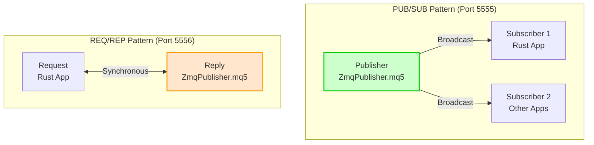
```mermaid
flowchart TB
    subgraph PUB_SUB["PUB/SUB Pattern (Port 5555)"]
        direction LR
        PUB[Publisher<br/>ZmqPublisher.mq5]
        SUB1[Subscriber 1<br/>Rust App]
        SUB2[Subscriber 2<br/>Other Apps]
        
        PUB -->|Broadcast| SUB1
        PUB -->|Broadcast| SUB2
    end
    
    subgraph REQ_REP["REQ/REP Pattern (Port 5556)"]
        direction LR
        REQ[Request<br/>Rust App]
        REP[Reply<br/>ZmqPublisher.mq5]
        
        REQ <-->|Synchronous| REP
    end
    
    style PUB fill:#ccffcc,stroke:#00cc00,stroke-width:2px
    style REP fill:#ffe6cc,stroke:#ff9900,stroke-width:2px
```

### Socket Configuration

**PUB Socket (EA Side)**:
```mql5
g_publisher = new CZmq();
g_publisher.Init(ZMQ_PUB);
g_publisher.Bind("tcp://0.0.0.0:5555");  // Bind to all interfaces
g_publisher.Send(json, true);            // Non-blocking send
```

**SUB Socket (Rust Side)**:
```rust
let mut socket = zeromq::SubSocket::new();
socket.connect("tcp://127.0.0.1:5555").await;  // Connect to localhost
socket.subscribe("").await;                     // Subscribe to all messages
let msg = socket.recv().await;                  // Blocking receive
```

**REP Socket (EA Side)**:
```mql5
g_responder = new CZmq();
g_responder.Init(ZMQ_REP);
g_responder.Bind("tcp://0.0.0.0:5556");     // Bind to all interfaces
string request = g_responder.Receive(true);  // Non-blocking receive
g_responder.Send(response, false);           // Blocking send (REP pattern)
```

**REQ Socket (Rust Side)**:
```rust
let mut socket = zeromq::ReqSocket::new();
socket.connect("tcp://127.0.0.1:5556").await;  // Connect to localhost
socket.send(json_request.into()).await;        // Blocking send
let msg = socket.recv().await;                  // Blocking receive
```

---

## Async Task Management

### Tokio Runtime Architecture

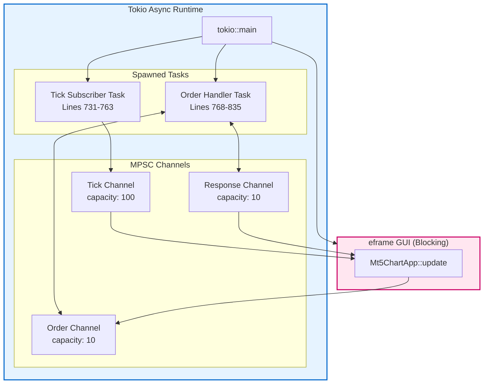
```mermaid
flowchart TB
    subgraph TOKIO["Tokio Async Runtime"]
        MAIN[tokio::main]
        
        subgraph TASKS["Spawned Tasks"]
            TICK_TASK[Tick Subscriber Task<br/>Lines 731-763]
            ORDER_TASK[Order Handler Task<br/>Lines 768-835]
        end
        
        subgraph CHANNELS["MPSC Channels"]
            TICK_CH[Tick Channel<br/>capacity: 100]
            ORDER_CH[Order Channel<br/>capacity: 10]
            RESP_CH[Response Channel<br/>capacity: 10]
        end
    end
    
    subgraph EGUI["eframe GUI (Blocking)"]
        APP[Mt5ChartApp::update]
    end
    
    MAIN --> TICK_TASK
    MAIN --> ORDER_TASK
    MAIN --> EGUI
    
    TICK_TASK --> TICK_CH
    ORDER_TASK <--> ORDER_CH
    ORDER_TASK <--> RESP_CH
    
    TICK_CH --> APP
    APP --> ORDER_CH
    RESP_CH --> APP
    
    style TOKIO fill:#e6f3ff,stroke:#0066cc,stroke-width:2px
    style EGUI fill:#ffe6f0,stroke:#cc0066,stroke-width:2px
```

### Tick Subscriber Task (Lines 731-763)

```rust
tokio::spawn(async move {
    let mut socket = zeromq::SubSocket::new();
    match socket.connect("tcp://127.0.0.1:5555").await {
        Ok(_) => println!("Connected to ZMQ Tick Publisher on port 5555"),
        Err(e) => eprintln!("Failed to connect to ZMQ tick publisher: {}", e),
    }
    
    let _ = socket.subscribe("").await;

    loop {
        match socket.recv().await {
            Ok(msg) => {
                if let Some(payload_bytes) = msg.get(0) {
                    if let Ok(json_str) = std::str::from_utf8(payload_bytes) {
                        match serde_json::from_str::<TickData>(json_str) {
                            Ok(tick) => {
                                if let Err(e) = tick_tx.send(tick).await {
                                    eprintln!("Tick channel error: {}", e);
                                    break;
                                }
                            }
                            Err(e) => eprintln!("JSON Parse Error: {}. Msg: {}", e, json_str),
                        }
                    }
                }
            }
            Err(e) => {
                eprintln!("ZMQ Tick Recv Error: {}", e);
                tokio::time::sleep(tokio::time::Duration::from_millis(1000)).await;
            }
        }
    }
});
```

### Order Handler Task (Lines 768-835)

```rust
tokio::spawn(async move {
    let mut socket = zeromq::ReqSocket::new();
    match socket.connect("tcp://127.0.0.1:5556").await {
        Ok(_) => println!("Connected to ZMQ Order Handler on port 5556"),
        Err(e) => {
            eprintln!("Failed to connect to ZMQ order handler: {}", e);
            return;
        }
    }

    while let Some(order_request) = order_rx.recv().await {
        // Serialize order request to JSON
        let json_request = match serde_json::to_string(&order_request) {
            Ok(json) => json,
            Err(e) => {
                eprintln!("Failed to serialize order request: {}", e);
                continue;
            }
        };
        
        println!("Sending request: {}", json_request);
        
        // Send request (blocking in REQ/REP pattern)
        if let Err(e) = socket.send(json_request.into()).await {
            eprintln!("Failed to send: {}", e);
            let _ = response_tx.send(OrderResponse {
                success: false,
                ticket: None,
                error: Some(format!("Send failed: {}", e)),
                message: None,
            }).await;
            continue;
        }
        
        // Wait for response (blocking in REQ/REP pattern)
        match socket.recv().await {
            Ok(msg) => {
                if let Some(payload_bytes) = msg.get(0) {
                    if let Ok(json_str) = std::str::from_utf8(payload_bytes) {
                        println!("Received response: {}", json_str);
                        match serde_json::from_str::<OrderResponse>(json_str) {
                            Ok(response) => {
                                let _ = response_tx.send(response).await;
                            }
                            Err(e) => {
                                let _ = response_tx.send(OrderResponse {
                                    success: false,
                                    ticket: None,
                                    error: Some(format!("Parse error: {}", e)),
                                    message: None,
                                }).await;
                            }
                        }
                    }
                }
            }
            Err(e) => {
                eprintln!("Response recv error: {}", e);
                let _ = response_tx.send(OrderResponse {
                    success: false,
                    ticket: None,
                    error: Some(format!("Recv failed: {}", e)),
                    message: None,
                }).await;
            }
        }
    }
});
```

---

## File Structure & Dependencies

### Complete Directory Structure

```
SUM3API/
├── MQL5/
│   ├── Experts/
│   │   └── ZmqPublisher.mq5           # Main EA (451 lines, 19 KB)
│   ├── Include/
│   │   └── Zmq/
│   │       └── Zmq.mqh                # ZMQ wrapper (145 lines, 4 KB)
│   └── Libraries/
│       ├── libzmq.dll                 # ZeroMQ native library
│       └── libsodium.dll              # Crypto library (ZMQ dependency)
│
└── Rustmt5-chart/
    ├── Cargo.toml                     # Rust dependencies
    ├── Cargo.lock                     # Dependency lock file (117 KB)
    ├── src/
    │   └── main.rs                    # Main application (853 lines, 35 KB)
    ├── output/                        # CSV output directory
    │   ├── History_*.csv              # Downloaded historical data
    │   └── Live_*.csv                 # Live recorded tick data
    └── target/                        # Build artifacts
        ├── debug/                     # Debug build
        └── release/                   # Release build

```

### Dependency Graph

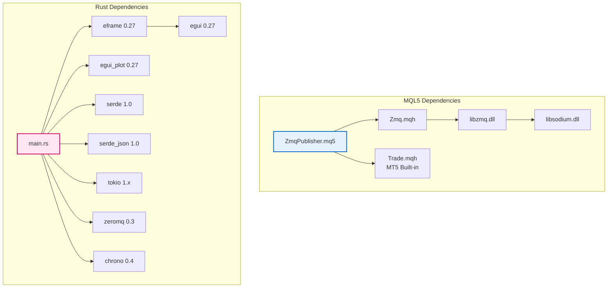
```mermaid
flowchart TB
    subgraph MQL5_DEPS["MQL5 Dependencies"]
        EA[ZmqPublisher.mq5]
        ZMQ_MQH[Zmq.mqh]
        TRADE_MQH[Trade.mqh<br/>MT5 Built-in]
        LIBZMQ[libzmq.dll]
        LIBSODIUM[libsodium.dll]
    end
    
    subgraph RUST_DEPS["Rust Dependencies"]
        MAIN[main.rs]
        EFRAME[eframe 0.27]
        EGUI[egui 0.27]
        EGUI_PLOT[egui_plot 0.27]
        SERDE[serde 1.0]
        SERDE_JSON[serde_json 1.0]
        TOKIO[tokio 1.x]
        ZEROMQ[zeromq 0.3]
        CHRONO[chrono 0.4]
    end
    
    EA --> ZMQ_MQH
    EA --> TRADE_MQH
    ZMQ_MQH --> LIBZMQ
    LIBZMQ --> LIBSODIUM
    
    MAIN --> EFRAME
    MAIN --> EGUI_PLOT
    MAIN --> SERDE
    MAIN --> SERDE_JSON
    MAIN --> TOKIO
    MAIN --> ZEROMQ
    MAIN --> CHRONO
    EFRAME --> EGUI
    
    style EA fill:#e6f3ff,stroke:#0066cc,stroke-width:2px
    style MAIN fill:#ffe6f0,stroke:#cc0066,stroke-width:2px
```

---

## Summary

This document provides a complete end-to-end technical specification of the MQL5 ↔ ZeroMQ ↔ Rust trading system, including:

**Security Architecture**: Credential-free design with session inheritance  
**Account Information Flow**: From MT5 API to Rust GUI  
**Complete Data Structures**: JSON formats and Rust/MQL5 types  
**Communication Patterns**: PUB/SUB and REQ/REP with sequence diagrams  
**Async Task Management**: Tokio runtime and channel architecture  
**Micro-level Implementation**: Line-by-line code references  
**File Structure**: Complete dependency graph  

**Key Security Advantage**: Unlike MT5's Python API which requires explicit credentials in code, this system leverages MT5's authenticated session, eliminating credential exposure entirely.

---

# MQL5 ZeroMQ Wrapper Library

A comprehensive reusable MQL5 wrapper library for ZeroMQ socket operations, designed for real-time communication between MetaTrader 5 and external applications.

---

## Table of Contents

1. [Overview](#overview)
2. [Architecture](#architecture)
3. [Prerequisites and Installation](#prerequisites-and-installation)
4. [API Reference](#api-reference)
5. [Usage Guide](#usage-guide)
6. [Socket Patterns](#socket-patterns)
7. [Message Protocol](#message-protocol)
8. [Complete Examples](#complete-examples)
9. [Error Handling](#error-handling)
10. [Best Practices](#best-practices)
11. [Troubleshooting](#troubleshooting)

---

## Overview

This library provides a high-level MQL5 wrapper around the native ZeroMQ (libzmq) library, enabling MetaTrader 5 Expert Advisors and indicators to communicate with external applications via TCP sockets.

> [!NOTE]
> For the companion Rust client library, see [Rust-ZMQ Library for SUM3API](Rust-ZMQ%20Library%20for%20SUM3API.md).

### Key Features

- **Simple API**: Object-oriented wrapper class with intuitive methods
- **Multiple Socket Types**: Support for PUB, SUB, REQ, and REP patterns
- **Non-blocking Operations**: Configurable blocking/non-blocking send and receive
- **UTF-8 Support**: Automatic string encoding/decoding
- **Resource Management**: Automatic cleanup on destruction

### Supported Socket Types

| Constant | Value | Description |
|----------|-------|-------------|
| `ZMQ_PUB` | 1 | Publisher socket for broadcasting messages |
| `ZMQ_SUB` | 2 | Subscriber socket for receiving broadcasts |
| `ZMQ_REQ` | 3 | Request socket for request/reply pattern (client) |
| `ZMQ_REP` | 4 | Reply socket for request/reply pattern (server) |

---

## Architecture

### System Overview

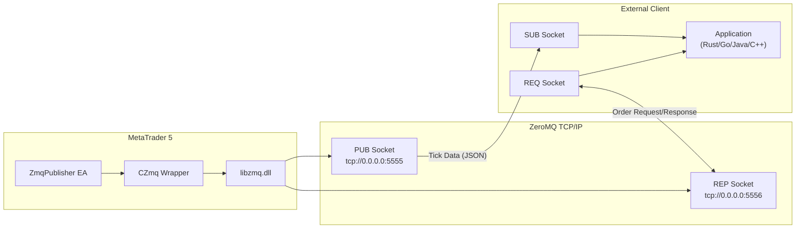
```mermaid
flowchart LR
    subgraph MT5["MetaTrader 5"]
        EA["ZmqPublisher EA"]
        CZmq["CZmq Wrapper"]
        DLL["libzmq.dll"]
        EA --> CZmq
        CZmq --> DLL
    end

    subgraph Network["ZeroMQ TCP/IP"]
        PUB["PUB Socket<br/>tcp://0.0.0.0:5555"]
        REP["REP Socket<br/>tcp://0.0.0.0:5556"]
    end

    subgraph Client["External Client"]
        SUB["SUB Socket"]
        REQ["REQ Socket"]
        APP["Application<br/>(Rust/Go/Java/C++)"]
        SUB --> APP
        REQ --> APP
    end

    DLL --> PUB
    DLL --> REP
    PUB -->|"Tick Data (JSON)"| SUB
    REQ <-->|"Order Request/Response"| REP
```

### Communication Flow

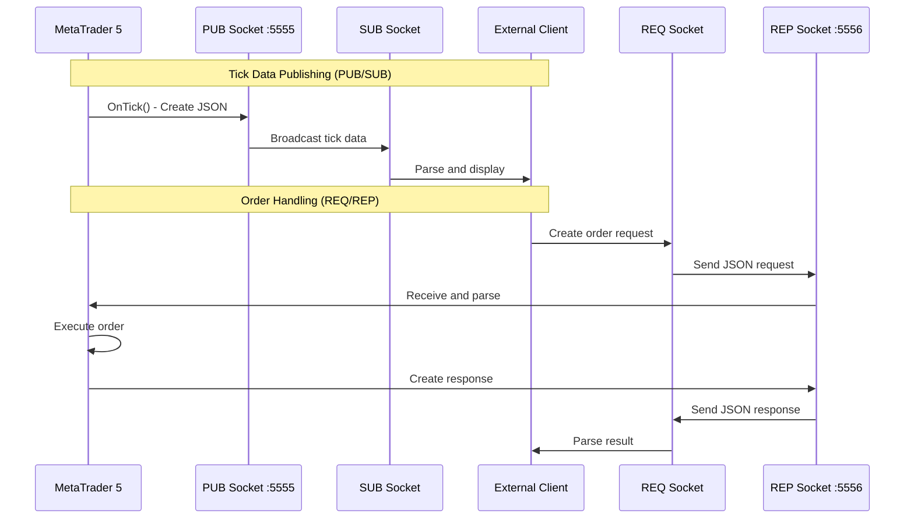
```mermaid
sequenceDiagram
    participant MT5 as MetaTrader 5
    participant PUB as PUB Socket :5555
    participant SUB as SUB Socket
    participant Client as External Client
    participant REQ as REQ Socket
    participant REP as REP Socket :5556

    Note over MT5,Client: Tick Data Publishing (PUB/SUB)
    MT5->>PUB: OnTick() - Create JSON
    PUB->>SUB: Broadcast tick data
    SUB->>Client: Parse and display

    Note over MT5,Client: Order Handling (REQ/REP)
    Client->>REQ: Create order request
    REQ->>REP: Send JSON request
    REP->>MT5: Receive and parse
    MT5->>MT5: Execute order
    MT5->>REP: Create response
    REP->>REQ: Send JSON response
    REQ->>Client: Parse result
```

### Pattern Details

1. **Tick Data Publishing** (PUB/SUB Pattern)
   - EA binds PUB socket to `tcp://0.0.0.0:5555`
   - External client subscribes via SUB socket
   - EA publishes tick data as JSON on every tick

2. **Order Handling** (REQ/REP Pattern)
   - EA binds REP socket to `tcp://0.0.0.0:5556`
   - External client sends order requests via REQ socket
   - EA processes orders and sends responses

---

## Prerequisites and Installation

### Required Files

Place the following files in your MetaTrader 5 installation directory:

```
MQL5/
  |-- Libraries/
  |     |-- libzmq.dll          # ZeroMQ core library
  |     |-- libsodium.dll       # Cryptographic dependency for libzmq
  |
  |-- Include/
  |     |-- Zmq/
  |           |-- Zmq.mqh       # MQL5 wrapper class
  |
  |-- Experts/
        |-- ZmqPublisher.mq5    # Example Expert Advisor
```

### Installation Steps

1. **Download ZeroMQ Libraries**
   - Download `libzmq.dll` (v4.3.x or later) from [ZeroMQ releases](https://github.com/zeromq/libzmq/releases)
   - Download `libsodium.dll` from [libsodium releases](https://github.com/jedisct1/libsodium/releases)
   - Both DLLs must be the same architecture (x64 for 64-bit MT5)

2. **Copy Files**
   ```
   Copy libzmq.dll    --> MQL5/Libraries/
   Copy libsodium.dll --> MQL5/Libraries/
   Copy Zmq.mqh       --> MQL5/Include/Zmq/
   ```

3. **Enable DLL Imports in MetaTrader 5**
   - Go to `Tools > Options > Expert Advisors`
   - Enable "Allow DLL imports"
   - Disable "Allow DLL imports only for signed DLLs" (or sign the DLLs)

4. **Compile Your EA**
   - Open MetaEditor
   - Include the wrapper: `#include <Zmq/Zmq.mqh>`
   - Compile your Expert Advisor

---

## API Reference

### Class: CZmq

The main wrapper class for ZeroMQ operations.

#### Constructor and Destructor

```cpp
CZmq()
```
Creates a new CZmq instance. Does not initialize any ZMQ resources.

```cpp
~CZmq()
```
Destructor. Automatically calls `Shutdown()` to clean up resources.

---

#### Init

```cpp
bool Init(int type)
```

Initializes the ZeroMQ context and creates a socket of the specified type.

**Parameters:**
| Name | Type | Description |
|------|------|-------------|
| `type` | `int` | Socket type: `ZMQ_PUB`, `ZMQ_SUB`, `ZMQ_REQ`, or `ZMQ_REP` |

**Returns:**
- `true` if initialization succeeded
- `false` if context or socket creation failed

**Example:**
```cpp
CZmq *publisher = new CZmq();
if(!publisher.Init(ZMQ_PUB)) {
    Print("Failed to initialize ZMQ publisher");
    return INIT_FAILED;
}
```

---

#### Bind

```cpp
bool Bind(string endpoint)
```

Binds the socket to a local endpoint. Typically used by server-side sockets (PUB, REP).

**Parameters:**
| Name | Type | Description |
|------|------|-------------|
| `endpoint` | `string` | ZMQ endpoint URL (e.g., `"tcp://0.0.0.0:5555"`) |

**Returns:**
- `true` if binding succeeded
- `false` if binding failed (check logs for error code)

**Endpoint Formats:**
| Format | Description |
|--------|-------------|
| `tcp://*:5555` | Bind to all interfaces on port 5555 |
| `tcp://0.0.0.0:5555` | Same as above |
| `tcp://127.0.0.1:5555` | Bind to localhost only |
| `ipc:///tmp/socket` | Inter-process communication (Unix only) |

**Example:**
```cpp
if(!publisher.Bind("tcp://0.0.0.0:5555")) {
    Print("Failed to bind to port 5555");
    return INIT_FAILED;
}
```

---

#### Connect

```cpp
bool Connect(string endpoint)
```

Connects the socket to a remote endpoint. Typically used by client-side sockets (SUB, REQ).

**Parameters:**
| Name | Type | Description |
|------|------|-------------|
| `endpoint` | `string` | ZMQ endpoint URL (e.g., `"tcp://127.0.0.1:5555"`) |

**Returns:**
- `true` if connection initiated successfully
- `false` if connection failed

**Example:**
```cpp
CZmq *subscriber = new CZmq();
subscriber.Init(ZMQ_SUB);
if(!subscriber.Connect("tcp://127.0.0.1:5555")) {
    Print("Failed to connect to publisher");
}
```

---

#### Send

```cpp
int Send(string message, bool nonBlocking = true)
```

Sends a string message through the socket.

**Parameters:**
| Name | Type | Description |
|------|------|-------------|
| `message` | `string` | The message to send (UTF-8 encoded) |
| `nonBlocking` | `bool` | If `true`, returns immediately. If `false`, blocks until sent. Default: `true` |

**Returns:**
- Number of bytes sent on success
- `-1` on failure

**Example:**
```cpp
string json = "{\"symbol\":\"EURUSD\",\"bid\":1.1234}";
int bytes = publisher.Send(json, false);  // Blocking send
if(bytes < 0) {
    Print("Send failed");
}
```

---

#### Receive

```cpp
string Receive(bool nonBlocking = true)
```

Receives a message from the socket.

**Parameters:**
| Name | Type | Description |
|------|------|-------------|
| `nonBlocking` | `bool` | If `true`, returns immediately with empty string if no message. If `false`, blocks until message received. Default: `true` |

**Returns:**
- Received message as string on success
- Empty string `""` if no message available (non-blocking) or on error

**Buffer Size:**
- Maximum receive buffer is 4096 bytes
- For larger messages, modify the `buffer[4096]` in `Zmq.mqh`

**Example:**
```cpp
// Non-blocking receive (polling)
string msg = responder.Receive(true);
if(msg != "") {
    Print("Received: ", msg);
}

// Blocking receive (waits for message)
string msg = requester.Receive(false);
```

---

#### Shutdown

```cpp
void Shutdown()
```

Closes the socket and terminates the ZMQ context. Should be called during cleanup.

**Example:**
```cpp
void OnDeinit(const int reason) {
    if(g_publisher != NULL) {
        g_publisher.Shutdown();
        delete g_publisher;
        g_publisher = NULL;
    }
}
```

---

## Usage Guide

### Step 1: Include the Library

```cpp
#include <Zmq/Zmq.mqh>
```

### Step 2: Declare Global Instance

```cpp
CZmq *g_publisher;  // Declare as pointer for proper lifecycle management
```

### Step 3: Initialize in OnInit()

```cpp
int OnInit() {
    g_publisher = new CZmq();
    
    if(!g_publisher.Init(ZMQ_PUB)) {
        Print("ZMQ initialization failed");
        return INIT_FAILED;
    }
    
    if(!g_publisher.Bind("tcp://0.0.0.0:5555")) {
        Print("ZMQ bind failed");
        return INIT_FAILED;
    }
    
    Print("ZMQ Publisher ready on port 5555");
    return INIT_SUCCEEDED;
}
```

### Step 4: Use in OnTick()

```cpp
void OnTick() {
    MqlTick tick;
    if(SymbolInfoTick(_Symbol, tick)) {
        string json;
        StringConcatenate(json, 
            "{\"symbol\":\"", _Symbol, 
            "\",\"bid\":", DoubleToString(tick.bid, _Digits),
            ",\"ask\":", DoubleToString(tick.ask, _Digits), 
            "}");
        
        g_publisher.Send(json);
    }
}
```

### Step 5: Cleanup in OnDeinit()

```cpp
void OnDeinit(const int reason) {
    if(g_publisher != NULL) {
        g_publisher.Shutdown();
        delete g_publisher;
        g_publisher = NULL;
    }
}
```

---

## Socket Patterns

### PUB/SUB Pattern (One-to-Many Broadcasting)

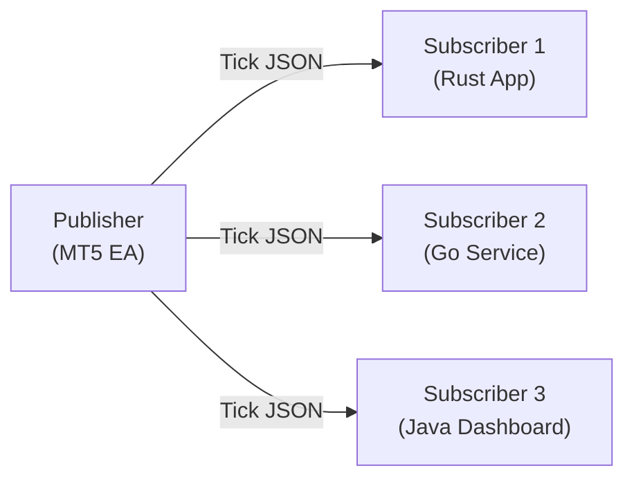
```mermaid
flowchart LR
    PUB["Publisher\n(MT5 EA)"]
    SUB1["Subscriber 1\n(Rust App)"]
    SUB2["Subscriber 2\n(Go Service)"]
    SUB3["Subscriber 3\n(Java Dashboard)"]
    
    PUB -->|"Tick JSON"| SUB1
    PUB -->|"Tick JSON"| SUB2
    PUB -->|"Tick JSON"| SUB3
```

Used for real-time data streaming where the publisher broadcasts to all connected subscribers.

**MQL5 Side (Publisher):**
```cpp
CZmq *publisher = new CZmq();
publisher.Init(ZMQ_PUB);
publisher.Bind("tcp://0.0.0.0:5555");

// In OnTick
publisher.Send("{\"bid\": 1.1234}");
```

**Rust Client Side (Subscriber):**
```rust
use zeromq::{Socket, SubSocket};

let mut socket = SubSocket::new();
socket.connect("tcp://127.0.0.1:5555").await?;
socket.subscribe("").await?;  // Subscribe to all messages

loop {
    let msg = socket.recv().await?;
    println!("Received: {:?}", msg);
}
```

**Go Client Side (Subscriber):**
```go
package main

import (
    "fmt"
    zmq "github.com/pebbe/zmq4"
)

func main() {
    subscriber, _ := zmq.NewSocket(zmq.SUB)
    defer subscriber.Close()
    
    subscriber.Connect("tcp://127.0.0.1:5555")
    subscriber.SetSubscribe("")  // Subscribe to all messages
    
    for {
        msg, _ := subscriber.Recv(0)
        fmt.Printf("Received: %s\n", msg)
    }
}
```

---

### REQ/REP Pattern (Request-Reply)

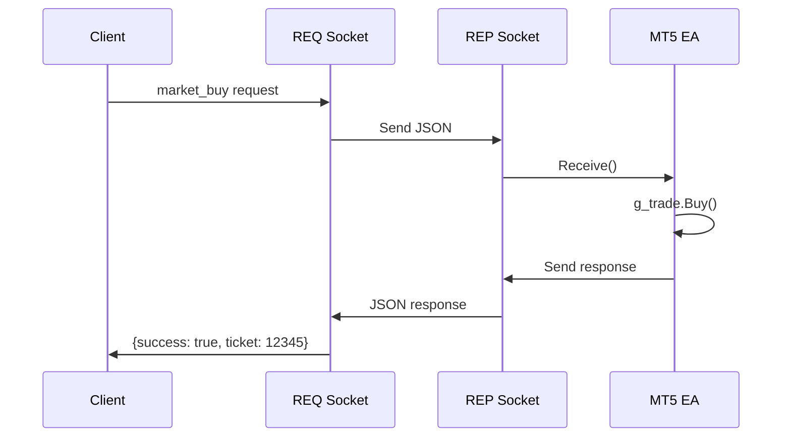
```mermaid
sequenceDiagram
    participant Client
    participant REQ as REQ Socket
    participant REP as REP Socket
    participant MT5 as MT5 EA

    Client->>REQ: market_buy request
    REQ->>REP: Send JSON
    REP->>MT5: Receive()
    MT5->>MT5: g_trade.Buy()
    MT5->>REP: Send response
    REP->>REQ: JSON response
    REQ->>Client: {success: true, ticket: 12345}
```

Used for command-response communication, such as order execution.

**MQL5 Side (Responder):**
```cpp
CZmq *responder = new CZmq();
responder.Init(ZMQ_REP);
responder.Bind("tcp://0.0.0.0:5556");

// In OnTick (non-blocking poll)
string request = responder.Receive(true);
if(request != "") {
    // Process request
    string response = ProcessOrderRequest(request);
    responder.Send(response, false);  // Blocking send required for REP
}
```

**Rust Client Side (Requester):**
```rust
use zeromq::{Socket, ReqSocket};

let mut socket = ReqSocket::new();
socket.connect("tcp://127.0.0.1:5556").await?;

// Send order request
let request = r#"{"type":"market_buy","symbol":"EURUSD","volume":0.01}"#;
socket.send(request.into()).await?;

// Wait for response
let response = socket.recv().await?;
println!("Response: {:?}", response);
```

**Go Client Side (Requester):**
```go
package main

import (
    "fmt"
    zmq "github.com/pebbe/zmq4"
)

func main() {
    requester, _ := zmq.NewSocket(zmq.REQ)
    defer requester.Close()
    
    requester.Connect("tcp://127.0.0.1:5556")
    
    // Send order request
    request := `{"type":"market_buy","symbol":"EURUSD","volume":0.01}`
    requester.Send(request, 0)
    
    // Wait for response
    response, _ := requester.Recv(0)
    fmt.Printf("Response: %s\n", response)
}
```

---

## Message Protocol

### Tick Data Message (PUB Socket)

Published on every tick from MQL5 to connected subscribers.

```json
{
    "symbol": "XAUUSDc",
    "bid": 2345.67,
    "ask": 2345.89,
    "time": 1706400000,
    "volume": 100,
    "balance": 10000.00,
    "equity": 10150.50,
    "margin": 500.00,
    "free_margin": 9650.50,
    "min_lot": 0.01,
    "max_lot": 100.00,
    "lot_step": 0.01,
    "positions": [
        {
            "ticket": 12345,
            "type": "BUY",
            "volume": 0.10,
            "price": 2340.50,
            "profit": 15.25
        }
    ],
    "orders": [
        {
            "ticket": 12346,
            "type": "BUY LIMIT",
            "volume": 0.05,
            "price": 2330.00
        }
    ]
}
```

### Order Request Message (REQ Socket)

Sent from external client to MQL5 for order execution.

**Market Order:**
```json
{
    "type": "market_buy",
    "symbol": "XAUUSDc",
    "volume": 0.01,
    "price": 0
}
```

**Limit Order:**
```json
{
    "type": "limit_buy",
    "symbol": "XAUUSDc",
    "volume": 0.01,
    "price": 2340.00
}
```

**Close Position:**
```json
{
    "type": "close_position",
    "ticket": 12345
}
```

**Cancel Order:**
```json
{
    "type": "cancel_order",
    "ticket": 12346
}
```

**Download History:**
```json
{
    "type": "download_history",
    "symbol": "XAUUSDc",
    "timeframe": "M1",
    "start": "2024.01.01",
    "end": "2024.01.31",
    "mode": "OHLC"
}
```

### Order Response Message (REP Socket)

Sent from MQL5 back to the client.

**Success:**
```json
{
    "success": true,
    "ticket": 12347
}
```

**Failure:**
```json
{
    "success": false,
    "error": "Error 10019: Not enough money"
}
```

### Supported Order Types

| Type String | Description |
|-------------|-------------|
| `market_buy` | Execute market buy order |
| `market_sell` | Execute market sell order |
| `limit_buy` | Place buy limit pending order |
| `limit_sell` | Place sell limit pending order |
| `stop_buy` | Place buy stop pending order |
| `stop_sell` | Place sell stop pending order |
| `close_position` | Close existing position by ticket |
| `cancel_order` | Delete pending order by ticket |
| `download_history` | Request historical data download |

---

## Complete Examples

### Example 1: Simple Tick Publisher

```cpp
//+------------------------------------------------------------------+
//|                                           SimpleTickPublisher.mq5 |
//+------------------------------------------------------------------+
#include <Zmq/Zmq.mqh>

input string InpAddress = "tcp://0.0.0.0:5555";

CZmq *g_publisher;

int OnInit() {
    g_publisher = new CZmq();
    
    if(!g_publisher.Init(ZMQ_PUB)) {
        Print("Failed to init ZMQ");
        return INIT_FAILED;
    }
    
    if(!g_publisher.Bind(InpAddress)) {
        Print("Failed to bind");
        return INIT_FAILED;
    }
    
    Print("Publisher ready on ", InpAddress);
    return INIT_SUCCEEDED;
}

void OnDeinit(const int reason) {
    if(g_publisher != NULL) {
        g_publisher.Shutdown();
        delete g_publisher;
    }
}

void OnTick() {
    MqlTick tick;
    if(SymbolInfoTick(_Symbol, tick)) {
        string json;
        StringConcatenate(json,
            "{\"symbol\":\"", _Symbol,
            "\",\"bid\":", DoubleToString(tick.bid, _Digits),
            ",\"ask\":", DoubleToString(tick.ask, _Digits),
            ",\"time\":", IntegerToString(tick.time),
            "}");
        
        g_publisher.Send(json);
    }
}
```

### Example 2: Order Executor Service

```cpp
//+------------------------------------------------------------------+
//|                                              OrderExecutor.mq5    |
//+------------------------------------------------------------------+
#include <Zmq/Zmq.mqh>
#include <Trade/Trade.mqh>

input string InpAddress = "tcp://0.0.0.0:5556";

CZmq *g_responder;
CTrade g_trade;

int OnInit() {
    g_responder = new CZmq();
    
    if(!g_responder.Init(ZMQ_REP))
        return INIT_FAILED;
    
    if(!g_responder.Bind(InpAddress))
        return INIT_FAILED;
    
    g_trade.SetDeviationInPoints(10);
    
    Print("Order executor ready on ", InpAddress);
    return INIT_SUCCEEDED;
}

void OnDeinit(const int reason) {
    if(g_responder != NULL) {
        g_responder.Shutdown();
        delete g_responder;
    }
}

void OnTick() {
    // Non-blocking receive
    string request = g_responder.Receive(true);
    
    if(request == "") return;
    
    Print("Request: ", request);
    
    // Parse and execute (simplified)
    string response;
    if(StringFind(request, "market_buy") >= 0) {
        double ask = SymbolInfoDouble(_Symbol, SYMBOL_ASK);
        if(g_trade.Buy(0.01, _Symbol, ask)) {
            StringConcatenate(response, 
                "{\"success\":true,\"ticket\":", 
                IntegerToString(g_trade.ResultOrder()), "}");
        } else {
            response = "{\"success\":false,\"error\":\"Buy failed\"}";
        }
    } else {
        response = "{\"success\":false,\"error\":\"Unknown command\"}";
    }
    
    g_responder.Send(response, false);  // Blocking send for REP
    Print("Response: ", response);
}
```

### Example 3: Rust Client (Complete)

```rust
// Cargo.toml dependencies:
// zeromq = "0.3"
// tokio = { version = "1", features = ["full"] }
// serde = { version = "1", features = ["derive"] }
// serde_json = "1"

use serde::{Deserialize, Serialize};
use tokio::sync::mpsc;
use zeromq::{Socket, SocketRecv, SocketSend};

#[derive(Debug, Deserialize)]
struct TickData {
    symbol: String,
    bid: f64,
    ask: f64,
    time: i64,
}

#[derive(Debug, Serialize)]
struct OrderRequest {
    #[serde(rename = "type")]
    order_type: String,
    symbol: String,
    volume: f64,
}

#[tokio::main]
async fn main() -> Result<(), Box<dyn std::error::Error>> {
    // Subscribe to tick data
    let (tx, mut rx) = mpsc::channel::<TickData>(100);
    
    tokio::spawn(async move {
        let mut socket = zeromq::SubSocket::new();
        socket.connect("tcp://127.0.0.1:5555").await.unwrap();
        socket.subscribe("").await.unwrap();
        
        loop {
            if let Ok(msg) = socket.recv().await {
                if let Some(bytes) = msg.get(0) {
                    if let Ok(json) = std::str::from_utf8(bytes) {
                        if let Ok(tick) = serde_json::from_str::<TickData>(json) {
                            let _ = tx.send(tick).await;
                        }
                    }
                }
            }
        }
    });
    
    // Process ticks
    while let Some(tick) = rx.recv().await {
        println!("{}: Bid={}, Ask={}", tick.symbol, tick.bid, tick.ask);
    }
    
    Ok(())
}
```

### Example 4: Java Client (Complete)

```java
// Maven dependency: org.zeromq:jeromq:0.5.3
import org.zeromq.SocketType;
import org.zeromq.ZContext;
import org.zeromq.ZMQ;
import com.google.gson.Gson;

public class MT5Client {
    private ZContext context;
    private ZMQ.Socket subscriber;
    private ZMQ.Socket requester;
    private Gson gson = new Gson();
    
    public MT5Client(int tickPort, int orderPort) {
        context = new ZContext();
        
        // Subscriber for tick data
        subscriber = context.createSocket(SocketType.SUB);
        subscriber.connect("tcp://127.0.0.1:" + tickPort);
        subscriber.subscribe("".getBytes());
        
        // Requester for orders
        requester = context.createSocket(SocketType.REQ);
        requester.connect("tcp://127.0.0.1:" + orderPort);
    }
    
    public void startTickStream() {
        new Thread(() -> {
            while (!Thread.currentThread().isInterrupted()) {
                String msg = subscriber.recvStr(ZMQ.DONTWAIT);
                if (msg != null) {
                    TickData tick = gson.fromJson(msg, TickData.class);
                    System.out.printf("%s: Bid=%.5f, Ask=%.5f%n", 
                        tick.symbol, tick.bid, tick.ask);
                }
                try { Thread.sleep(1); } catch (InterruptedException e) { break; }
            }
        }).start();
    }
    
    public OrderResponse sendOrder(String type, String symbol, double volume) {
        OrderRequest request = new OrderRequest(type, symbol, volume);
        requester.send(gson.toJson(request));
        String response = requester.recvStr();
        return gson.fromJson(response, OrderResponse.class);
    }
    
    public void close() {
        context.close();
    }
    
    // Data classes
    static class TickData {
        String symbol;
        double bid, ask;
        long time;
    }
    
    static class OrderRequest {
        String type, symbol;
        double volume;
        OrderRequest(String t, String s, double v) { type=t; symbol=s; volume=v; }
    }
    
    static class OrderResponse {
        boolean success;
        Long ticket;
        String error;
    }
    
    public static void main(String[] args) {
        MT5Client client = new MT5Client(5555, 5556);
        client.startTickStream();
        
        // Execute a buy order
        OrderResponse response = client.sendOrder("market_buy", "EURUSD", 0.01);
        System.out.println("Order result: " + response.success);
    }
}
```

### Example 5: C++ Client (Complete)

```cpp
// Requires: libzmq, cppzmq, nlohmann/json
// Compile: g++ -std=c++17 -o mt5_client mt5_client.cpp -lzmq -lpthread

#include <zmq.hpp>
#include <nlohmann/json.hpp>
#include <iostream>
#include <thread>
#include <atomic>

using json = nlohmann::json;

class MT5Client {
private:
    zmq::context_t context;
    zmq::socket_t subscriber;
    zmq::socket_t requester;
    std::atomic<bool> running{false};
    std::thread tick_thread;

public:
    MT5Client(int tick_port = 5555, int order_port = 5556)
        : context(1), subscriber(context, zmq::socket_type::sub),
          requester(context, zmq::socket_type::req) {
        
        subscriber.connect("tcp://127.0.0.1:" + std::to_string(tick_port));
        subscriber.set(zmq::sockopt::subscribe, "");
        
        requester.connect("tcp://127.0.0.1:" + std::to_string(order_port));
    }
    
    void start_tick_stream() {
        running = true;
        tick_thread = std::thread([this]() {
            while (running) {
                zmq::message_t message;
                auto result = subscriber.recv(message, zmq::recv_flags::dontwait);
                if (result) {
                    std::string msg(static_cast<char*>(message.data()), message.size());
                    json tick = json::parse(msg);
                    std::cout << tick["symbol"].get<std::string>() 
                              << ": Bid=" << tick["bid"].get<double>()
                              << ", Ask=" << tick["ask"].get<double>() << std::endl;
                }
                std::this_thread::sleep_for(std::chrono::milliseconds(1));
            }
        });
    }
    
    json send_order(const std::string& type, const std::string& symbol, double volume) {
        json request = {{"type", type}, {"symbol", symbol}, {"volume", volume}};
        std::string req_str = request.dump();
        
        zmq::message_t req_msg(req_str.begin(), req_str.end());
        requester.send(req_msg, zmq::send_flags::none);
        
        zmq::message_t reply;
        requester.recv(reply);
        
        std::string reply_str(static_cast<char*>(reply.data()), reply.size());
        return json::parse(reply_str);
    }
    
    json market_buy(const std::string& symbol, double volume) {
        return send_order("market_buy", symbol, volume);
    }
    
    json market_sell(const std::string& symbol, double volume) {
        return send_order("market_sell", symbol, volume);
    }
    
    void stop() {
        running = false;
        if (tick_thread.joinable()) tick_thread.join();
    }
    
    ~MT5Client() { stop(); }
};

int main() {
    MT5Client client;
    client.start_tick_stream();
    
    // Execute a buy order
    json response = client.market_buy("EURUSD", 0.01);
    std::cout << "Order result: " << response.dump() << std::endl;
    
    // Keep running
    std::this_thread::sleep_for(std::chrono::seconds(60));
    return 0;
}
```

---

## Error Handling

### ZMQ Error Codes

The library uses `zmq_errno()` to retrieve error codes. Common errors:

| Error Code | Description | Solution |
|------------|-------------|----------|
| 11 | EAGAIN (resource unavailable) | Normal for non-blocking ops when no data |
| 48 | EADDRINUSE (address in use) | Port already bound, use different port |
| 111 | ECONNREFUSED | Remote endpoint not available |
| 156384713 | ETERM (context terminated) | ZMQ context was terminated |

### Defensive Programming

```cpp
// Always check initialization
if(!g_publisher.Init(ZMQ_PUB)) {
    Print("ZMQ Init failed");
    return INIT_FAILED;
}

// Always check bind/connect
if(!g_publisher.Bind("tcp://0.0.0.0:5555")) {
    Print("ZMQ Bind failed, errno: ", zmq_errno());
    g_publisher.Shutdown();
    return INIT_FAILED;
}

// Handle empty receive gracefully
string msg = g_responder.Receive(true);
if(msg == "") {
    // No message available, continue
    return;
}
```

---

## Best Practices

### 1. Resource Management

Always use pointers and proper cleanup:

```cpp
CZmq *g_socket = NULL;  // Initialize to NULL

int OnInit() {
    g_socket = new CZmq();
    // ... init and bind
}

void OnDeinit(const int reason) {
    if(g_socket != NULL) {
        g_socket.Shutdown();
        delete g_socket;
        g_socket = NULL;
    }
}
```

### 2. Non-Blocking in OnTick()

Never use blocking operations in `OnTick()` - they will freeze the terminal:

```cpp
void OnTick() {
    // GOOD: Non-blocking receive
    string msg = g_responder.Receive(true);
    
    // BAD: This would freeze the terminal
    // string msg = g_responder.Receive(false);
}
```

### 3. REQ/REP Pattern Compliance

The REP socket must always send a reply after receiving a request:

```cpp
void OnTick() {
    string request = g_responder.Receive(true);
    if(request != "") {
        // MUST send response for every request
        string response = ProcessRequest(request);
        g_responder.Send(response, false);  // Use blocking send
    }
}
```

### 4. Buffer Size Considerations

The default receive buffer is 4096 bytes. For larger messages:

```cpp
// In Zmq.mqh, modify:
uchar buffer[16384];  // Increase to 16KB
```

### 5. JSON Message Construction

Use `StringConcatenate` for efficient string building:

```cpp
string json;
StringConcatenate(json,
    "{\"symbol\":\"", _Symbol,
    "\",\"value\":", DoubleToString(value, 5),
    "}");
```

---

## Troubleshooting

### Common Issues

**Issue: "dll imports are not allowed"**
- Solution: Enable `Allow DLL imports` in Tools > Options > Expert Advisors

**Issue: "Cannot load library 'libzmq.dll'"**
- Solution: Ensure libzmq.dll is in MQL5/Libraries/ folder
- Solution: Ensure libsodium.dll is also present (dependency)
- Solution: Verify DLLs are 64-bit if using 64-bit MT5

**Issue: "ZMQ Bind failed"**
- Solution: Check if port is already in use
- Solution: Try a different port number
- Solution: Ensure firewall allows the port

**Issue: No data received on subscriber**
- Solution: Ensure subscriber connects AFTER publisher binds
- Solution: Add a small delay after connect before expecting data
- Solution: Verify network connectivity

**Issue: "Request not answered" on REQ socket**
- Solution: Ensure REP socket always sends a response for every receive
- Solution: Check for crashes in request processing logic

### Debug Logging

Add print statements to trace execution:

```cpp
void OnTick() {
    string request = g_responder.Receive(true);
    if(request != "") {
        Print("Received request: ", request);
        
        string response = ProcessRequest(request);
        Print("Sending response: ", response);
        
        int sent = g_responder.Send(response, false);
        Print("Bytes sent: ", sent);
    }
}
```

---

## Version History

| Version | Date | Changes |
|---------|------|---------|
| 2.00 | 2026-01-27 | Added REP socket support, order handling, account info streaming |
| 1.00 | 2026-01-20 | Initial release with PUB socket support |

---

## References

- [ZeroMQ Official Documentation](https://zeromq.org/get-started/)
- [ZeroMQ Socket Types Guide](https://zeromq.org/socket-api/)
- [MQL5 DLL Import Guide](https://www.mql5.com/en/docs/runtime/imports)
- [GitHub Repository](https://github.com/algorembrant/Rust-ZMQ-MT5)

---

//end of documentattion

# Rust ZeroMQ Wrapper Library for MT5 Communication

A comprehensive reusable Rust library for ZeroMQ socket operations, designed for real-time communication with MetaTrader 5 via the MQL5-ZMQ bridge.

---

## Table of Contents

1. [Overview](#overview)
2. [Architecture](#architecture)
3. [Prerequisites and Installation](#prerequisites-and-installation)
4. [API Reference](#api-reference)
5. [Usage Guide](#usage-guide)
6. [Data Structures](#data-structures)
7. [Complete Examples](#complete-examples)
8. [Error Handling](#error-handling)
9. [Best Practices](#best-practices)
10. [Integration with Other Languages](#integration-with-other-languages)

---

## Overview

This library provides a high-level Rust wrapper for ZeroMQ socket operations, specifically designed to communicate with MetaTrader 5 Expert Advisors running the MQL5-ZMQ bridge.

> [!NOTE]
> For the companion MQL5 server library, see [MQL5-ZMQ Library for SUM3API](MQL5-ZMQ%20Library%20for%20SUM3API.md).

### Key Features

- **Async/Await Support**: Built on Tokio for non-blocking operations
- **Type-Safe Messages**: Serde-based JSON serialization with strongly typed structs
- **Dual Socket Pattern**: SUB socket for tick streaming, REQ socket for order execution
- **Channel-Based Architecture**: Uses MPSC channels for thread-safe message passing
- **Automatic Reconnection**: Resilient connection handling

### Supported Socket Types

| Pattern | Rust Socket | MQL5 Socket | Purpose |
|---------|-------------|-------------|---------|
| PUB/SUB | `SubSocket` | `ZMQ_PUB` | Real-time tick data streaming |
| REQ/REP | `ReqSocket` | `ZMQ_REP` | Order execution and commands |

---

## Architecture

### System Integration

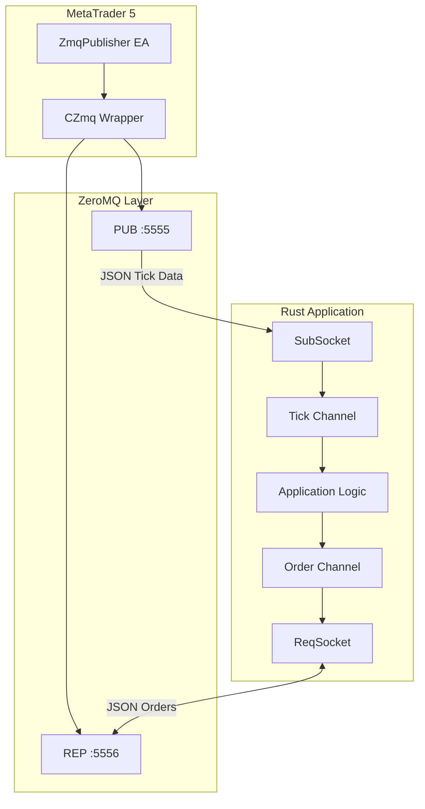
```mermaid
flowchart TB
    subgraph MT5["MetaTrader 5"]
        EA["ZmqPublisher EA"]
        MQL["CZmq Wrapper"]
        EA --> MQL
    end

    subgraph ZMQ["ZeroMQ Layer"]
        PUB["PUB :5555"]
        REP["REP :5556"]
    end

    subgraph Rust["Rust Application"]
        SUB["SubSocket"]
        REQ["ReqSocket"]
        TICK_CH["Tick Channel"]
        ORDER_CH["Order Channel"]
        APP["Application Logic"]
        
        SUB --> TICK_CH
        TICK_CH --> APP
        APP --> ORDER_CH
        ORDER_CH --> REQ
    end

    MQL --> PUB
    MQL --> REP
    PUB -->|"JSON Tick Data"| SUB
    REQ <-->|"JSON Orders"| REP
```

### Data Flow

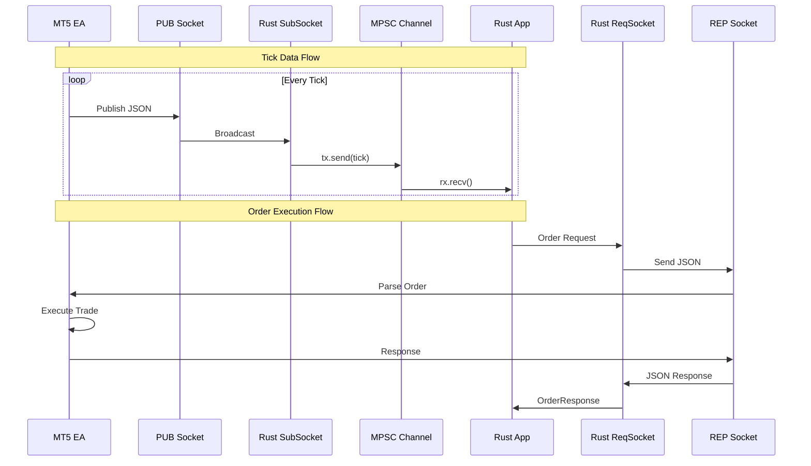
```mermaid
sequenceDiagram
    participant MT5 as MT5 EA
    participant PUB as PUB Socket
    participant SUB as Rust SubSocket
    participant CH as MPSC Channel
    participant APP as Rust App
    participant REQ as Rust ReqSocket
    participant REP as REP Socket

    Note over MT5,APP: Tick Data Flow
    loop Every Tick
        MT5->>PUB: Publish JSON
        PUB->>SUB: Broadcast
        SUB->>CH: tx.send(tick)
        CH->>APP: rx.recv()
    end

    Note over APP,MT5: Order Execution Flow
    APP->>REQ: Order Request
    REQ->>REP: Send JSON
    REP->>MT5: Parse Order
    MT5->>MT5: Execute Trade
    MT5->>REP: Response
    REP->>REQ: JSON Response
    REQ->>APP: OrderResponse
```

---

## Prerequisites and Installation

### Cargo.toml Dependencies

```toml
[dependencies]
zeromq = "0.3"
tokio = { version = "1", features = ["full"] }
serde = { version = "1", features = ["derive"] }
serde_json = "1"
chrono = "0.4"
```

### System Requirements

- Rust 1.70 or later
- ZeroMQ library installed on system (for zeromq crate)
- MetaTrader 5 with MQL5-ZMQ EA running

### Installation Steps

1. **Add dependencies to Cargo.toml** (see above)

2. **Build the project**
   ```bash
   cargo build --release
   ```

3. **Verify MT5 EA is running**
   - Ensure `ZmqPublisher.mq5` is attached to a chart
   - Verify ports 5555 (tick data) and 5556 (orders) are accessible

---

## API Reference

### Data Structures

#### TickData

Represents real-time market data received from MT5.

```rust
#[derive(Clone, Debug, Deserialize)]
pub struct TickData {
    pub symbol: String,
    pub bid: f64,
    pub ask: f64,
    pub time: i64,
    #[serde(default)]
    pub volume: u64,
    #[serde(default)]
    pub balance: f64,
    #[serde(default)]
    pub equity: f64,
    #[serde(default)]
    pub margin: f64,
    #[serde(default)]
    pub free_margin: f64,
    #[serde(default)]
    pub min_lot: f64,
    #[serde(default)]
    pub max_lot: f64,
    #[serde(default)]
    pub lot_step: f64,
    #[serde(default)]
    pub positions: Vec<PositionData>,
    #[serde(default)]
    pub orders: Vec<PendingOrderData>,
}
```

| Field | Type | Description |
|-------|------|-------------|
| `symbol` | `String` | Trading symbol (e.g., "EURUSD") |
| `bid` | `f64` | Current bid price |
| `ask` | `f64` | Current ask price |
| `time` | `i64` | Unix timestamp |
| `volume` | `u64` | Tick volume |
| `balance` | `f64` | Account balance |
| `equity` | `f64` | Account equity |
| `margin` | `f64` | Used margin |
| `free_margin` | `f64` | Available margin |
| `min_lot` | `f64` | Minimum lot size |
| `max_lot` | `f64` | Maximum lot size |
| `lot_step` | `f64` | Lot size increment |
| `positions` | `Vec<PositionData>` | Active positions |
| `orders` | `Vec<PendingOrderData>` | Pending orders |

---

#### PositionData

Represents an active trading position.

```rust
#[derive(Clone, Debug, Deserialize)]
pub struct PositionData {
    pub ticket: u64,
    #[serde(rename = "type")]
    pub pos_type: String,  // "BUY" or "SELL"
    pub volume: f64,
    pub price: f64,
    pub profit: f64,
}
```

---

#### PendingOrderData

Represents a pending order.

```rust
#[derive(Clone, Debug, Deserialize)]
pub struct PendingOrderData {
    pub ticket: u64,
    #[serde(rename = "type")]
    pub order_type: String,  // "BUY LIMIT", "SELL STOP", etc.
    pub volume: f64,
    pub price: f64,
}
```

---

#### OrderRequest

Request structure for sending orders to MT5.

```rust
#[derive(Clone, Debug, Serialize)]
pub struct OrderRequest {
    #[serde(rename = "type")]
    pub order_type: String,
    pub symbol: String,
    pub volume: f64,
    pub price: f64,
    #[serde(default)]
    pub ticket: u64,
    #[serde(skip_serializing_if = "Option::is_none")]
    pub timeframe: Option<String>,
    #[serde(skip_serializing_if = "Option::is_none")]
    pub start: Option<String>,
    #[serde(skip_serializing_if = "Option::is_none")]
    pub end: Option<String>,
    #[serde(skip_serializing_if = "Option::is_none")]
    pub mode: Option<String>,
}
```

**Supported Order Types:**

| Type | Description |
|------|-------------|
| `market_buy` | Execute market buy order |
| `market_sell` | Execute market sell order |
| `limit_buy` | Place buy limit pending order |
| `limit_sell` | Place sell limit pending order |
| `stop_buy` | Place buy stop pending order |
| `stop_sell` | Place sell stop pending order |
| `close_position` | Close position by ticket |
| `cancel_order` | Cancel pending order by ticket |
| `download_history` | Request historical data |

---

#### OrderResponse

Response structure from MT5 order execution.

```rust
#[derive(Clone, Debug, Deserialize)]
pub struct OrderResponse {
    pub success: bool,
    pub ticket: Option<i64>,
    pub error: Option<String>,
    pub message: Option<String>,
}
```

---

## Usage Guide

### Step 1: Create Channels

```rust
use tokio::sync::mpsc;

// Channel for tick data (MT5 -> App)
let (tick_tx, tick_rx) = mpsc::channel::<TickData>(100);

// Channel for order requests (App -> MT5)
let (order_tx, order_rx) = mpsc::channel::<OrderRequest>(10);

// Channel for order responses (MT5 -> App)
let (response_tx, response_rx) = mpsc::channel::<OrderResponse>(10);
```

### Step 2: Spawn Tick Subscriber Task

```rust
tokio::spawn(async move {
    let mut socket = zeromq::SubSocket::new();
    socket.connect("tcp://127.0.0.1:5555").await.unwrap();
    socket.subscribe("").await.unwrap();

    loop {
        match socket.recv().await {
            Ok(msg) => {
                if let Some(bytes) = msg.get(0) {
                    if let Ok(json) = std::str::from_utf8(bytes) {
                        if let Ok(tick) = serde_json::from_str::<TickData>(json) {
                            let _ = tick_tx.send(tick).await;
                        }
                    }
                }
            }
            Err(e) => {
                eprintln!("Tick recv error: {}", e);
                tokio::time::sleep(Duration::from_secs(1)).await;
            }
        }
    }
});
```

### Step 3: Spawn Order Handler Task

```rust
tokio::spawn(async move {
    let mut socket = zeromq::ReqSocket::new();
    socket.connect("tcp://127.0.0.1:5556").await.unwrap();

    while let Some(request) = order_rx.recv().await {
        let json = serde_json::to_string(&request).unwrap();
        
        if let Err(e) = socket.send(json.into()).await {
            let _ = response_tx.send(OrderResponse {
                success: false,
                ticket: None,
                error: Some(format!("Send failed: {}", e)),
                message: None,
            }).await;
            continue;
        }

        match socket.recv().await {
            Ok(msg) => {
                if let Some(bytes) = msg.get(0) {
                    if let Ok(json) = std::str::from_utf8(bytes) {
                        if let Ok(response) = serde_json::from_str::<OrderResponse>(json) {
                            let _ = response_tx.send(response).await;
                        }
                    }
                }
            }
            Err(e) => {
                let _ = response_tx.send(OrderResponse {
                    success: false,
                    ticket: None,
                    error: Some(format!("Recv failed: {}", e)),
                    message: None,
                }).await;
            }
        }
    }
});
```

### Step 4: Process Ticks and Send Orders

```rust
// Process incoming ticks
while let Some(tick) = tick_rx.recv().await {
    println!("{}: Bid={}, Ask={}", tick.symbol, tick.bid, tick.ask);
    
    // Example: Send a buy order when certain condition is met
    if some_trading_condition(&tick) {
        let order = OrderRequest {
            order_type: "market_buy".to_string(),
            symbol: tick.symbol.clone(),
            volume: 0.01,
            price: 0.0,
            ticket: 0,
            timeframe: None,
            start: None,
            end: None,
            mode: None,
        };
        let _ = order_tx.send(order).await;
    }
}
```

---

## Complete Examples

### Example 1: Basic Tick Subscriber

```rust
use serde::Deserialize;
use zeromq::{Socket, SocketRecv};

#[derive(Debug, Deserialize)]
struct TickData {
    symbol: String,
    bid: f64,
    ask: f64,
    time: i64,
}

#[tokio::main]
async fn main() -> Result<(), Box<dyn std::error::Error>> {
    let mut socket = zeromq::SubSocket::new();
    socket.connect("tcp://127.0.0.1:5555").await?;
    socket.subscribe("").await?;
    
    println!("Connected to MT5 tick publisher");

    loop {
        let msg = socket.recv().await?;
        if let Some(bytes) = msg.get(0) {
            if let Ok(json) = std::str::from_utf8(bytes) {
                if let Ok(tick) = serde_json::from_str::<TickData>(json) {
                    println!("{}: {:.5} / {:.5}", tick.symbol, tick.bid, tick.ask);
                }
            }
        }
    }
}
```

### Example 2: Order Execution Client

```rust
use serde::{Deserialize, Serialize};
use zeromq::{Socket, SocketRecv, SocketSend};

#[derive(Serialize)]
struct OrderRequest {
    #[serde(rename = "type")]
    order_type: String,
    symbol: String,
    volume: f64,
    price: f64,
}

#[derive(Debug, Deserialize)]
struct OrderResponse {
    success: bool,
    ticket: Option<i64>,
    error: Option<String>,
}

#[tokio::main]
async fn main() -> Result<(), Box<dyn std::error::Error>> {
    let mut socket = zeromq::ReqSocket::new();
    socket.connect("tcp://127.0.0.1:5556").await?;
    
    println!("Connected to MT5 order handler");

    // Send a market buy order
    let order = OrderRequest {
        order_type: "market_buy".to_string(),
        symbol: "EURUSD".to_string(),
        volume: 0.01,
        price: 0.0,
    };

    let json = serde_json::to_string(&order)?;
    println!("Sending: {}", json);
    
    socket.send(json.into()).await?;

    let response = socket.recv().await?;
    if let Some(bytes) = response.get(0) {
        if let Ok(json) = std::str::from_utf8(bytes) {
            let resp: OrderResponse = serde_json::from_str(json)?;
            if resp.success {
                println!("Order executed! Ticket: {:?}", resp.ticket);
            } else {
                println!("Order failed: {:?}", resp.error);
            }
        }
    }

    Ok(())
}
```

### Example 3: Full Trading Application

```rust
use serde::{Deserialize, Serialize};
use tokio::sync::mpsc;
use zeromq::{Socket, SocketRecv, SocketSend};
use std::time::Duration;

// ============================================================================
// Data Structures
// ============================================================================

#[derive(Clone, Debug, Deserialize)]
struct PositionData {
    ticket: u64,
    #[serde(rename = "type")]
    pos_type: String,
    volume: f64,
    price: f64,
    profit: f64,
}

#[derive(Clone, Debug, Deserialize)]
struct TickData {
    symbol: String,
    bid: f64,
    ask: f64,
    time: i64,
    #[serde(default)]
    balance: f64,
    #[serde(default)]
    equity: f64,
    #[serde(default)]
    positions: Vec<PositionData>,
}

#[derive(Clone, Debug, Serialize)]
struct OrderRequest {
    #[serde(rename = "type")]
    order_type: String,
    symbol: String,
    volume: f64,
    #[serde(default)]
    price: f64,
    #[serde(default)]
    ticket: u64,
}

#[derive(Clone, Debug, Deserialize)]
struct OrderResponse {
    success: bool,
    ticket: Option<i64>,
    error: Option<String>,
}

// ============================================================================
// Main Application
// ============================================================================

#[tokio::main]
async fn main() -> Result<(), Box<dyn std::error::Error>> {
    // Create channels
    let (tick_tx, mut tick_rx) = mpsc::channel::<TickData>(100);
    let (order_tx, mut order_rx) = mpsc::channel::<OrderRequest>(10);
    let (response_tx, mut response_rx) = mpsc::channel::<OrderResponse>(10);

    // Spawn tick subscriber
    tokio::spawn(async move {
        let mut socket = zeromq::SubSocket::new();
        if let Err(e) = socket.connect("tcp://127.0.0.1:5555").await {
            eprintln!("Failed to connect to tick publisher: {}", e);
            return;
        }
        let _ = socket.subscribe("").await;
        println!("Tick subscriber connected");

        loop {
            match socket.recv().await {
                Ok(msg) => {
                    if let Some(bytes) = msg.get(0) {
                        if let Ok(json) = std::str::from_utf8(bytes) {
                            if let Ok(tick) = serde_json::from_str::<TickData>(json) {
                                if tick_tx.send(tick).await.is_err() {
                                    break;
                                }
                            }
                        }
                    }
                }
                Err(e) => {
                    eprintln!("Tick error: {}", e);
                    tokio::time::sleep(Duration::from_secs(1)).await;
                }
            }
        }
    });

    // Spawn order handler
    let resp_tx = response_tx.clone();
    tokio::spawn(async move {
        let mut socket = zeromq::ReqSocket::new();
        if let Err(e) = socket.connect("tcp://127.0.0.1:5556").await {
            eprintln!("Failed to connect to order handler: {}", e);
            return;
        }
        println!("Order handler connected");

        while let Some(request) = order_rx.recv().await {
            let json = match serde_json::to_string(&request) {
                Ok(j) => j,
                Err(e) => {
                    let _ = resp_tx.send(OrderResponse {
                        success: false,
                        ticket: None,
                        error: Some(format!("Serialize error: {}", e)),
                    }).await;
                    continue;
                }
            };

            println!("Sending order: {}", json);

            if let Err(e) = socket.send(json.into()).await {
                let _ = resp_tx.send(OrderResponse {
                    success: false,
                    ticket: None,
                    error: Some(format!("Send error: {}", e)),
                }).await;
                continue;
            }

            match socket.recv().await {
                Ok(msg) => {
                    if let Some(bytes) = msg.get(0) {
                        if let Ok(json) = std::str::from_utf8(bytes) {
                            if let Ok(resp) = serde_json::from_str::<OrderResponse>(json) {
                                let _ = resp_tx.send(resp).await;
                            }
                        }
                    }
                }
                Err(e) => {
                    let _ = resp_tx.send(OrderResponse {
                        success: false,
                        ticket: None,
                        error: Some(format!("Recv error: {}", e)),
                    }).await;
                }
            }
        }
    });

    // Spawn response handler
    tokio::spawn(async move {
        while let Some(response) = response_rx.recv().await {
            if response.success {
                println!("Order SUCCESS: Ticket {:?}", response.ticket);
            } else {
                println!("Order FAILED: {:?}", response.error);
            }
        }
    });

    // Main loop - process ticks
    println!("Starting main loop...");
    let mut tick_count = 0u64;

    while let Some(tick) = tick_rx.recv().await {
        tick_count += 1;
        
        // Print every 100th tick to avoid spam
        if tick_count % 100 == 0 {
            println!(
                "[{}] {}: Bid={:.5}, Ask={:.5}, Balance={:.2}, Positions={}",
                tick_count,
                tick.symbol,
                tick.bid,
                tick.ask,
                tick.balance,
                tick.positions.len()
            );
        }

        // Example trading logic: buy when no positions exist
        if tick.positions.is_empty() && tick_count == 500 {
            let order = OrderRequest {
                order_type: "market_buy".to_string(),
                symbol: tick.symbol.clone(),
                volume: 0.01,
                price: 0.0,
                ticket: 0,
            };
            let _ = order_tx.send(order).await;
        }
    }

    Ok(())
}
```

---

## Error Handling

### Common Error Patterns

```rust
// Connection error handling
match socket.connect("tcp://127.0.0.1:5555").await {
    Ok(_) => println!("Connected"),
    Err(e) => {
        eprintln!("Connection failed: {}", e);
        // Implement retry logic
        tokio::time::sleep(Duration::from_secs(5)).await;
    }
}

// Receive error handling with retry
loop {
    match socket.recv().await {
        Ok(msg) => process_message(msg),
        Err(e) => {
            eprintln!("Recv error: {}", e);
            tokio::time::sleep(Duration::from_millis(100)).await;
            continue;
        }
    }
}

// JSON parsing error handling
match serde_json::from_str::<TickData>(json) {
    Ok(tick) => handle_tick(tick),
    Err(e) => eprintln!("JSON parse error: {} - Data: {}", e, json),
}
```

### Error Response Structure

Always check `OrderResponse.success` before using other fields:

```rust
if response.success {
    let ticket = response.ticket.unwrap_or(0);
    println!("Order executed with ticket: {}", ticket);
} else {
    let error = response.error.unwrap_or_else(|| "Unknown error".to_string());
    eprintln!("Order failed: {}", error);
}
```

---

## Best Practices

### 1. Use Bounded Channels

Prevent memory issues with bounded channels:

```rust
// Good: Bounded channel with reasonable capacity
let (tx, rx) = mpsc::channel::<TickData>(100);

// Avoid: Unbounded channels can grow infinitely
// let (tx, rx) = mpsc::unbounded_channel();
```

### 2. Handle Channel Errors

Check for send/receive errors:

```rust
// Check if receiver is dropped
if tx.send(tick).await.is_err() {
    eprintln!("Receiver dropped, exiting");
    break;
}

// Use try_send for non-blocking with backpressure
match tx.try_send(tick) {
    Ok(_) => {},
    Err(mpsc::error::TrySendError::Full(_)) => {
        eprintln!("Channel full, dropping tick");
    }
    Err(mpsc::error::TrySendError::Closed(_)) => break,
}
```

### 3. Graceful Shutdown

Implement proper shutdown handling:

```rust
use tokio::signal;

tokio::select! {
    _ = process_ticks(&mut tick_rx) => {},
    _ = signal::ctrl_c() => {
        println!("Shutting down...");
    }
}
```

### 4. Connection Resilience

Implement reconnection logic:

```rust
async fn connect_with_retry(addr: &str, max_retries: u32) -> Result<SubSocket, Error> {
    for attempt in 1..=max_retries {
        let mut socket = zeromq::SubSocket::new();
        match socket.connect(addr).await {
            Ok(_) => return Ok(socket),
            Err(e) => {
                eprintln!("Attempt {}/{} failed: {}", attempt, max_retries, e);
                tokio::time::sleep(Duration::from_secs(attempt as u64)).await;
            }
        }
    }
    Err(Error::ConnectionFailed)
}
```

---

## Integration with Other Languages

This Rust library is designed to work alongside the MQL5-ZMQ bridge. The same protocol can be implemented in other languages:

### Go Integration

```go
// See MQL5-ZMQ Library documentation for Go examples
import zmq "github.com/pebbe/zmq4"
```

### Java Integration

```java
// See MQL5-ZMQ Library documentation for Java examples
import org.zeromq.ZMQ;
```

### C++ Integration

```cpp
// See MQL5-ZMQ Library documentation for C++ examples
#include <zmq.hpp>
```

All clients use the same JSON message protocol defined in the [MQL5-ZMQ Library](MQL5-ZMQ%20Library%20for%20SUM3API.md#message-protocol).

---

## Version History

| Version | Date | Changes |
|---------|------|---------|
| 2.00 | 2026-01-27 | Added order handling, position tracking, full async support |
| 1.00 | 2026-01-20 | Initial release with tick subscription |

---

## License

MIT License

Copyright (c) 2026 Albeos Rembrant

Permission is hereby granted, free of charge, to any person obtaining a copy
of this software and associated documentation files (the "Software"), to deal
in the Software without restriction, including without limitation the rights
to use, copy, modify, merge, publish, distribute, sublicense, and/or sell
copies of the Software, and to permit persons to whom the Software is
furnished to do so, subject to the following conditions:

The above copyright notice and this permission notice shall be included in all
copies or substantial portions of the Software.

THE SOFTWARE IS PROVIDED "AS IS", WITHOUT WARRANTY OF ANY KIND, EXPRESS OR
IMPLIED, INCLUDING BUT NOT LIMITED TO THE WARRANTIES OF MERCHANTABILITY,
FITNESS FOR A PARTICULAR PURPOSE AND NONINFRINGEMENT. IN NO EVENT SHALL THE
AUTHORS OR COPYRIGHT HOLDERS BE LIABLE FOR ANY CLAIM, DAMAGES OR OTHER
LIABILITY, WHETHER IN AN ACTION OF CONTRACT, TORT OR OTHERWISE, ARISING FROM,
OUT OF OR IN CONNECTION WITH THE SOFTWARE OR THE USE OR OTHER DEALINGS IN THE
SOFTWARE.

---

## References

- [ZeroMQ Rust Crate](https://crates.io/crates/zeromq)
- [Tokio Async Runtime](https://tokio.rs/)
- [Serde JSON](https://serde.rs/)
- [MQL5-ZMQ Library](MQL5-ZMQ%20Library%20for%20SUM3API.md)
- [GitHub Repository](https://github.com/algorembrant/Rust-ZMQ-MT5)

---

## Citation

If you use this library in your research or project, please cite:

```bibtex
@software{rembrant2026sum3api,
  author       = {Rembrant, Albeos},
  title        = {{SUM3API}: Using Rust, ZeroMQ, and MetaQuotes Language (MQL5) API Combination to Extract, Communicate, and Externally Project Financial Data from MetaTrader 5 (MT5)},
  year         = {2026},
  publisher    = {GitHub},
  url          = {https://github.com/algorembrant/SUM3API},
  version      = {2.00}
}
```

//end of documentattion
