# MT5 ZeroMQ Trading System - Architecture v5

Complete data flow and component integration with **bidirectional ZeroMQ**, real-time tick data, order execution, CSV export, and chart visualization.

## System Overview

```mermaid
flowchart LR
    subgraph MT5["MT5 Platform"]
        EA["ZmqPublisher.mq5<br/>+ Zmq.mqh + Trade.mqh"]
        DLL["libzmq.dll"]
        EA --> DLL
    end

    subgraph ZMQ["ZeroMQ Transport"]
        PUB["PUB :5555<br/>(Tick/Account/Positions)"]
        REP["REP :5556<br/>(Orders/History)"]
    end

    subgraph Rust["mt5-chart (Rust)"]
        App["main.rs<br/>• egui/eframe GUI<br/>• zeromq SUB+REQ<br/>• tokio async<br/>• CSV export"]
    end

    DLL --> PUB --> App
    App --> REP --> DLL
```



## Communication Flow

```mermaid
sequenceDiagram
    participant EA as ZmqPublisher.mq5
    participant ZMQ as ZeroMQ
    participant App as mt5-chart

    Note over EA,App: Real-time Tick Flow
    loop Every Tick
        EA->>ZMQ: PUB JSON (tick+positions+orders)
        ZMQ->>App: SUB receive → Chart update
        App->>App: Record to CSV (if enabled)
    end

    Note over EA,App: Order Execution
    App->>ZMQ: REQ {type, symbol, volume, price}
    ZMQ->>EA: Execute trade
    EA->>ZMQ: REP {success, ticket}
    ZMQ->>App: Show result + Add breakline

    Note over EA,App: History Download
    App->>ZMQ: REQ {download_history, dates, TF}
    EA->>ZMQ: REP {success, file path}
```



## Data Structures

### Tick Data (PUB → SUB)
```json
{
  "symbol": "XAUUSD", "bid": 2000.50, "ask": 2000.80,
  "time": 1706188800, "volume": 150,
  "balance": 10000.00, "equity": 10050.00,
  "margin": 200.00, "free_margin": 9850.00,
  "min_lot": 0.01, "max_lot": 100.00, "lot_step": 0.01,
  "positions": [{"ticket": 12345, "type": "BUY", "volume": 1.0, "price": 2000.50, "profit": 50.0}],
  "orders": [{"ticket": 12346, "type": "BUY LIMIT", "volume": 0.1, "price": 1990.00}]
}
```

### Supported Actions (REQ → REP)

| Action | Description | Fields |
|--------|-------------|--------|
| `market_buy/sell` | Instant execution | symbol, volume |
| `limit_buy/sell` | Pending limit | symbol, volume, price |
| `stop_buy/sell` | Pending stop | symbol, volume, price |
| `close_position` | Close position | ticket |
| `cancel_order` | Cancel pending | ticket |
| `download_history` | Export CSV | start, end, timeframe, mode |

## UI Layout

```mermaid
flowchart LR
    subgraph Window["MT5 Trading Chart"]
        subgraph Side["Sidebar (280px)"]
            A["💰 Account Info"]
            B["📂 History Download"]
            C["🔴 Live Recording"]
            D["📦 Trade Controls"]
            E["📨 Last Message"]
            F["💼 Positions (Close)"]
            G["⏳ Orders (Cancel)"]
        end
        subgraph Main["Chart Panel"]
            H["Symbol + Bid/Ask"]
            I["Price Chart<br/>• Bid/Ask Lines<br/>• Position HLines<br/>• Order VLines (Breaklines)"]
        end
    end
```



## New Features (v5)

### CSV Output Management
- **Output folder**: `mt5-chart/output/` (auto-created)
- **Filename format**: `Live_{symbol}_ID{counter}_{timestamp}.csv`
- **Unique IDs**: Counter increments for each recording session
- **Infinite downloads**: No limit on CSV exports

### Order Breaklines
- **Visual indicator**: Vertical line on chart at order execution index
- **Colors**: Green (BUY), Red (SELL)
- **Label**: Order ticket number
- **Limit**: Last 50 breaklines displayed

### Position/Order Management
- **Active Positions**: List with Close button for each
- **Pending Orders**: List with Cancel button for each
- **Color coded**: BUY (green), SELL (red)

## File Structure

```
mt5-chart/
├── Cargo.toml
├── src/
│   └── main.rs          # Application + UI + ZMQ
└── output/              # CSV export directory
    ├── Live_XAUUSD_ID0001_20260126_120000.csv
    └── Live_XAUUSD_ID0002_20260126_130000.csv
```
