# MT5 ZeroMQ Trading System - Architecture Diagram

This diagram illustrates the complete data flow and component integration of the MT5-Chart trading system with **bidirectional ZeroMQ communication** for real-time tick data, order execution, and full trade management.

## System Overview


## Bidirectional Communication Flow


## Data Structures

### Tick Data JSON (PUB → SUB)
Updated to include active positions and pending orders for chart visualization.
```json
{
    "symbol": "XAUUSD",
    "bid": 2000.50,
    "ask": 2000.80,
    "time": 1706188800,
    "volume": 150,
    "balance": 10000.00,
    "equity": 10050.00,
    "margin": 200.00,
    "free_margin": 9850.00,
    "min_lot": 0.01,
    "max_lot": 100.00,
    "lot_step": 0.01,
    "positions": [
        {"ticket": 12345, "type": "BUY", "volume": 1.0, "price": 2000.50, "profit": 50.0}
    ],
    "orders": [
        {"ticket": 12346, "type": "BUY LIMIT", "volume": 0.1, "price": 1990.00}
    ]
}
```

### Order Request JSON (REQ → REP)
Supported request `type`s now include close/cancel actions.
```json
{
    "type": "close_position",
    "symbol": "XAUUSD",
    "volume": 0.0,
    "price": 0.0,
    "ticket": 12345
}
```

**Supported Actions:**
| Action Type | Description | Required Fields |
|-------------|-------------|-----------------|
| `market_buy/sell` | Instant execution | `symbol`, `volume` |
| `limit_buy/sell` | Pending limit order | `symbol`, `volume`, `price` |
| `stop_buy/sell` | Pending stop order | `symbol`, `volume`, `price` |
| `close_position` | Close active position | `ticket` |
| `cancel_order` | Delete pending order | `ticket` |

## Visualization Logic

### 1. Time-Based Charting
-   **X-Axis**: Represents Unix Timestamps (Seconds).
-   **Formatting**: Converted to `HH:MM:SS` format on the chart axis.
-   **Data Alignment**: Price candles and Tick Volume bars are aligned by exact timestamp.

### 2. Order Visualization
Active trades are drawn directly on the price chart:

| Item Type | Visual Style | Color | Details |
|-----------|--------------|-------|---------|
| **BUY Position** | Dashed Line | 🔵 Blue | Label: `BUY #Ticket Vol` |
| **SELL Position** | Dashed Line | 🔴 Red | Label: `SELL #Ticket Vol` |
| **BUY Order** | Dotted Line | 🔵 Blue | Label: `BUY LIMIT/STOP #Ticket` |
| **SELL Order** | Dotted Line | 🔴 Red | Label: `SELL LIMIT/STOP #Ticket` |

### 3. UI Component Layout

```mermaid
flowchart LR
    subgraph Window["MT5 Trading Chart Window"]
        subgraph SidePanel["Left Side Panel (250px)"]
            direction TB
            AccountInfo["💰 Account Info"]
            Prices["📈 Prices"]
            TradeControls["⚡ Order Controls<br/>(Market/Limit/Stop)"]
            sep1[separator]
            ActivePos["💼 Active Positions<br/>(List with 'Close' buttons)"]
            PendingOrd["⏳ Pending Orders<br/>(List with 'Cancel' buttons)"]
            
            AccountInfo --> Prices
            Prices --> TradeControls
            TradeControls --> sep1
            sep1 --> ActivePos
            ActivePos --> PendingOrd
        end
        
        subgraph MainPanel["Central Panel"]
            direction TB
            Header["Symbol + Prices + Tick Volume"]
            PriceChart2["Price Chart (Time-Axis)<br/>• Bid/Ask Lines<br/>• Order Lines (Blue/Red)"]
            VolumeChart2["Volume Chart (Time-Axis)<br/>• Tick Volume Bars"]
            
            Header --> PriceChart2
            PriceChart2 --> VolumeChart2
        end
    end
```

