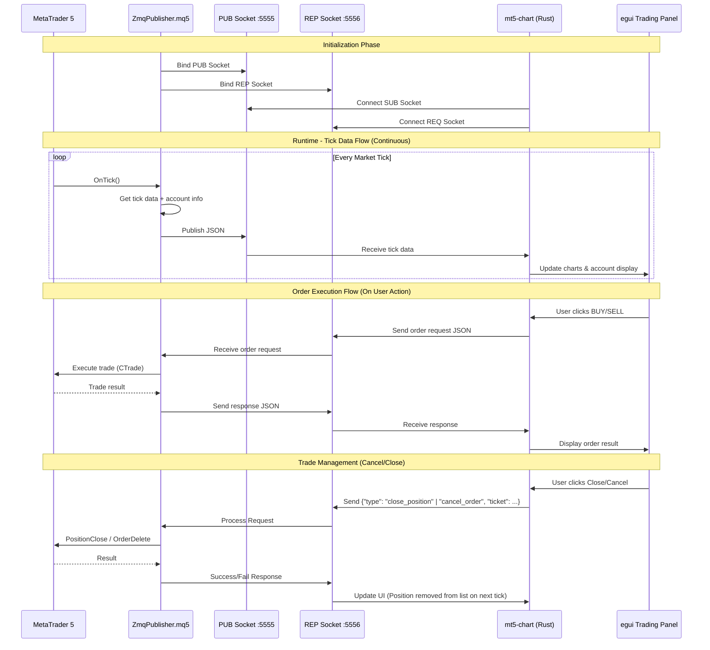
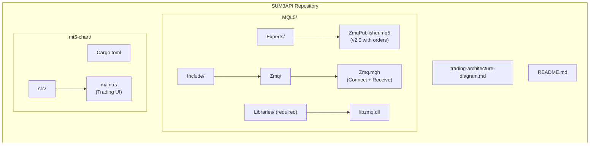

# MT5 ZeroMQ Trading System - Architecture Diagram

This diagram illustrates the complete data flow and component integration of the MT5-Chart trading system with **bidirectional ZeroMQ communication** for real-time tick data and order execution.

## System Overview

```mermaid
flowchart TB
    subgraph MT5["MetaTrader 5 Platform"]
        direction TB
        subgraph MQL5Layer["MQL5 Layer"]
            EA["ZmqPublisher.mq5<br/>(Expert Advisor v2.0)"]
            Header["Zmq.mqh<br/>(ZMQ Wrapper Class)"]
            Trade["Trade.mqh<br/>(Trading Functions)"]
        end
        
        subgraph DLLLayer["Native DLL Layer"]
            LibZmq["libzmq.dll<br/>(ZeroMQ Native Library)"]
        end
        
        EA -->|"#include"| Header
        EA -->|"#include"| Trade
        Header -->|"#import"| LibZmq
    end

    subgraph RustApp["mt5-chart (Rust Application)"]
        direction TB
        Main["main.rs"]
        
        subgraph UIComponents["UI Components"]
            TradingPanel["Trading Panel<br/>• Account Info<br/>• Lot Size Adjuster<br/>• Order Buttons"]
            PriceChart["Price Chart<br/>• Bid/Ask Lines<br/>• Real-time Update"]
            VolumeChart["Volume Chart<br/>• Tick Volume Bars"]
        end
        
        subgraph Crates["Rust Dependencies"]
            ZmqRust["zeromq crate<br/>(SUB + REQ Sockets)"]
            Eframe["eframe + egui<br/>(GUI Framework)"]
            EguiPlot["egui_plot<br/>(Chart Rendering)"]
            Tokio["tokio<br/>(Async Runtime)"]
            Serde["serde + serde_json<br/>(JSON Parsing)"]
        end
        
        Main --> UIComponents
        Main --> ZmqRust
        Main --> Eframe
        Main --> EguiPlot
        Main --> Tokio
        Main --> Serde
    end

    subgraph Network["ZeroMQ Transport"]
        PUBSocket["PUB Socket<br/>tcp://127.0.0.1:5555<br/>(Tick Data + Account Info)"]
        REPSocket["REP Socket<br/>tcp://127.0.0.1:5556<br/>(Order Handling)"]
    end

    LibZmq -->|"PUB Bind"| PUBSocket
    LibZmq -->|"REP Bind"| REPSocket
    PUBSocket -->|"SUB Connect"| ZmqRust
    ZmqRust -->|"REQ Connect"| REPSocket
```



## Bidirectional Communication Flow



## Data Structures

### Tick Data JSON (PUB → SUB)

```json
{
    "symbol": "XAUUSD",
    "bid": 2000.50,
    "ask": 2000.80,
    "time": 1706188800,
    "volume": 150,
    "balance": 10000.00,
    "equity": 10050.00,
    "margin": 200.00,
    "free_margin": 9850.00,
    "min_lot": 0.01,
    "max_lot": 100.00,
    "lot_step": 0.01,
    "positions": [
        {"ticket": 12345, "type": "BUY", "volume": 1.0, "price": 2000.50, "profit": 50.0}
    ],
    "orders": [
        {"ticket": 12346, "type": "BUY LIMIT", "volume": 0.1, "price": 1990.00}
    ]
}
```

### Order Request JSON (REQ → REP)

```json
{
    "type": "market_buy",
    "symbol": "XAUUSD",
    "volume": 0.01,
    "price": 0.0
}
```

**Order Types:**
| Type | Description |
|------|-------------|
| `market_buy` | Instant buy at market price |
| `market_sell` | Instant sell at market price |
| `limit_buy` | Pending buy limit order |
| `limit_sell` | Pending sell limit order |
| `stop_buy` | Pending buy stop order |
| `stop_sell` | Pending sell stop order |
| `close_position` | Close an active position (requires `ticket`) |
| `cancel_order` | Delete a pending order (requires `ticket`) |

### Order Response JSON (REP → REQ)

**Success:**
```json
{
    "success": true,
    "ticket": 123456789
}
```

**Failure:**
```json
{
    "success": false,
    "error": "Not enough money"
}
```

## UI Component Layout

```mermaid
flowchart LR
    subgraph Window["MT5 Trading Chart Window"]
        subgraph SidePanel["Left Side Panel (250px)"]
            direction TB
            AccountInfo["💰 Account Info<br/>├ Balance<br/>├ Equity<br/>├ Margin Used<br/>└ Free Margin"]
            Prices["📈 Prices<br/>├ Bid<br/>├ Ask<br/>└ Volume"]
            LotSize["📦 Lot Size<br/>├ Min/Max/Step<br/>├ +/- Buttons<br/>└ Quick Presets"]
            MarketOrders["🔥 Market Orders<br/>├ BUY Button<br/>└ SELL Button"]
            LimitOrders["📋 Limit Orders<br/>├ Price Input<br/>├ BUY LIMIT<br/>└ SELL LIMIT"]
            StopOrders["🛑 Stop Orders<br/>├ Price Input<br/>├ BUY STOP<br/>└ SELL STOP"]
            ActivePos["💼 Active Positions<br/>├ Symbol/Type/Vol<br/>├ Profit<br/>└ Close Button"]
            PendingOrd["⏳ Pending Orders<br/>├ Type/Vol/Price<br/>└ Cancel Button"]
            OrderResult["📨 Last Order Result"]
        end
        
        subgraph MainPanel["Central Panel"]
            direction TB
            Header["Symbol + Current Prices + Tick Volume"]
            PriceChart2["Price Chart (65% height)<br/>• Bid Line (Green)<br/>• Ask Line (Red)"]
            VolumeChart2["Volume Chart (35% height)<br/>• Tick Volume Bars (Blue)"]
        end
    end
```



## File Structure



## ZMQ Socket Configuration

| Socket | Type | Port | Direction | Purpose |
|--------|------|------|-----------|---------|
| Publisher | PUB | 5555 | MT5 → Rust | Tick data + Account info |
| Responder | REP | 5556 | MT5 ← Rust | Order execution |

> [!IMPORTANT]
> The `libzmq.dll` must be placed in the `MQL5/Libraries/` folder of your MetaTrader 5 data directory.

> [!WARNING]
> Order buttons execute **REAL** trades on your MT5 account. Always test on a demo account first!

## Trading Features

### Account Information Display
- **Balance**: Current account balance
- **Equity**: Balance + floating P/L
- **Margin Used**: Margin for open positions
- **Free Margin**: Available margin for new trades

### Order Types Supported
1. **Market Orders**: Instant execution at current price
2. **Limit Orders**: Pending orders at specified price (better than current)
3. **Stop Orders**: Pending orders at specified price (worse than current)

### Lot Size Management
- Display of min/max lot and step size
- Adjustable via +/- buttons
- Quick preset buttons (0.01, 0.1, 0.5, 1.0)
- Manual text input with validation
